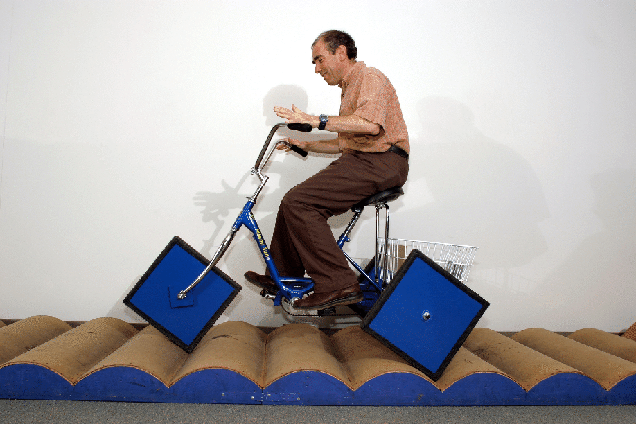

# Model a Bicycle


{:standard_toc}


## Learning goals

- Implementing a new class
- Writing unit tests for a new class
- Translating verbal descriptions of state and behavior into code
- Understanding the role of instance variables, methods, and constructors
- Using common Java class structure idioms:
  - Getters and setters
  - Mutable and immutable properties
  - Constructor chaining
- Understanding the relationships between **Java syntax**, **object-oriented design decisions**, and the **real-world entities you are modeling**

<callout>
  We usually tell you to use your own judgment about how much of each activity is useful learning for you. This is one of the rare activities where we strongly recommend that you **complete the activity all the way to the end** (not including the “Extra bonus challenge”).

  The ideas in this activity are _crucial_ to programming — not just this course, not just Java, but programming in general. Be thorough, and take the time to absorb each detail.
</callout>

## Modeling sits at the heart of software development

Today we will create a new class that **models** a bicycle. The class won’t describe _everything_ about a bicycle, and it won’t describe every bicycle in the world. It is a simplified description that captures just a few things that we care about, just accurately enough for our purposes. That is what the word “modeling” means.

<definition-callout>
  A <def>model</def> represents something messy and complex with something that is simpler or more abstract.
</definition-callout>

When we use mathematics to model something (for example, equations that describe electromagnetism or plant growth or economic markets), we call it a “[mathematical model](https://m3challenge.siam.org/resources/whatismathmodeling).” When we use thoughts — metaphors, images, rules, [heuristics](https://en.wikipedia.org/wiki/Heuristic), etc. — to model something, we call it a “[mental model](https://thesystemsthinker.com/what-are-mental-models/).” Similarly, when we use object-oriented programming to model something, we call it an “<def>object model</def>.”

An essential feature of models is that they _don’t describe everything._ A model _has to_ leave some things out; otherwise it’s not a model. A related saying you may hear is "[all models are wrong, but some are useful](https://en.wikipedia.org/wiki/All_models_are_wrong)" (George Box). Your goal is not to reproduce all of reality. Your goal is to make a model that is useful for the problem at hand.

Because of this, it is not sufficient to consider only the **accuracy** of a model; it is equally crucial to ask questions about the **purpose**:

> What is this model _for_? How will we _use_ it?

> What does it need to capture accurately for that purpose? What can it ignore?

> What other models or systems will this model interact with? What information and behavior do _they_ need our model to provide?

For example, if we are modeling a bicycle, do we need to model its _color_? If the purpose of our model is to estimate transportation time, or to build a robot that rides a bicycle…then no, probably not! However, if the purpose of our model is to track a bicycle store’s inventory, or build a bicycle video game, then perhaps we do need color information.

We also need to ask questions about **our own fallibility** and the **limits of our understanding**:

> How can I _validate_ this model? How can we ensure that it behaves the way we programmers think it behaves? Does it work the way our users, clients, and/or stakeholders expect? Does it work properly in its larger context?

> How can we _break_ this model? What are its [failure modes](https://asq.org/quality-resources/fmea)? How can we discover surprising ways of breaking it that we never anticipated?

> What are the limits of our own knowledge?

> Who do we need to communicate with in order to answer these questions?

Note that these aren’t solely questions about code. They are questions about our approach, about the _ideas_ and _assumptions_ we are bringing to our model. We can ask these questions from the very beginning, even before we even write any code! For example: “What happens if we turn the handlebars of a bicycle more than 90°? Will our model accurately capture the motion of the bicycle in that case? Does it need to?”

These modeling questions sit at the heart of software development. Learning to think about them well is **every bit as important as learning to write code**. A correct implementation of the wrong idea is not a success!

<callout>
  “The thing about being wrong is that before you know you’re wrong,<br>
  it feels _exactly_ like being right.”

  —Roman Mars (from [this excellent radio feature](https://99percentinvisible.org/episode/episode-52-galloping-gertie/))
</callout>

Today’s model is _not_ for practical purposes. It is just a learning exercise. However, it lays a crucial piece of foundation for this kind of good thinking about object modeling: you are going to practice seeing how **specific Java syntax corresponds to specific modeling assumptions**. Throughout this activity, take a moment to digest the “syntax / what it’s called / what it means” tables. As you do, remember that they are not just talking about code; they are establishing _relationships_ between Java code and modeling assumptions.

## Task 0: Create a bicycle class

Once you and your partner are set up with the activity, create a new file called `Bicycle.java` in the `src/bicyclemodel` directory. (Be sure to create it **in** `bicyclemodel/`, not just `src/`! This is what the course [style guide](/resources/style-guide) means when it says you should create classes in a <def>package</def>.)

VS Code should create a file that says `package bicyclemodel;` at the top, and that contains an empty class declaration. This starter file combines two different pieces of Java syntax, both  important:


||============================================================||

[syntax]      Java syntax
[terminology] What it’s called
[semantics]   What it means

||============================================================||

[syntax]

  class Bicycle {
    <ghost>...</ghost>
  }

[terminology]

  - <def>class declaration</def> <meta>(n)</meta>
  - declare a class <meta>(v)</meta>

[semantics]

  “In our world, `Bicycle` is one type of thing that can exist. There aren’t any of them yet! But there could be. Here is a description of their state and behavior….”

||------------------------------------------------------------||

[syntax]

  public

[terminology]

  - <def>public access modifier</def> <meta>(n)</meta>
  - make it public <meta>(v)</meta>

[semantics]

  “This thing isn’t hidden from the world; it isn’t **encapsulated**. It is a part of our **public API**, and other code can use it.”

||------------------------------------------------------------||


## Task 1: Add a property

We are going to add a piece of state to our bicycle:

> **direction**: the direction that the bicycle’s steering column is currently pointed. Measured in degrees. Straight ahead is 0°. Always in the range -90°…90°.

(We limit the range because a bicycle’s steering doesn’t work properly when we turn the wheel past 90°, and we don’t want to try to model the complex behavior of a bicycle falling over!)

To do this, we will **add an instance variable** named `direction` with type `double`.

<definition-callout>
  An <def>instance variable</def> is a variable that is **attached to an object**. Instance variables are what keep track of the **state** of an object. The variable’s lifecycle begins when the object is created, and ends when the object is no longer used.
</definition-callout>

A class declaration lists the instance variables each object of this class will have. When you create a new object, that object gets its own personal storage for each of the instance variables the class declaration says it should have. In this case, we are going to say that every `Bicycle` has its own independent `direction`.

You already know about declaring **local variablies** that live inside a function / method. Those variables come into existence only when the function is called. (All the variable declarations you have seen so far in this course have been local variables.) The syntax for instance variables is similar, but there are two important differences to remember:

1. An instance variable needs to be nested directly inside the class, but not inside any method.
2. The declaration should begin with the word `private`. Instance variables should (almost) always be private, so that the object gets to decide how its own state changes.

Read that and think about it with your partner, then look at the syntax:

<hidden-block>
    public class Bicycle {
        private double direction;
    }
</hidden-block>

Add that code to your `Bicycle` class.

We are also going to give our bicycle two new behaviors:

> **get direction**: asks the bicycle to tell us what its current direction is

> **set direction:** changes the bicycle’s direction

You will do this by creating two new methods. The syntax will be a lot like the static methods you created already in this course, but now without the word `static`. The word “static” means “not associated with any particular object.” But you want both of these methods to be things we can ask of _a specific bicycle_.

1. `getDirection()` takes no parameters, and its return type is `double`. It returns the current value of the instance variable `direction`.

    **Before you start typing in VS Code,** discuss with your partner what the syntax for this method will be. Make your best guess. **Write it out on paper.**

    Now start typing “`getDire`…” and VS Code will fill in the getter method for you! Let VS Code generate it, and check your guess on paper against what VS Code did.

2. `setDirection()` takes one parameter, a `double` named `direction`, and returns nothing. It assigns the `direction` parameter to the `direction` instance variable.

    Once again, **before you start typing in VS Code**, discuss with your partner what the syntax will be. Tricky question: how do you distinguish between a parameter and an instance variable when they have the same name? Answer: <hidden>refer to the instance variable as <code>this.direction</code></hidden>.

    Once again, type “`setDir`…” into VS Code and let it auto-generate the setter method, and use it to see what the code should look like.

What you just did here — creating an instance variable plus getter and setter methods — is an _incredibly_ (some would say annoyingly!) common pattern in Java. People sometimes refer to the instance variable + getter + setter all together as a <def>property</def> of the class.

<callout>
  The autocomplete feature you used is very helpful for writing getters and setters — but remember what the String Methods activity had to say about [never letting the computer do the thinking for you](/activities/string_methods#thinking)!

  **Do** use autocomplete for boilerplate code like this. Java in particular has a verbose syntax designed with the assumption you will lean on autocomplete. **Do not** stop paying attention to what the autocomplete generates, or what it means, or how the pieces of it fit together.
</callout>


||============================================================||

[syntax]      Java syntax
[terminology] What it’s called
[semantics]   What it means

||============================================================||

[syntax]

  <ghost>class Bicycle {
    …</ghost>
    double direction;
    <ghost>…
  }</ghost>

[terminology]

  - <def>instance variable</def>
    (in Java, also known as a <def>field</def>) <meta>(n)</meta>
  - declare an instance variable <meta>(v)</meta>

[semantics]

  “Every Bicycle **has a** direction. Direction is a part of the **state** of a bicycle: even when the Bicycle is just sitting there, not doing anything, it still always has a direction. The direction exists as long as the bicycle exists. It is a double-precision floating point number.”

[commentary]

  Question: What syntax makes `direction` an instance variable, and not a local variable?

  <hidden>The variable declaration is nested directly inside the class. It is not inside a method.</hidden>

  What would happen if `direction` were a local variable instead, inside a method?

  <hidden>Then the direction would exist only while that method is running. Every time the method returned, the direction would disappear. Direction would not be part of the state of a bicycle, and every bicycle would not have a direction.</hidden>

||------------------------------------------------------------||

[syntax]

  private

[terminology]

  - <def>private access modifier</def> <meta>(n)</meta>
  - make it private <meta>(v)</meta>

[semantics]

  “This thing is hidden from the world; it is **encapsulated**. It is **not** a part of our public API, and outside code cannot see it or use it directly. If other code wants to know about it or change it, it will need to ask via some behavior that is part of our API.”

||------------------------------------------------------------||

[syntax]

  double getDirection()

[terminology]

  - <def>getter</def> / <def entry="getter">getter method</def> (n)
  - declare a getter <meta>(v)</meta>

[semantics]

  “If you want to know about the direction of a bicycle, you have to ask. The bicycle code gets to decide what it reveals to you about its direction.”

||------------------------------------------------------------||

[syntax]

  void setDirection(double direction)

[terminology]

  - <def>setter</def> / <def entry="setter">setter method</def> (n)
  - declare a setter <meta>(v)</meta>

[semantics]

  “If you want to change the direction of a bicycle, you have to ask. The bicycle gets to decide what happens when you try to change the direction. It may or may not honor your request.”

||------------------------------------------------------------||

[syntax]

  this

[terminology]

  - <def>this</def> <meta>(n)</meta>
  - (also called <def entry="this">self</def> in many languages, e.g. Python, Swift, Ruby)

[semantics]

  “The object this method belongs to; the particular bicycle that is performing the behavior we are describing here.”

[commentary]

  Some languages call this `self` instead, and that’s a nice way to think of it: _“I’m an object providing a behavior, and this is me!”_

||------------------------------------------------------------||

[syntax]

  this.direction

[terminology]

  - instance variable access <meta>(n)</meta>
  - use the instance variable <meta>(v)</meta>

[semantics]

  “Maybe there are other local variables named `direction` around here, but I specifically want the one that is an instance variable of this object.”

[commentary]

  Note that the `this.` is optional if there is only one variable in scope named `direction`. However, if there is also a local variable named `direction`, then you need add the `this.` prefix to specify that you mean the instance variable.

||------------------------------------------------------------||


## Task 2: Guard the bicycle’s state

Why go to all the work of making getter and setter methods? Because the object can use them to **guard its state**. Remember that we want to limit the direction to the range -90°…90°? Right now, anybody can set the direction to any value! However, because we are using a setter method to change the direction, we can change its behavior to make the bicycle refuse to turn past -90° or 90°.

Before we fix this problem, let’s **write a unit test that exposes the issue**.

Create a new class called `BicycleTest.java` in `test/bicyclemodel`. (Note: be sure to create it in <highlight>`test`</highlight>`/bicyclemodel`, not <highlight>`src`</highlight>`/bicyclemodel`!)

Add a new test that:

1. Creates a new bicycle
2. Sets its direction to something in the valid range
3. Asserts that the direction changed to that value
4. Sets it to something that is greater than 90
5. Asserts that the direction is 90
6. Sets it to something less than -90
7. Asserts that the direction is -90

Here is one way of writing that test, which you can reveal a few lines at a time if you need hints or want to check your work:

<pre>
<hidden>    @Test</hidden>
<hidden>    void changeDirection() {</hidden>
<hidden>        Bicycle bike = new Bicycle();</hidden>
<hidden>        bike.setDirection(70);</hidden>
<hidden>        assertEquals(70, bike.getDirection());</hidden>
<hidden>        bike.setDirection(1000000);</hidden>
<hidden>        assertEquals(90, bike.getDirection());</hidden>
<hidden>        bike.setDirection(-1000000);</hidden>
<hidden>        assertEquals(-90, bike.getDirection());</hidden>
<hidden>    }</hidden>
</pre>

Run the test. **It should fail.** That’s good! That means you are successfully testing for what you want to implement. **Never skip this step** when you are doing test-driven development!

Now **modify** `setDirection()` so that if the direction parameter is less than -90° then it sets it to -90°, and if the direction parameter is greater than 90° then it sets it to 90°.

Run the test again. **It should pass**.

Good time to commit and push!

_**Optional challenge on the side**: If this activity is going quickly for you, try implementing `setDirection()` in just one tidy line using `Math.min()` and `Math.max()`. Ensure your tests still pass!_


## Task 3: Add behavior beyond properties

We are going give our bicycle one new piece of state:

> **speed**: how fast the bicycle is going, in km per hour. Always positive; we do not model someone manually pushing the bicycle backwards.

However, we are not going to use a setter method for this! Why? Because you can’t suddenly change a bicycle’s speed in the same way you can suddenly rotate the handlebars. Instead, we are going to introduce _three_ behaviors:

> **get speed**: asks the bicycle what its current speed is

> **pedal harder**: increases the speed, accounting for drag (because you can only get going so fast by pedaling) with the following formula:

>> speed after pedaling harder = (speed + pedal power) \* (1 - drag)

> **brake**: activates the bicycle’s brakes for a moment, applying this formula:

>> speed after braking = (speed - brakingPower) \* (1 - drag)
>> (but never going below 0)

(Yes, yes, these formulas are both _wildly_ inaccurate. Physicists, I’m sorry. But this is a good example of a model that is wrong but useful: as a physics model of a bicycle, it is *very wrong*. But it is *very useful* for our purpose of learning about objects, behavior, state, and the process of modeling. And it is useful for making a nice animation at the end of the activity!)

What are “drag,” “pedal power,” and “braking power?” They are constants, which you should declare at the top of the class and set as follows:

- drag is 0.1
- pedal power is 2
- braking power is 3

Here is the syntax for declaring and initializing a constant in Java:

<hidden-block>
    private static final double DRAG = 0.1;
</hidden-block>

This is Java's idiom for declaring a constant. The "static" means "one variable shared by all instances of this class." The "final" means "doesn't change after being set". Private means...well, private: “only this class is allowed to use it. Code outside this class has no access to it.” (You can of course make public constants too.)

The broadly accepted style in the Java community and our class is: constant names should be UPPER\_CASE\_WITH\_UNDERSCORES. See [the style guide](/resources/style-guide/#java-specific-conventions).

Once you’ve created those constants, **add the instance variable for speed** and **implement the three methods above**.

Now write two test methods called `accelerate()` and `decelerate()` in your test class that make assertions about the effect of `pedalHarder()` and `brake()`. Two things to think about:

- You can’t really test `brake()` unless the bike’s speed is greater than zero first. But you can’t set the speed. What will you need to do?
- Make sure that you test that `brake()` doesn’t let the speed go below zero, no matter how much you brake.

Here is a fairly thorough implementation of the `decelerate()` test, which again you can reveal a few lines at a time if you’d like some hints:

<pre>
<hidden>    @Test</hidden>
<hidden>    void decelerate() {</hidden>
<hidden>        bike.pedalHarder();</hidden>
<hidden>        bike.pedalHarder();</hidden>
<hidden>        bike.brake();</hidden>
<hidden>        assertEquals(0.378, bike.getSpeed(), 0.00001);</hidden>
<hidden>        bike.brake();</hidden>
<hidden>        assertEquals(0, bike.getSpeed(), 0.00001);</hidden>
<hidden>        bike.brake();</hidden>
<hidden>        assertEquals(0, bike.getSpeed(), 0.00001);</hidden>
<hidden>    }</hidden>
</pre>


||============================================================||

[syntax]      Java syntax
[terminology] What it’s called
[semantics]   What it means

||============================================================||

[syntax]

    static final double DRAG

[terminology]

  - <def>constant declaration</def> <meta>(n)</meta>
  - declare a constant <meta>(v)</meta>

[semantics]

  “There is one single `DRAG` value shared by all bicycles. It is a `double`. It never changes.”

||------------------------------------------------------------||

[syntax]
    void pedalHarder() {
      <ghost>…</ghost>
    }

[terminology]

  - <def>method declaration</def> <meta>(n)</meta>
  - declare a method <meta>(v)</meta>

[semantics]

  “You can ask a bicycle to pedal harder. That is one of the behaviors of a bicycle.”

[commentary]

  We’ve already seen method declarations…haven’t we? Well, yes, but this is something new: it does not have the `static` modifier. Because it is not a static method, we are saying that pedaling harder is something that _a specific bicycle can do_. You can’t just say “for all bicycles in general, pedal harder!” We have to say which _individual_ bicycle we want to pedal harder.

||------------------------------------------------------------||


## Interlude: What modeling decisions have we made?

Remember that the point of this activity is not just learning Java syntax, but also learning how **specific Java syntax corresponds to specific modeling assumptions**. What modeling assumptions have we embedded in our bicycle code so far?

We’ve said that there are bicycles in our world (class declaration).

We’ve said that every bicycle has a direction, and that’s part of its state (instance variable), but that direction is encapsulated (private), so the bicycle has some control over what rules the direction follows, and how it can change.

We’ve said that anyone can ask a bicycle what its direction is (public getter). Anyone can also ask to change the direction (public setter), but the bicycle doesn’t just let you change the state to anything you want; it will apply some rules about which directions are valid (which are in the setter method’s implementation).

We’ve said that every bicycle also has a speed (instance variable) which is also encapsulated (private). Anyone can ask for the speed (public getter), but they can’t just set it to anything they want! The only way they can change the speed is with the behaviors (public methods) of (1) pedaling harder or (2) applying the brakes.

Our code is thus not only an **abstract logical system**; it is an **expression of human assumptions** about what a bicycle is — or at least of what a bicycle will be for the purposes of this particular piece of software.

### Interlude<sup>2</sup>: on assumptions and wheel shape

Your model of a bicycle very likely includes an assumption about the shape of the wheels. Furthermore, observe that there are several models we're talking about, including:

- your **mental model**: the abstract, idealized notion of "bicycle" you have in your mind when thinking about the general idea of bicycle, and not some *particular* bicycle. Very much like the Platonic form of bicycle.
- your **Java model**: the abstract notion of bicycle as described by these instructions, and reflected in your Java code.

Observe that the Java model does not say *anything* about the wheels of a bicycle, or about their shape!

Your mental model almost certainly *assumes* that bicycles have wheels that are round. But this is a false assumption -- and it was a Macalester professor who showed this! In the 1990s, Stan Wagon, a well-known math professor, built a bicycle with **square wheels**:



(image from [Professor Wagon's website](https://stanwagon.com))

[See here for more details](https://www.macalester.edu/mscs/multimedia/squarewheeledbike/squarewheelbike/). You can't ride this bicycle on a flat surface, of course. [Professor Wagon's website has the math-y details](https://stanwagon.com/public/squarewheelposter2011.pdf) of the necessary shape of the surface on which you can ride the square-wheel bicycle.

That bicycle -- or a successor thereof -- is kept in OLRI and we do bring it out for MSCS events now and then.

**What other assumptions have you made in your model, either your mental one or the Java one?** Thinking about that can be valuable in almost any programming task.

## Task 4: Add immutable state

### Change the variable declarations

Because we made drag, pedal power, and braking power all constants, that means that they are the same for _all_ bicycles. That doesn’t seem accurate, does it? Different bicycles must have a different drag, right? However, we are going to assume that while drag (and the others) are different for _different_ bicycles, they never change for one _particular_ bicycle. To model this, we will add an **immutable instance variable** to `Bicycle`.

<definition-callout>
  When something is <def>mutable</def>, that means it can change. “Mutable data” or “mutable state” might have one value now, but a different value in the future.

  When something is <def>immutable</def>, that means it cannot change. It might eventually _disappear_, but as long as that data or that state exists, it will always have the same value.
</definition-callout>

Here again is the syntax for making drag a constant shared by **all** bicycles:

        private static final double DRAG = 0.1;  // constant

Here is the syntax for making it a **mutable** part of each individual bicycle’s state:

        private double drag = 0.1;  // mutable state

Other than changing the name to lowercase, which is only a matter of style, what is the difference here? Two words: `static` and `final`.

In this context, “<def>static</def>” means “shared by _all_ objects of this class,” and “<def term="final variable">final</def>” means “can only be assigned to once, i.e. can never change after it’s set.”

So if we want to have each bicycle have its own (potentially different) drag? Drop the word `static` (and make the variable name lowercase). But if we don’t want a particular bike’s drag to ever change? **Keep** the word `final`:

        private final double drag = 0.1;  // immutable state

Change `drag`, `pedalPower`, and `brakingPower` so that they are all immutable state for each individual bicycle.

**Run your tests**. They should still pass.

Commit and push.


||============================================================||

[syntax]      Java syntax
[terminology] What it’s called
[semantics]   What it means

||============================================================||

[syntax]

  static

[terminology]

  - <def>static variable</def> / <def>static method</def> <meta>(n)</meta>

[semantics]

  “There is only one of this thing in our whole world. It belongs to the whole class, not to any particular object.”

[commentary]

  Alas, the word “static” means several completely different and unrelated things in programming. Sorry! Here we are talking about static variables and static methods. In this context, “static” means “there is just one of it;” it is the opposite of “instance:”

  - static variable → just one of it
  - instance variable → each object has its own

  - static method → you don’t need any particular object
  - instance method → you have have to ask one specific object to do it

  We also talk about “static types” in this class. That is a _completely unrelated_ meaning; it just happens to be the same word. In _that_ context, the word “static” means “before the code runs;” it is the opposite of “runtime.” These really should have been two different words!

||------------------------------------------------------------||

[syntax]

  final double drag

[terminology]

  - <def>final variable</def> <meta>(n)</meta>

[semantics]

  “This variable’s value can never change. We are only allowed to assign to it exactly once: no more, no less.”

||------------------------------------------------------------||


### Add a constructor that sets drag

OK, so each individual bicycle _could_ have its own unique drag…but we’re still setting them all to 0.1. That isn’t very useful! How do we let different bikes have different drags? We create a constructor that takes drag as a parameter.

<definition-callout>
  A <def>constructor</def> is code that runs exactly once when an object is first created. The constructor sets up the initial state of the object — setting instance variables to appropriate values, and possibly other work too — so that the object is ready to use.
</definition-callout>

To do this:

- Remove the assignment that initializes drag to 0.1. Java will now (accurately) complain that drag is never initialized. Note that Java complains about this specifically because we declared the variable `final`, and we have to assign a value to a final variable exactly once — no more, no less.
- Create a constructor that takes one parameter, `drag`. Make it set the instance variable using this parameter. What is the syntax for this?

  - The structure will be similar to a setter method: you will take `drag` as a parameter, and you will assign its value to the `drag` instance variable.

  - Constructors look just like methods, except they (1) <hidden>have the same name as the class</hidden> and (2) <hidden>do not have any return type, not even <code>void</code></hidden>.

  - Study that text and think for a moment with your partner about what the syntax would look like, but don’t spend _too_ long puzzling over this on your own. When you have thought about it, reveal the syntax:

    <hidden-block>
        public Bicycle(double drag) {
          this.drag = drag;
        }
    </hidden-block>

Now you can specify the drag when you create a bicycle! Now, instead of creating a bicycle with `new Bicycle()`, you create one by specifying a drag: `new Bicycle(0.2)` (for example).

But oh no…the tests are broken! Why? Check the error message in your test class, **but don’t fix it!**

### Add a convenience constructor

Instead of changing the test class to pass a value for drag everywhere, we are going to add a _second constructor_ that takes no parameters, and sets drag to its old default of 0.1. One way to do this would be to repeat the structure of the other constructor, but use a constant instead of a parameter:

<hidden-block>
    public Bicycle() {
        this.drag = 0.1;
    }
</hidden-block>

(This text is only hidden so it doesn’t spoil the previous section. You should reveal it and look at it.)

There is a problem with that approach. Suppose we added some logic to validate drag, or do a computation with drag while creating the object. Or suppose the constructor had more work to do beside just setting drag. We would have to repeat all that code in both constructors!

Instead, wouldn’t it be nice if our no-parameter constructor could say, “Just call the constructor that does take a drag parameter, and pass 0.1 for the drag?” We can! Java has a strange special syntax for this:

<hidden-block>
    public Bicycle() {
        this(0.1);
    }
</hidden-block>

Add that constructor, and **your code should compile** and **the tests should all pass again**. Commit and push.

Note: the keyword `this` has two different meanings in Java. In an expression, it means “the object whose method is running here.” But if you are in a constructor and you say `this(…)`, then it means “call another constructor.” In other words, sometimes `this` is a special variable, and sometimes it is a special method. Yes, this is confusing (pun intended).

### Expand the constructor

Make it so that you can use the constructor to specify a custom `pedalPower` and `brakingPower`, and make the zero-parameter constructor pass their old values as the default, just as you did with drag. You should now have a 3-parameter constructor and a zero-parameter constructor.

Once you’ve done that, **the tests should all pass without needing any changes**.

Add tests that make sure the new 3-parameter constructor changes the characteristics of the bike. You can call the constructor in a test like this:

    new Bicycle(0.05, 3.5, 5.0)  // or whatever numbers you like

Make sure to **hang on to your old tests too!** You want to make sure that what was working in the past _continues_ to work in the future. (This is called **regression testing**.) It is therefore important to test both old code _and_ new code in your unit tests.

For thoroughness, add a test that makes sure a newly created bicycle has a speed and direction of 0.

**Here is code for the [completed `Bicycle` class](completed-bicycle) and [`BicycleTest`](completed-bicycle-test).** Use it to check your work. (This includes the solution to the `Math.min()`/`max()` challenge above.)


||============================================================||

[syntax]      Java syntax
[terminology] What it’s called
[semantics]   What it means

||============================================================||

[syntax]

  <ghost>class Bicycle {
      …</ghost>
      Bicycle(…) {<ghost>
          …</ghost>
      }<ghost>
      …
  }</ghost>

[terminology]

  - <def>constructor</def> <meta>(n)</meta>
  - declare a constructor <meta>(v)</meta>

[semantics]

  “When we create a new bicycle object, here is one of the ways we can set up its initial state so that it is all ready for other code to interact with it.”

||------------------------------------------------------------||

[syntax]

  this(<ghost>…</ghost>);

[terminology]

  - <def>constructor chaining</def> <meta>(n)</meta>
  - call another constructor <meta>(v)</meta>

[semantics]

  “When somebody calls this constructor here, first call this other constructor over there.”

||------------------------------------------------------------||


## A little reward at the end

Find the file named `build.gradle` inside the project. This is that file that tells Java how your project is set up, where to look for code, etc.

Inside that file, find this line:

```groovy
sourceSets.main.java.srcDirs = ['src']
```

Change it to:

```groovy
sourceSets.main.java.srcDirs = ['src', 'bonus']
```

…and save the file.

This tells Java to also look for source code inside the `bonus` directory. Inside that directory is a little visualization that uses your bicycle model.

Open up the `BicyclePlayground` class, and run its main method.

**If you get compile errors** and the playground won’t run, it is probably because your `Bicycle` class doesn’t look _exactly_ the way the playground code expects it to look. For example, perhaps you capitalized a method name differently. Compare your code to [the solution](completed-bicycle) — and, as always, read the error message!

Once the playground is running, experiment with your bicycle model. That’s your code in action, making decisions about the states and behaviors of bicycles! What do the “pedal harder” and “brake” behaviors look like? Is your code limiting the handlebar direction to the range -90°…90° as expected? Try adding more bicycles! Make them all go fast! Are graphics the _best_? <hidden>Obviously.</hidden>

The playground code uses many tools and techniques we haven’t covered yet. You do not need to understand it, but you are nonetheless welcome to puzzle over it. A simulation + visualization of this sort could be a good final project for this class.


* * *


## Bonus challenge <aside>(optional)</aside>

Model a bicycle with multiple gears. Some thoughts:

- Gears are numbered, and they are discrete (unless you want to model a fancy continuously variable transmission instead).
- A bicycle has a minimum and a maximum gear.
- Gears change the relationship between “pedal power” and acceleration. (Feel free to make up a formula. This isn’t real physics! The point is to practice code.)
- Some bicycles have front and rear shifters. That’s a lot to model at once! Try modeling the rear shifter first, testing it, then adding the front shifter.
