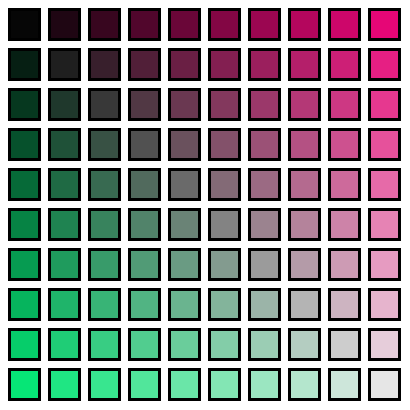
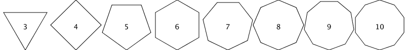

# Debugging Practice


{:standard_toc}

## Learning goals

* Use various strategies for investigating the runtime state of your program to discover the cause of, and to fix, bugs.
* Try several strategies for debugging: see [the reading assignment](/resources/debugging_strategies/) due today.
* Learn about different varieties of bugs.

This activity asks you to debug existing code. There are 4 separate files for this activity, **each with a different type of bug**.

## Task 1: Macalester Lines

In this part, you will be debugging the `MacalesterLines` class. This class should draw lines that look something like the back of a Macalester ID card, but it currently only draws one line.

Carefully read through the code to determine what is causing the issue. You might consider using the source debugger, print statements, or partial execution to narrow down the problem.

Please note that **all the colors and coordinates in the code are already correct.**

Then fix the code so that it draws the picture below:


### Strategy 1: print statements

You can use any method you like to fix this code; here's one you might try.

This one is perhaps the simplest possible: just insert a print statement that outputs something about the state of your program. Perhaps you suspect something is wrong in the `doTheThing` method, which has a variable `length` that doesn't seem to get set correctly. Just insert something like

```java
System.out.printing("doTheThing, length is" + length);
```

When you run your program, the terminal will print that out:

{:scale="2.5" }

Now you know something about (1) the value of `length`, but also (2) its value at a particular place in the code, and by seeing how many times that message is printed, (3) how many times that code got executed.

**For this task:** The problem is that the lines aren't displayed correctly. This class has a `createLines` method --- so it sure seems like the problem is there.

The coordinates and colors are all correct. You could add some print statements throughout that method to probe the state of the two local variables `line` and `lines`. The latter is a collection --- what kinds of properties does it have that represent its state? Think about the relationship between the problem --- *only one line gets drawn* --- and what that might mean for that collection of lines.

## Task 2: Drawing Stars

The `Star` class is supposed to produce this image, but it doesn’t:


The `Star` class draws stars by breaking the process down into two methods. The first method, `getStarPoints`, makes the list for the points of a star that is centered at `(0,0)`. The second method, `translateStarPoints`, moves the points to be centered in the canvas window, so that the entire star is visible when drawn. However, it isn’t quite drawing the star correctly. Hint: <hidden>The `getStarPoints` method</hidden> has no bugs.

1. Find and fix this bug so that the code draws the star correctly.
2. Take a closer look at where you found the bug. Is this the best means of carrying out this type of task, given that we are transforming each element of a List? If not, what would be a better way of doing this? Hint: <hidden>There is a stream operation that applies some transformation to every element of a list and gives you a new list with the results. What is it? To use it, you will need to change the signature of the translateStarPoints() method <em>and</em> slightly change how you use the method.</hidden> Note that if the code used that approach, it would have prevented the original bug entirely!

### Meta-strategy: find where the bug *is*

The first step in fixing a bug is to simply find out where in the code the bug *is*! What code is misbehaving? In the first task, it was simple enough. Here it's a bit more complicated.

The strategy here is very much like detective work. It's also not a precise algorithm you can just blindly follow. You gather evidence and narrow down the possibilities to several suspects. Which one to investigate first? Think about how likely it is that the suspect is guilty, and start with the most likely one. Do your investigation...and then, if needed, repeat until you have a firm idea of who's guilty --- that is, which section of code harbors the bug.

Here, you might go through this kind of thought process:

1. The `main` method here just kicks off the drawing; it's very unlikely (though not impossible...) that the bug is there. Let's ignore that for now and come back to it if we can't find the bug elsewhere.

2. Look in `draw()`. That does several things. Which of them might cause the problem?
   1. Could it be `getStarPoints()`? Here, us instructors just tell you the bug isn't there. If you trust us, you can safely ignore that method.
   2. It makes a copy of the list. Could that be the source of the problem?
   3. It then does: (a) call `translateStarPoints`; (b) make a `Path` from the list of points; (c) set the fill color to yellow; (d) add the star shape to the canvas. Which of those seems most likely to be the source of the problem? Well, three of those are part of the Kilt graphics package. Do you trust that package to work correctly? If so, what's left?

### Strategy 2: the source debugger

Again, you can use any strategy to like to fix this code, but here's another key tool you should know.

The most powerful and flexible of these strategies is the source debugger. Here are a couple links on using the Visual Studio Code debugger:

* [Debugging for absolute beginners](https://github.com/MicrosoftDocs/visualstudio-docs/blob/main/docs/debugger/debugging-absolute-beginners.md)
* [Debugging for...not absolute beginners](https://github.com/MicrosoftDocs/visualstudio-docs/blob/main/docs/get-started/csharp/tutorial-debugger.md).
* [The official VS Code site's article on debugging](https://code.visualstudio.com/docs/debugtest/debugging).

To use the debugger, you need to set some breakpoints. These tell VS Code to stop and let you start stepping through your source code line by line. Click on the far left column to set a breakpoint. It'll appear as a red dot.

Now run your program in debug mode: you can use the "triangle with a bug" pane on the left, or by selecting "Debug Java" in the upper right:

{:scale="1.1"} {:scale="1.4" }

When the debugger hits a breakpoint, Visual Studio will halt execution and wait for you to tell it what to do next. Look for the debug toolbar:

{:scale="1.5"}

The key icons are continue, step over, step into, step out, and stop. Hover over them to see the tooltips. Here's what they do:

| Action | Description |
|--------|-------------|
| Continue | Resume normal execution, keep going to next breakpoint or end of program |
| Step over | Execute the next line as a single command |
| Step into | Advance into the next method to be called as part of evaluating the current line |
| Step out | Advance to the end of the current method and stop at the first line past where it got called |
| Stop | Terminate the current program |

In this task, set a breakpoint at the start of the section of code you think might be doing something wrong. Step through the code and inspect the state of the variables and what the code does with them.


## Task 3: Color Wall



The `ColorWall` class is supposed to draw some simple mid-century modernist art. There are multiple bugs in this class, which you can solve in any order. Hint: <hidden>The `getColor` method has no bugs.</hidden>

1. The outline on the image above shows how large the window **should**  be. Unfortunately, the window is much bigger. (NOTE: on most computers it will only go as big as your screen by default.) Figure out why the window is this size. Pay special attention to the variables the code uses to define the window’s size.
2. Only one square seems to be drawing. Figure out why. Hint: <hidden>Pay careful attention to the punctuation characters around the loops.</hidden>
3. The squares are likely not centered in the window. Figure out why and fix it.

## Task 4: Shape Wall



The ShapeWall class is supposed to draw a series of shapes from simple to more complex, but there are multiple errors preventing this from working as intended.

1. The first error is keeping the program from drawing any shapes on the canvas at all. Finding this error will require a very close read-through of all of the code. Pay careful attention to how variables are declared, initialized, and used within each scope.
2. Once you have shapes being drawn to the canvas, you’ll notice that they aren’t the regular polygons you should be getting. Take a look at how the code generates the polygons’ points. You may need to look up the javadoc for the math functions the code uses.
3. Now that your program is drawing regular polygons, note you _might_ still get an error message in the console. If so, figure out what causes this error, and what changes you need to make so the error doesn’t occur.
