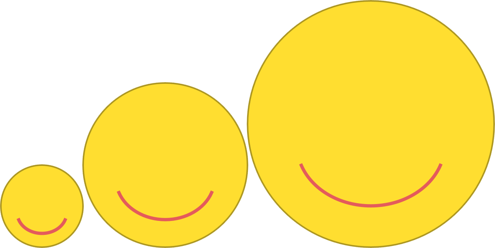

# Emoji Drawing

{:standard_toc}

## Learning goals

Today you are practicing :

- **Using objects** by instantiating them, passing messages to them (a.k.a. calling their methods), and sharing them between different pieces of code
- Breaking code into smaller pieces using **method decomposition**
- Creating graphics with the **[Kilt Graphics](https://github.com/mac-comp127/kilt-graphics)** library
- Using **local coordinate systems** to organize graphical interfaces

**Be sure to commit and push your work to share your code with your activity partner today.** <highlight>You will **both** need the emoji(s) you created for the next take-home exercise!</highlight> Your partner can clone/pull after you push.

## Libraries

In programming, a <def>library</def> is reusable unit of code that is not a whole program in itself, but is instead designed for many different programs to use. Programmers share libraries with each other, and there are _thousands_ of libraries available online to solve common (or uncommon!) problems. Each library focuses on some particular set of related problems or tasks. There are libraries, for example, for doing statistical analysis and creating animations in video games and generating music. One example of a library you are already using is JUnit, which focuses on automated testing of code. Including the JUnit library is what lets you write `@Test` in your test code.

We faculty at Macalester have created a graphics library for Java called “Kilt Graphics” (because Scots wear kilts, and [kilts are cool](https://en.wikipedia.org/wiki/Kilt)). The Kilt Graphics library is focused on creating graphics and user interfaces in a teaching context. We designed it to be just robust enough to build cool things in Comp 127 and 128, but simple enough to be a good teaching tool. The libraries that people use for building full-scale apps are quite complex. They can be overwhelming and messy, and they do not always do a good job of illustrating fundamental programming concepts. Kilt Graphics is not a good way to build an app for releasing to the public, but it is a good training tool for building the cognitive foundations you'll need to learn and use those more complex libraries well.

## The big idea: using objects, using abstractions

Kilt Graphics provides **classes** that you can use in your code. They have names like `Rectangle` and `Ellipse`. Each object of one of those Kilt Graphics classes represents some shape that you could put on the screen. (But wait! If there is only _one_ `Ellipse` class, what if I want to draw _two_ ellipses? <hidden>Remember that there can be many **objects** of a single class!</hidden>)

Kilt Graphics also provides a `CanvasWindow` class. In Kilt Graphics terminology, `CanvasWindow` is a _window_ that appears on the screen when the program runs, and which acts as a blank _canvas_ on which you can draw shapes. To make a shape appear on the screen, you add it to a `CanvasWindow`:

    // Create a window that is 800 pixels wide and 600 pixels high:
    CanvasWindow canvas = new CanvasWindow("Happy Window", 800, 600);

    // Create a rectangle whose upper left corner corner is at (50, 10),
    // which is 100 pixels wide and 100 pixels tall:
    Rectangle box = new Rectangle(50, 10, 100, 100);

    // The rectangle is not visible yet! To make it show up,
    // we have to add it to the window:
    canvas.add(box);

How does Kilt Graphics make a window appear? How does the code know which pixels on the screen to change to black or white to make a rectangle?? What do all the pixels of a window look like: the border, the little button at the top??!? Guess what! _You don’t know. You don’t have to know. That’s not your code’s job._

This is the beauty of abstraction: if you understand what a good abstraction _provides_ to you, what it _accomplishes_, what _promises_ it makes…then you don’t have to know the details of _how it works_. As you learned in the [previous reading](/resources/classes_objects_state_behavior), this separation between _how to use an abstraction_ and _how the abstraction works_ is <def>encapsulation</def>. We have words for both sides of that split. The rules for _how other code uses the abstraction_ are its <def>interface</def> or <def>API</def> (application programming interface). The details of _how it works_ are its <def entry="implementation details">implementation</def>.

Software development mostly consists of understanding abstractions that other people have created for you, and using those abstractions to solve your problem. (Software development also consists of creating your own abstractions as your code grows — but today we’re focusing on using other people’s abstractions.)

## The syntax and the terminology

In this activity, the code you will read and write does a surprising number of different things with just a few basic building blocks, listed in the table below. Study this table carefully! This syntax and this terminology is _ubiquitous_, in this course and beyond.

||============================================================||

[syntax]      Java syntax
[terminology] What it’s called
[semantics]   What it means

||============================================================||

[syntax]

  Cat felix

[terminology]

  - <def>variable declaration</def> <meta>(n)</meta>
  - declare `felix` <meta>(v)</meta>

[semantics]

  "Here is a **new variable** named `felix`. This variable could point to any object that is a `Cat`. It doesn't point to any object yet, but it could!"

||------------------------------------------------------------||

[syntax]

  new Cat()

[terminology]

  - object <def entry="instantiate">instantiation</def> <meta>(n)</meta>
  - <def>instantiate</def> a `Cat` object <meta>(v)</meta>

[semantics]

  "Create a **new object** that is a `Cat`. The object didn't exist before; now it does. No variable points to it…yet."

||------------------------------------------------------------||

[syntax]

  felix = …;

[terminology]

  - <def>assignment</def> <meta>(n)</meta>
  - <def entry="assignment">assign</def> … to `felix` <meta>(v)</meta>

[semantics]

  "Make the `felix` variable point to whatever the expression on the right-hand side gives us. The declaration of `felix` above says the variable can only reference `Cat` objects, so please make sure that expression is guaranteed to give us a `Cat`."

||------------------------------------------------------------||

[syntax]

  Cat felix = new Cat();

[terminology]

  - <def>variable declaration</def> with an <def entry="initialize">initializer</def> <meta>(n)</meta>
  - declare and <def>initialize</def> a variable <meta>(v)</meta>

[semantics]

  _All of the above at once:_ "Here is a new variable named `felix`. Create a new object that is a `Cat`, and make the `felix` variable point to it."

||------------------------------------------------------------||

[syntax]

  felix.meow()

[terminology]

  - <def>method call</def> <meta>(n)</meta>
  - <def>call</def> the `meow` method of `felix` <meta>(v)</meta>

[semantics]

  "Find whatever object `felix` currently is pointing to, and ask that object to `meow` / send it the `meow` message."

||------------------------------------------------------------||

Spot these building blocks in the code, and **practice using the proper terminology** to describe them out loud as you work with your partner:

> ❌ “Now type ‘`Cat` `felix` equals…’”
>
> ✅ “Let’s declare a `Cat` variable named `felix`, and initialize it to…”

The extra words are worth it: they will allow you to communicate better with other developers, construct better web searches for your programming questions, read documentation better, and more easily transfer your object-oriented programming knowledge to new languages.

## Let’s make emojis!

- Open and run the `Emojis` class. You will see three smiley faces — but they’re missing the eyes! (Creepy!)

{:scale="0.33"}

- Don’t add any code yet! **Study the existing code** in `Emojis` first, and try to understand how it works. Things to note:

  - There are several methods. Each one has a specific job. Some methods call other methods. Which call which? What is the method dependency structure?
  - This code uses the graphics classes `Ellipse` and `Arc` to make the shapes you see. What methods do those classes have? Where does the emoji code call the constructors for those classes, and what parameters do the constructors take?
  - This code also uses a class called `GraphicsGroup`. Where does the code use it? What does it do?
  - Here’s the tricky one: The main method creates three different smiley faces, with three different sizes and positions. How does the code make the _sizes_ different? How does it make the _positions_ different? Those two questions have very different answers! Once you’ve figured out that difference, then you are ready to add code of your own.

    - _Hint:_ If you have a theory about how the code works, run an experiment! Change the code a little in a way that depends on your theory, and see if your theory holds. To make everything go back to the way it was in your most recent commit, go to GitHub Desktop, right-click a file, and choose “Discard Changes.”

- Now that you understand how the code handles sizing and positioning parts of faces, add eyes to the emojis by writing a `createEye(size)` method. Note “eye” singular: **your new method will only make _one_ eye**. You will call it twice (where?), putting the resulting eyes at different positions. The result should look something like this, but you’re free to use your own artistic judgment:

{:scale="0.33"}

- Once you have that working, write some new methods that are similar to `createSmiley()` but draw different faces. Note that `createSmiley()` **must continue to work**; you are making _new_ methods for new faces! That means that you should ensure your main method continues to test `createSmiley()` even as you test your other new kinds of faces too.

You may also add enhancements to the existing faces, but please make sure you create at least one additional _kind_ of face first. Here are some suggestions to get you started, but you are free to use your own imagination too:

<!--
The empty span below somehow makes the images display full size; without
it, all the images are really tiny, even though the  tag is
the same. *shrug*
-->

||============================================================||

[image] Image
[desc]  Method

||============================================================||

[image]
  
[desc]
  `createWinkingFace()`

[commentary]
  Most of this method will look just like `createSmileyFace()`; only one of the eyes is different. For the parts that are the same, you can call the same methods that the smiley calls.

||------------------------------------------------------------||

[image]
  
[desc]
  `createFrownyFace()`

[commentary]
  You can copy `createSmile()` to make a new `createFrown()` method, and change just a tiny bit of code. Finding that tiny bit of code may be tricky! Study how it creates the arc. Read the API documentation for [Arc's constructor](https://mac-comp127.github.io/kilt-graphics/edu/macalester/graphics/Arc.html#%3Cinit%3E(double,double,double,double,double,double)) to understand its parameters. *Big hint:* <hidden>Look at the `startAngle` parameter.</hidden>

||------------------------------------------------------------||

[image]
  
[desc]
  Add irises and ocular highlights to `createEye()`

[commentary]
  The tricky part here is that eyes are no longer just one ellipse; instead, there's an ellipse for the dark part and a second ellipse for the highlight. But you still want `createEye()` to return **one** object for the *whole* eye. How can you do that? *Hint:* <hidden>How does `createSmileyFace` do it?</hidden> Study how `createHead()` uses stroke color and width. You can use that for the iris color.

||------------------------------------------------------------||

_Hint:_ Want a different color? You will see a list of colors at the top of the class. You can add a new color of your own to those constants:

1. Find an HTML color picker, such as [this one](https://htmlcolorcodes.com/color-picker/)
2. Find a color you like
3. Copy its 6-digit HTML hex code, e.g. `#2438CB`
4. Replace “`#`” with “`0x`”, e.g. `0x2438CB`
5. Add a new constant and pass the code you copied as an argument to Color’s constructor, just as with the existing colors

Have more time? Create more elaborate faces! See top of this document for inspiration.

**We don’t necessarily expect that you will finish every part of this activity during class time**. Do as much as you can during class, and if you want more practice, do some more of the activity on your own time. It is always up to you how much of each activity you complete.

However, **you will need at least two emojis for the next take-home exercise**. We will give you some emoji code if you didn’t get a chance to finish during class today — but of course it’s more fun to use your own emojis!
