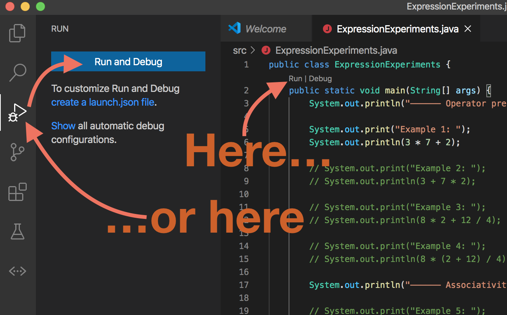
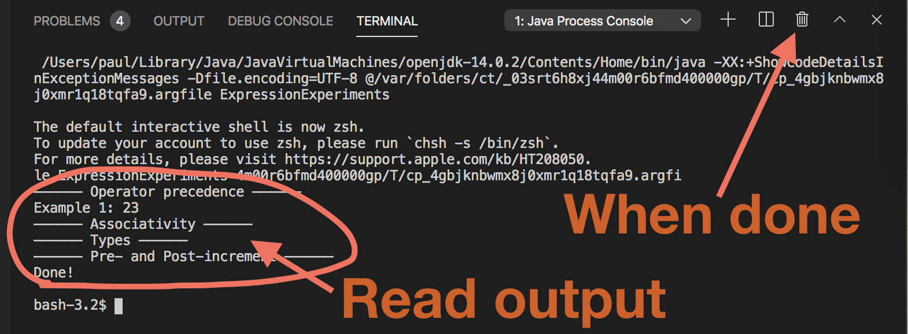
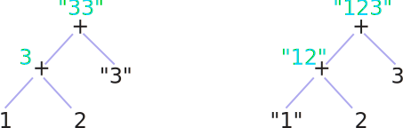
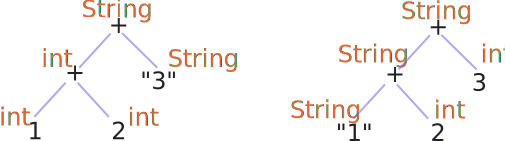
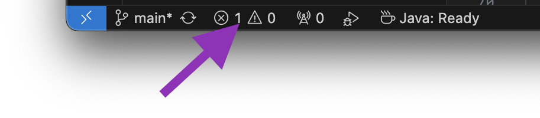

# Expressions, Abstract Syntax Trees (ASTs), and Types

{:standard_toc}

## Learning goals

In this activity, you will:

- Practice using ASTs to visualize how Java evaluates expressions
- See how operator precedence determines the AST for an expression
- See how left/right associativity rules can affect how operators behave
- See how different primitive types can change how expressions evaluate
- Learn about types
- Learn about static types vs dynamic types

## Why?

<callout>
  Writing good code involves (1) thinking about how _other people_ will see the code, and (2) thinking about how _the computer_ will see the code. Both are crucial. Drawing ASTs is immensely helpful in learning to do both. Programming language features make a lot more sense to programmers who can see the tree shape of code!

  Static typing vs. dynamic typing is one of the biggest distinctions between programming languages. It’s good for students to learn early on how to work effectively with both kinds of language, and not get boxed in to one way of thinking.
</callout>

## Getting started

Set up the assignment according to the [in-class activity procedure](/resources/activity-procedure). <highlight>Follow those directions carefully!</highlight>

Once **all partners are set up and ready to work**, open `ExpressionExperiments` in this activity’s project.

Run the code, either by clicking the little **Run** link just about the main() method, or by pushing the **Run and Debug** button in the “Run” tab on the left:

{:scale="0.4"}

You can **read the output** of your program in the terminal pane that pops open. When you are done with the output, you can press the **trash icon** above the terminal pane to make more room for your code again:

{:scale="0.4"}

**Discuss with your partner:** Why do you only see output from _some_ of the print statements?

## Precedence

Here is the AST for example 1, annotated with how it **evaluates** at runtime:

{:.dark-mode-invert scale="1.2"}

**Both** partners draw example 2’s AST on a scrap of paper. (You don’t need to hand this in; _trying it_ is the important part.) Try to guess what it will evaluate to **before** you let it run! Compare your drawing with your partner’s. If they are different, discuss.

Now uncomment example 2. (You can uncomment a line of code by pressing `command-/` (macOS) or `ctrl-/` (Windows). You can uncomment many lines all at once by selecting them and then pressing `command-/` or `ctrl-/`.)

Run the program. Did example 2 produce the result you expected?

**Discuss with your partner:** Why do the trees for 1 and 2 have different shapes?

Repeat this process with examples 3 and 4: draw, compare, discusss, **then** run. Note that in example 4, the **parentheses should not appear in the AST**; the structure of the AST itself makes them unnecessary.

**Discuss with your partner:** Why do the trees for 3 and 4 have different shapes?

<callout>
  This pattern you are practicing here is an _excellent_ way to learn an unfamiliar programming language or other technology:

  1. Devise an experiment.
  2. Make a guess about what will happen.
  3. Try it and find out!
  4. Think about the results.
  5. Repeat.

  Step 2 is the one people most often skip, but it is _crucial_. It doesn’t matter whether your guess is correct; this isn’t a game show, and you don’t get points for guessing right! The important thing is _making_ the guess. Why? Doing that wakes up your brain and engages your curiosity. And relentless curiosity? That is a _superpower._
</callout>

## Associativity

Consider the expression in example 5. There are many different AST shapes it might have. Here are some possibilities:

{:.dark-mode-invert scale="1.2"}

Which one does Java choose? Figure out **what each of these trees would evaluate to**.

Then uncomment example 5 and figure out **which one is the tree shape Java chooses**.

Can you make Java change the shape of the tree? Try uncommenting example 6, and **use parentheses to create a different one of the tree shapes above**. Check your answer by running your code.

Uncomment examples 7 and 8, and replace the \_\_ blanks with you and your partner’s ages. Run the program.

**Discuss with your partner:** Why do they produce different results? What must the tree shape for these two expressions be? What rule applies here? (Hint: <hidden>_int + int = int_, but _int + String = String_, and _String + int = String_</hidden>)

Copy example 8 over the TODO line in example 9, then fix it so it produces the correct output. (How?)

## Types

Isn’t it interesting that the `+` operator produces different results depending on whether it is adding strings or integers? A central concern of programming languages is the <def>type</def> of values. Types determine what operations are allowed, and what results those operations produce.

In Java, the names of those types you were just adding are `String` and `int`. Note that `String` is capitalized but `int` is not. That is not a mistake in these instructions! Java is perverse that way.

Example 10 shows another situation where types matter. Guess what example 10 is going to print. Uncomment it and see if you got it right!

Why does it produce that output? (Hint: <hidden>int division in Java **always** produces an int.</hidden>)

Now uncomment example 11. Why is its output different? **Discuss with your partner.** (Hint: <hidden>10 and 11 have exactly the same tree shape, but different types</hidden>.)

Once you understand example 11, uncomment examples 12 and 13. See if you can predict their output. (Think about the tree shape!)

One way of understanding these situations where types make a difference is to work out the specific values, as you have been doing so far in this activity. For example, here are two trees that illustrate the evaluation of `1 + 2 + "3"` versus `"1" + 2 + 3`:

{:.dark-mode-invert scale="1.2"}

Another way to analyze these situations, however, is by annotating the ASTs with _types_ instead of _values_. Here is the same example, but showing types instead of values:

{:.dark-mode-invert scale="1.2"}

Java analyzes your code in exactly this manner. Try drawing **ASTs with types** for examples 12 and 13. (The name for the type of those numbers with decimal points is `double`. That is short for “double precision,” and it means “number that allows fractions with a higher level of precision.”)

Now uncomment 14 and 15. Will they produce different output? **Discuss with your partner**, then find out!

## Static Types

Consider example 15, but now suppose that you _don’t know the value of the variable_:

> `double muffin = `<muted><code>??? </code></muted><muted><code>some mystery</code></muted><muted><code> number ???</code></muted>`;`

Three questions:

- Can you still draw the AST for the expression (`1 + muffin / 3`)? <hidden>Yes.</hidden>
- Can you still show the _evaluation_ of the AST? <hidden>Nope.</hidden>
- Can you still show the _types_ of the AST? <hidden>Yes, you can!</hidden>

In Java — unlike, say, Python — you have to _declare_ a variable before you can use it. And unlike Python, you have to specify the _type_ of the variable when you declare it. This code:

    double muffin

…means, “Hey, Java! I am making a new variable now, its name is `muffin`, and its type is `double`.”

Here’s the thing: when you say “the type is `double`,” that is not temporary. The type of that variable will _always_ be double, no matter what happens, no matter what values it takes on.

In this code:

    double muffin = 5;

…the assignment (`muffin = 5`) sets the value of the variable to `5` _for now_, but that value could change. However, the _declaration_ (`double muffin`) sets the type of the variable to `double` _forever_, guaranteed. Assignments are temporary; declarations are permanent. For example, Java won’t let you do this:

    double muffin = 5;
    muffin = "ginger";  // ❌ERROR

(Try it and see what happens!)

If you took COMP 123 at Mac, you’ll notice that these declarations are a big difference between Java and Python. However, the difference is even bigger still. Consider this code:

    "blue" - "fish"

Neither Java nor Python will allow this. Yes, Python has types too! And neither language lets you subtract strings. Not allowed! The types don’t make sense.

The difference is in _when_ the two languages check the types. In Python, if you run this code:

    print("blue" + "fish")
    print("blue" - "fish")

…then you will get a result like this:

<pre>
bluefish
<error>TypeError: unsupported operand type(s) for -: 'str' and 'str'</error>
</pre>

Python happily adds the strings, but then refuses to subtract them and stops the program with an error.

What will happen when you run the equivalent Java code? **Try it!**

    System.out.println("blue" + "fish");
    System.out.println("blue" - "fish");

Does it give an error? <hidden>Yes.</hidden> When you try to run this code, does it print `bluefish` before giving the error? <hidden>Nope!</hidden>

Huh. OK, what if we put that line with the error inside an if statement that will cause it never, ever to run?

    System.out.println("blue" + "fish");
    if (1 > 2) {
        System.out.println("blue" - "fish");
    }

1 is _never_ greater than 2, so the program can’t ever actually reach that broken line of code. Impossible. Will the program run now? Take a guess, then try it!

Once you’re done the experiment, scroll down.

<scroll-for-answer/>

Here’s what going on:

- Java constructs an AST for your _entire_ program,
- annotates that AST with types, and
- then checks that all of the types in the whole AST make sense
- _all before running any of your code._

Java won’t even _try_ to run your program if it detects a type error.

<definition-callout>
  This is called <def entry="static typing">static type checking</def>, or just <def>static typing</def>. Java (and many, many other languages) do it; we call those languages <def>statically typed</def>. Python (and many, many other languages) don’t do it; we call those languages <def>dynamically typed</def>.
</definition-callout>

Static type checking is one of many things Java does to prepare your code _before_ running it. All those pre-run preparations that Java makes are called “<def entry="compile">compiling</def> the code,” or just <def entry="compile">compilation</def>. The tool that does that work is called the Java <def>compiler</def>. An error, such as a type checking error, that happens during compilation (and thus prevents the program from running at all) is called <def>compile error</def>. That “subtract a string” code **doesn’t compile**.

Static typing comes with big tradeoffs: it can make code harder to write and harder to read; it can also help catch pernicious problems before they cause disasters. Some programmers love it. Some programmers hate it. The best programmers know how to work both with _and_ without it.

One of the best things you can do for yourself as a beginning programmer is to gain early experience in both a dynamically typed and a statically typed language. Both kinds are very common, and you are likely to encounter both. This is one of the reasons why we teach COMP 123 in Python and COMP 127 in Java here at Macalester.

If you first started programming in Python, then Java’s syntax and its static typing will be a _lot_ at first. Hang in there! You’ll get used to it.

On the other hand, if you had AP CS in Java in high school and started in COMP 127 here, we _strongly_ recommend getting some experience with a dynamically typed language soon. Don’t box yourself in by narrowing your own experience!

One last task for this activity:

**Try creating a few type errors in the code.**

For example, try using another operator with a type that doesn’t make sense. Or try changing the declared type of one of the variables. What else can you think of to break?

As you create these type errors, **study each error message you get**. Reading error messages is a superpower!

To show compile errors in VS Code, click the ⊗ icon in the lower left of the window:

* * *

## Bonus challenge: Pre- and Post-increment

If everything above is feeling comfortable, here is something tricky to ponder — either with extra time in class, or after class. On the other hand, if everything above is still a lot to digest, that’s OK! You can come back to this bonus challenge later, even after this course is done. Pick the learning path that’s best for you.

### Pre-increment vs Post-increment

The ++ and -- operators are a source of confusion — especially since x++ is not the same thing as ++x.

What is the difference? Uncomment 16 and 17. Why are they different? **Discuss with your partner.**

Once you think you understand the difference, see if you can predict what will happen in 18 and 19. Uncomment and run to see if you were correct! (These last two examples demonstrate a common beginner mistake.)

What will happen if you remove “`pretzel =`” from both 18 and 19?

### Order of evaluation

In the exercises above, you evaluated ASTs from the bottom up — but did it ever matter whether you did the left or the right side first? <hidden>No.</hidden> Draw the AST for this expression:

    x++ - x++

…and then experiment to see how Java evaluates it. Try drawing the tree for this one, and again checking how Java evaluates it:

    (x++ - x++) / (x-- + x--)

Now the left vs. right order of evaluation matters! (Why?) What is Java’s rule for left vs right order of evaluation, stated in terms of the **AST shape**?

### One more tricky question

What do you think `++x++` will do? Try it. What happens? Why?
