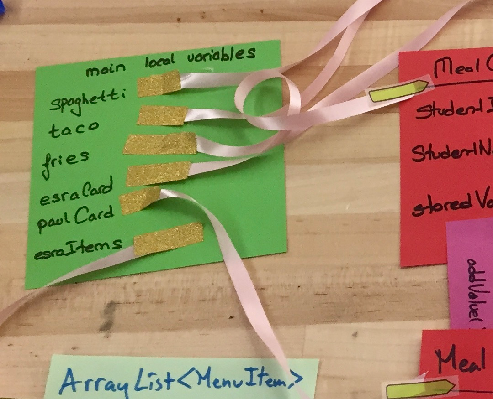
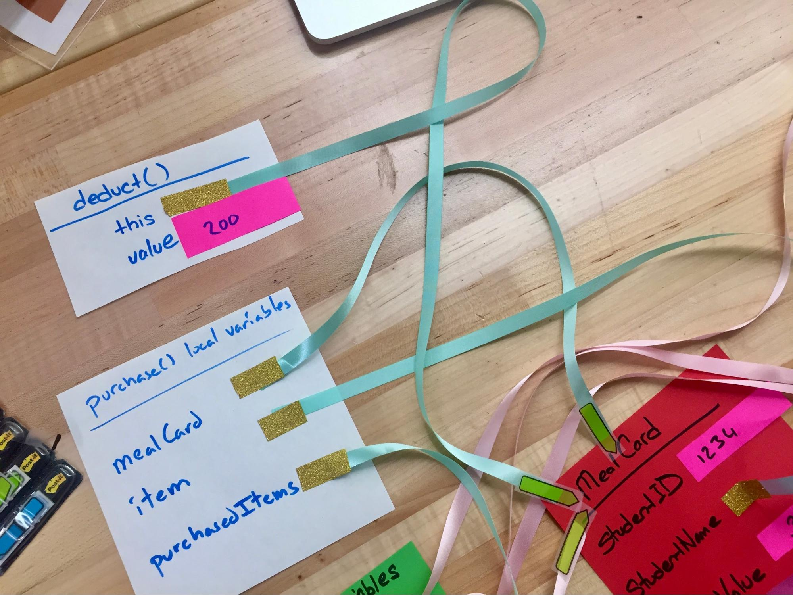
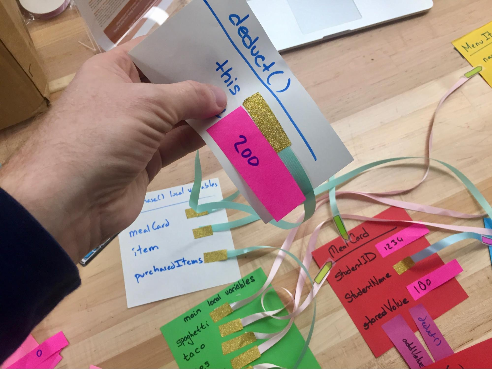
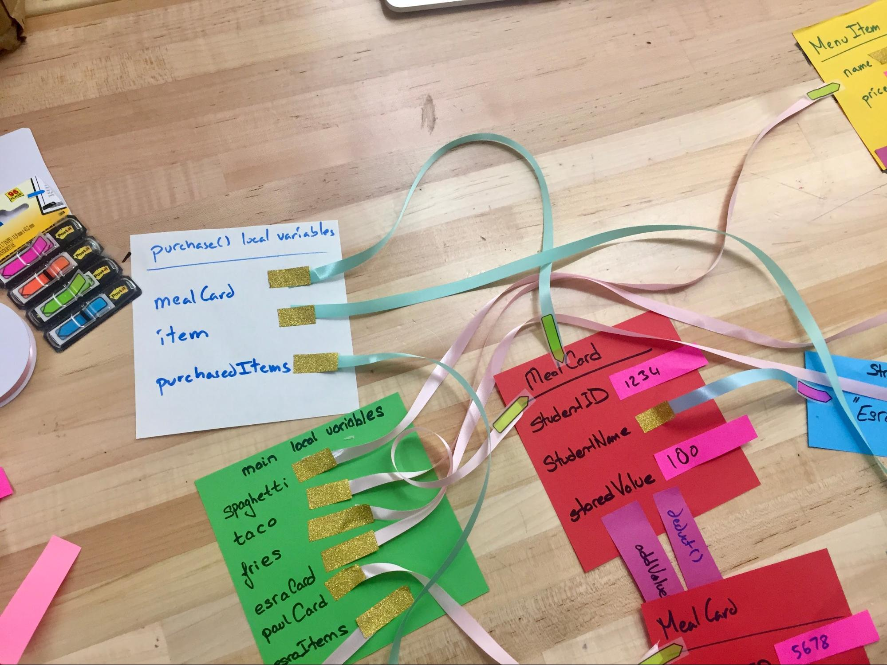
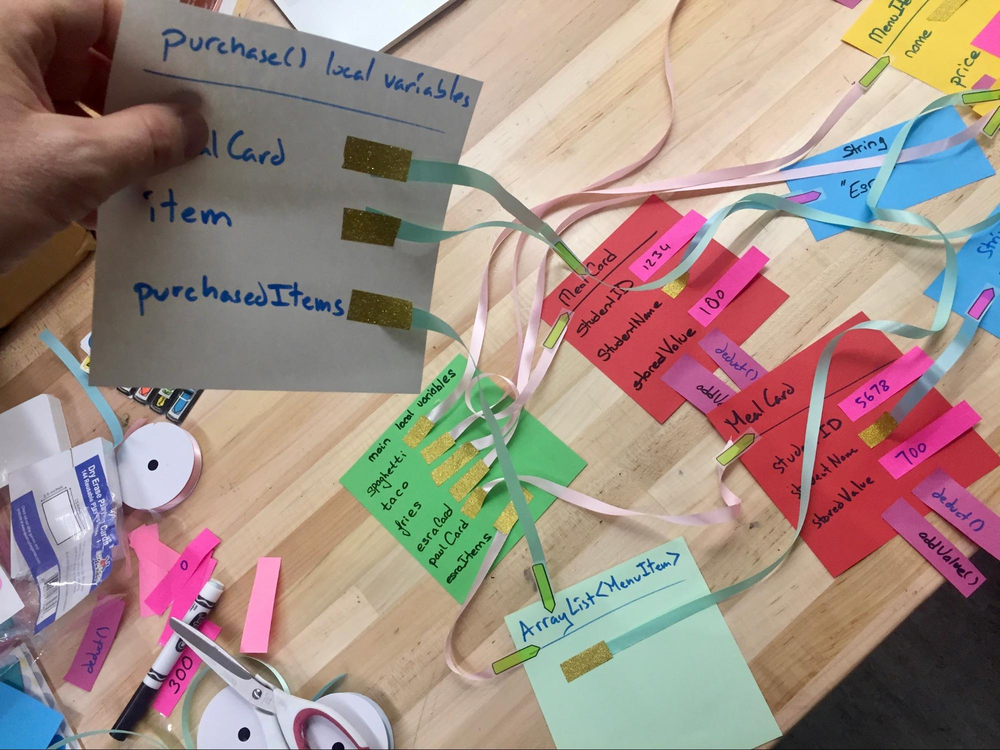
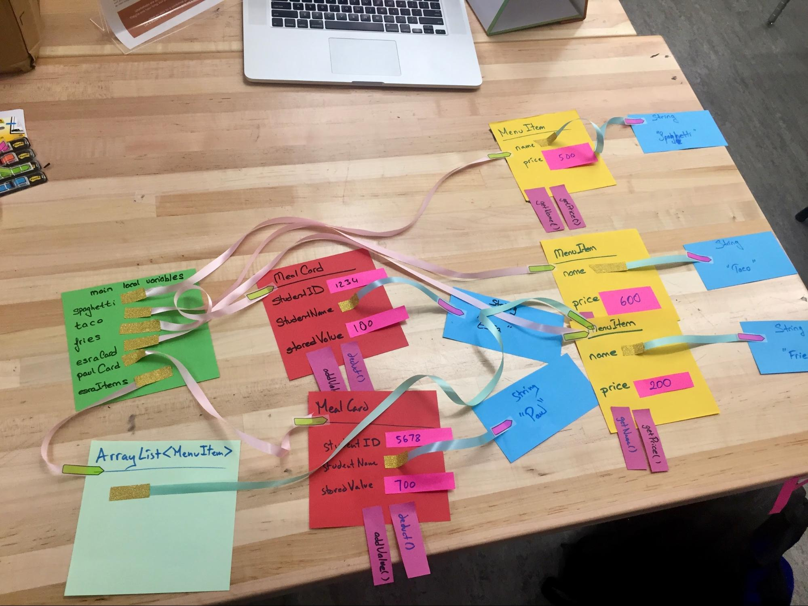

# Example solution

Here is a picture of what that whole object graph might look like when you are done. This is only to give you a sense of what you’re building, so you know if you’re on the right track — but **don’t just copy**  this picture! Instead, work through the code and think it out for yourself, or the whole point of the activity is lost.

We put `main()`’s **stack frame** on a separate sheet of paper:

Here is a close-up with a new sheet of paper to represent the stack frame created when `purchase()` is called.

This image shows another new sheet of paper to represent the stack frame for `deduct()`.

These images show the process of removing a call to `deduct()` once it has finished executing.

This is the same process happening after the call to `purchase()` has completed!

Here is what the state of your objects should look like when you’re done:

