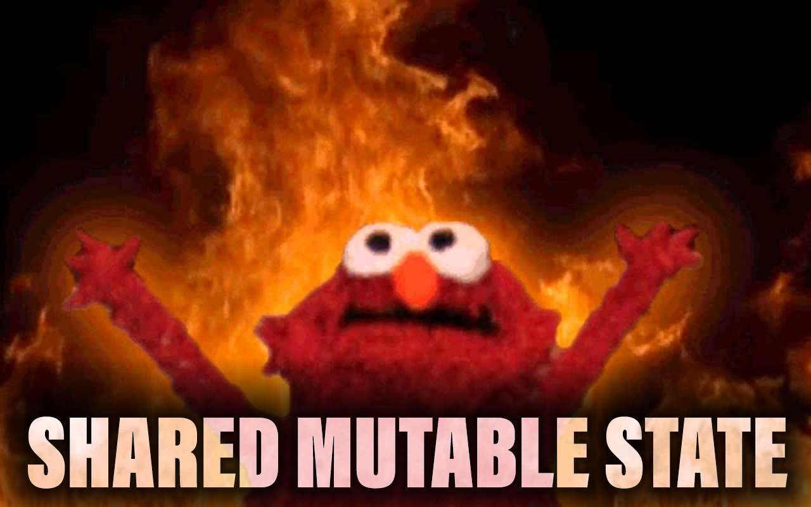
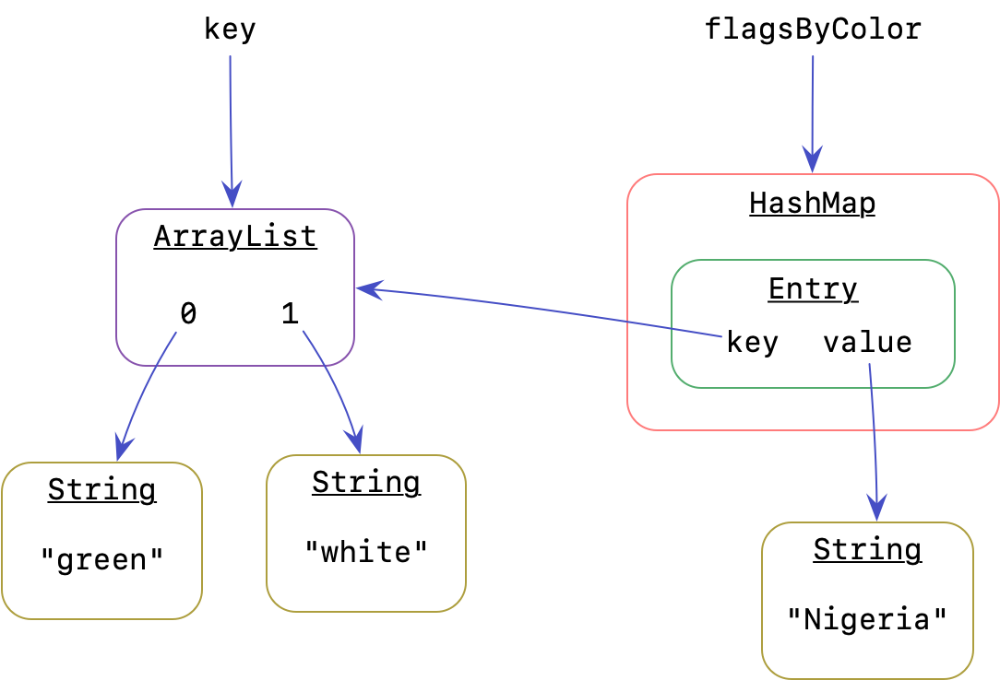
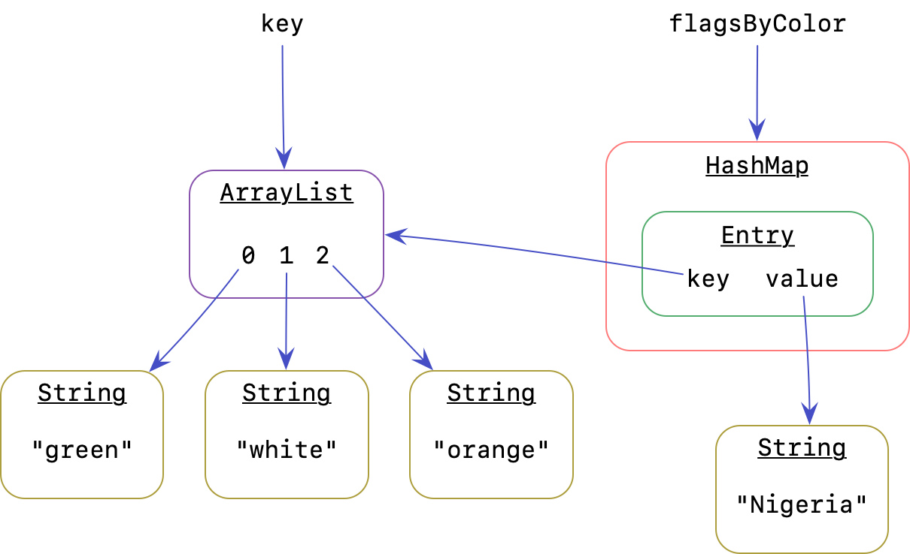
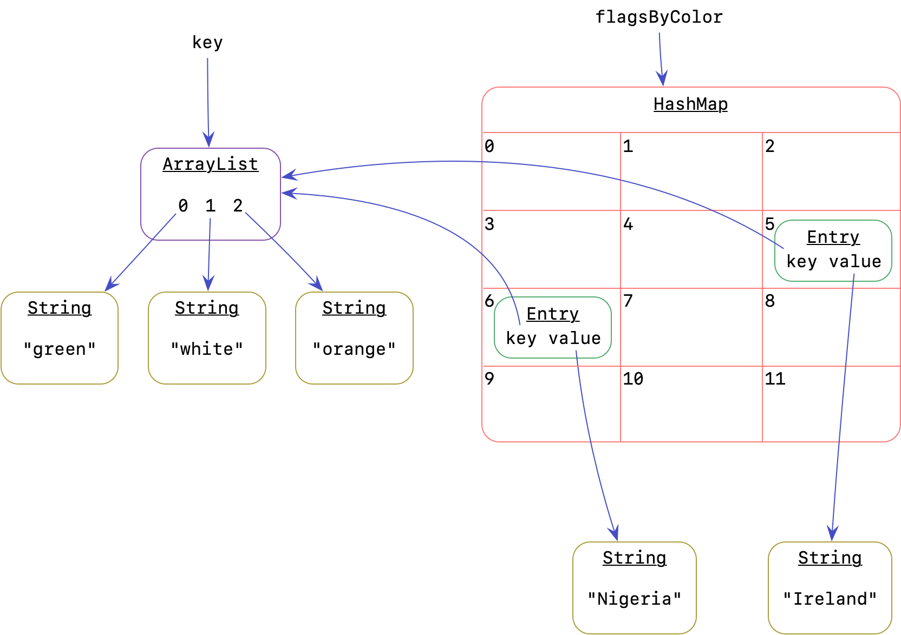

# Introduction to Maps

{:standard_toc}

## Learning objectives

- Learn the **Map API**: declaration, insertion, accessing elements, and removal
- Understand the structure of **keys**, **values**, and **entries** in a map, and learn to iterate through each in Java
- Practice the general skill of **learning and working with a library’s API**

## Maps

<def term="Map (data structure)">Maps</def> pair <def term="key (in a Map)">keys</def> with <def term="value (in a Map)">values</def>.

Keys are unique: if a key is present, it has exactly one value.

Values are not necessarily unique: multiple keys could have the same value.

In this activity, you will learn how to perform common operations with the Map API. `Map` is an interface (like `List`), and the most common implementation of `Map` is `HashMap`. Thus, if you are creating a map from Student ids (Integers) to Student objects, you would declare and initialize the map using the following:

    Map<Integer, Student> studentsByID = new HashMap<>();

(Note that in another recent activity, you learned about the `map` operation on streams. Even though it (unfortunately) shares the same name, the `Map` interface we are studying today is only distantly related to that steam operation. They both use the word “map” based on the mathematical idea of mapping: “this corresponds to that.” Despite the shared name, they are completely different things in Java.)

Note that there are two type parameters for Maps: the key type (in this case `Integer`), and value type (in this case `Student`). This map thus might hold data that looks like this:

| `10111235` | → | `Student(name=Sally, year=sophomore)` |
| `10125263` | → | `Student(name=Fred, year=first-year)` |
{:.compact}

The golden rule of maps is the following **invariant** rule:

<callout>
  For each _key_ in the map, there is **exactly one** _value_.
</callout>

Many keys may have the same value, but there is only one value for each key. For example, for a map that associates strings to integers --- that is, `Map<String, Integer>` --- here is an example of one set of mappings that is possible, and another that is impossible:

✅ Possible:

| `“one”`    | → |  `1` | |
| `“two”`    | → |  `2` | |
| `“double”` | → |  `2` | _(Two keys have the value 2)_ |
| `“three”`  | → |  `3` | |
| `“triple”` | → |  `3` | _(Two keys have the value 3)_ |
{:.compact}

❌ Not possible:

| `“several”` | → | `2` | |
| `“several”` | → | `3` | _Nope! The key “several” can only have **one** value_ _(In this example, adding the second entry would replace the first)_ |
{:.compact}

If you took Comp 123, all of this may be familiar: Java’s “map” is the same as Python’s “dictionary.” This same abstract data type exists in many other languages, which variously call it “dictionary,” “map,” “associative array,” and “hash.” The **syntax varies** quite a bit from language to language, but the **abstract structure is the same**. Keep in mind, therefore, that you are learning both the Java-specific API _and_ the general abstraction and its patterns of use.

Here is [a quick reference on basic Map methods in Java](https://www.codebyamir.com/blog/how-to-use-a-map-in-java) if you’d like to keep one handy.

## Task 1: Map basics

Look at the `Restaurant` class, and understand what it represents and how to create one.

Your first task is to complete the six steps listed in `RestaurantExplorer`. [There are hints for many of these in the Map JavaDoc](https://docs.oracle.com/en/java/javase/17/docs/api/java.base/java/util/Map.html).

1. Create a new map from restaurant names to `Restaurant` objects.
2. Add five new restaurants to the map. They can be anything you want — perhaps your five favorite restaurants!
3. Print the names of each restaurant in the map (by looping over the map, not by copying strings in the code).
4. Remove one restaurant from the map. Check to make sure it is gone.
5. Print out each restaurant object. (`Restaurant` has a reasonable `toString()` method, so you can simply pass a restaurant to `println()` and it will come out nicely formatted.)
6. Print out the restaurant name and object pairs.
7. Replace the value for one of the names that is **already present** in the map with a different `Restaurant` object. (Do you need to remove the existing value first? <hidden>No, you do not!</hidden>)

## Task 2: Word count

Look at `WebWordCounter`. Your goal is to complete a main method that counts the frequency of each unique word in some text file on the web.

Complete the 4 steps outlined in the `main` method.

**Optional:** Once you have it working, you can try it on some different text. Look through [this resource](http://textfiles.com/directory.html) and find a text file that looks interesting to you. Get the URL of that text file: open the specific text file you want in your browser, and then copy the URL (web address) from the browser’s address bar. Change `TEST_URL` to point to this URL in `WebWordCounter`.

## Task 3: Extra fun chaos! {#map-keys-chaos}

Look at the code in `Flags`, but **do not run it yet!**

1. Study the code. Ignore the commented-out code for now; just look at the code that will run.

   Look at the declaration of `flagsByColor`. What is the type of the **keys** in this map? <hidden>`List<String>`</hidden> And what type are the **values**? <hidden>`String`</hidden>

   Look at the main method. **What will this code print?** Make your guess first. Then run it and check your guess.
2. Using what you learned from what happened in section 1, uncomment section 2 and repeat the same exercise: **study the code, guess the output, then run it and check your guess.** Was anything surprising? Form a theory about what’s happening.
3. Repeat the same process with section 3…
4. …and section 4.

What is going on?! Scroll down when you’re ready to find out.

<scroll-for-answer/>

[spoiler warning]

<scroll-for-answer/>

Why look, it’s our old friend…

<scroll-for-answer/>

{:scale="2"}

### _[echoing evil laughter]_

Consider just this much of the code from `Flags`:

    private static final Map<List<String>,String> flagsByColor = new HashMap<>();

    ...

    List<String> key = new ArrayList<>();
    key.add("green");
    key.add("white");
    flagsByColor.put(key, "Nigeria");

What do the objects look like after this code runs? You might reasonably have a picture like this in your head:

![The key variable points to the list [green, white]. The flagsByColor variable points to a HashMap with its own separate copy of the list "green, white" as a key.](images/map-state-wrong.png){:.dark-mode-invert}

However, that picture misses something very important: the `ArrayList` and the `String`s are all objects — and one of those objects is **shared**. The reality is closer to this:

{:.dark-mode-invert}

Do you spot the shared object? Note the two arrows pointing to the `ArrayList`: the object that our main method’s `key` variable points to is the _same object_ that the map is using as a key. That `ArrayList` is <def entry="aliasing">aliased</def>: two different variables point to the same object. That means that when we run this code:

    key.add("orange");

…then this happens:

{:.dark-mode-invert}

Because the `HashMap` is sharing the _same_ mutable `ArrayList` object to which we are adding new elements, now the value `Nigeria` is stored in the map with an incorrect key! (The Nigerian flag 🇳🇬 has no orange.) That is why this document places the words **shared mutable state** atop flames and chaos above.

### It gets worse

Based on the picture above, we might well expect that the following line of code would _replace_ the value `Nigeria` in the map:

    flagsByColor.put(key, "Ireland");

…because we are putting a new value in the map with the same key as an existing one. It’s not even just that there are two keys whose values are equal; it is _the very same object_ that we passed to the `put` method the first time!

And indeed, at first it appears that the new value replaced the old one: when we ask the map to get the value for the key `List.of("green", "white")`, we get `null`. That sure _sounds_ like `Ireland` 🇮🇪 replaced `Nigeria` 🇳🇬. But then, when we ask for the _size_ of the map, it tells us there are multiple things in it. What?! If we were replacing the old values with the new ones at each step, we would expect the size to be 1 at the end. But it’s not!

Why??

The picture above is still not completely accurate. In software as in life, **there is always yet more hidden complexity.** An even more accurate picture of the map just after we add `Nigeria` would be this:

![Now the HashMap has a grid with numbered squares. Once again, the ArrayList contains just [green, white], and the HashMap has one entry for Nigeria. The Nigeria entry is in square number 6. The other squares are all empty.](images/map-state-buckets0.png){:.dark-mode-invert}

`HashMap` is built for speed. When you ask it to find the value for a given key, it doesn’t want to have to look through _every_ single entry in the whole map. To make key lookup faster, `HashMap` places its entries in buckets that are organized by key. Think about how you might group papers in file folders organized by year or by first letter of the name. Or think about how a library assigns numbers to its books, then labels each shelf with a specific range of book numbers. In a similar way, `HashMap` assigns a number (called a “hash code”) to every possible key and then organizes all its entries in bins according to that number.

(How does this mysterious process work? You can learn all about it in Comp 128. In fact, in that course, you will build it from scratch yourself!)

This “organized in bins” system is where things go _really_ wrong with the code in `Flags`. When the main method adds `orange` to the `key` list, it changes the existing map entry’s key too — but `HashMap` has no idea that the key changed, so the entry _stays in the same bin_, which is now the _wrong_ bin:

![The ArrayList contaings [green, white, orange]. The picture is otherwise unchanged. The Nigeria entry still points to this ArrayList, and is still in grid square 6.](images/map-state-buckets1.png){:.dark-mode-invert}

Imagine that you go into a library and write a new number on the spine of one of the books on the shelf. Then you ask the librarian to go find that book using the _new_ number that you just wrote on the book. They probably won’t be able to find it: they will look where the book with that number _should be_, not where it _is!_ That’s what we’re doing to poor `HashMap`: we’re changing the number of a book that’s already on the shelf.

When we ask to put `Ireland` in the map, `HashMap` dutifully checks whether there is already an entry with the same key. And there is such an entry! But it’s filed in the wrong bucket, so `HashMap` doesn’t find it. The old entry stays, the new entry gets added, and we end up with something like this:

{:.dark-mode-invert}

We now have a map with two entries for the same key, one of which is unfindable by the map because it’s in the wrong bucket. This is why the flames-and-chaos image up above is really _big:_ bugs involving shared mutable state can cause **cascading effects** that are quite surprising and insidious.

Run the full `Flags` code again. You can now make sense of every line of its cursed output.

### So what do we do about this?

Wait a minute: wasn’t it supposed to be an **invariant** of the map interface that there is only one entry for a given key? There are _two_ entries with the same key in the picture above! Doesn’t that break the invariant?!

The answer is **yes**. Yes it does.

Does that mean `HashMap` is broken?

No.

In addition to the _invariant_ about unique keys, the `Map` interface’s `put` method also has a _precondition_: **don’t mutate the keys.** That’s why it’s called an API **contract**: it requires both the abstraction’s implementation and the abstraction’s clients to do their part. The map interface makes a deal with us as map clients: “If you don’t mutate the keys you provide, I will make sure the keys are unique. Mutate the keys and you’ve broken the contract; all bets are off.”

The best way to avoid the problem we’ve created in `Flags` is to **always use immutable keys in maps**.

Have you wondered why Java’s `String` class is immutable? Well, here’s one reason: it is _always_ safe to use strings as keys in a map in Java. Nobody can mutate a string key and mess up a map. They can make _new_ strings by calling `substring` and `toLowerCase` and the like, but they can’t modify the _existing_ strings, so they can’t wreck any maps that are using those strings as keys. (That’s in Java. In, say, C, you get no such guarantees.)

Early in the class, students often ask, “Why should a class ever be immutable? Isn’t it better to allow every object to change, just in case we need to change it?” Here is your answer to that question: mutable objects mean shared mutable state. And shared mutable state means flames. And chaos. And Elmo.
