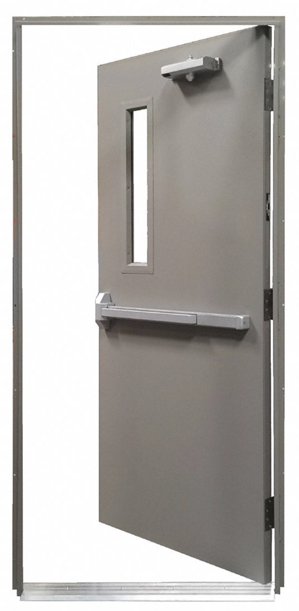

<!-- TODO: How do we want students to submit these? Just have them check it with the instructor in class? -->

# Opening the Door

Remember the activity from the first day of class? Today we will be returning to our classroom’s humble door, sketching out what a Door API might look like.

{:standard_toc}

## Learning goals

As on the first day of class, today’s activity involves no code. Later this week, you’ll have your head deep in details. Today we are focusing on abstract concepts. This activity’s learning goals:

- Form a conceptual understanding of how APIs are designed
- Practice designing an API using a day-to-day example
- Be aware of decisions involved when designing APIs
- Think about how APIs affect code compatibility
- Think about how use cases shape API design

**Aside: on "Norman doors" and usability**

In the background of this exercise are considerations of _usability_. How easy or difficult is it to use a particular door? Is it obvious how to use it? It turns out that doors have become a somewhat famous example of usability and design. Don Norman wrote [*The Design of Everyday Things*](https://en.wikipedia.org/wiki/The_Design_of_Everyday_Things), a book on, well, the design and usability of everyday things. He included a chapter on doors, and afterwards people started sending him examples of very poorly-designed doors.

You may think, _how hard is it to design a door? How can you mess that up?_

It turns out...there's no end to the ways one can design a door so that it is hard-to-use. Some doors are such an overtly user-hostile usability dumpster fire you might think they were deliberately made that way by some misanthropic designer.

You don't have to look far for examples of doors with design missteps: [here's the Macalester library](images/norman-door-in-macalester-library.jpg). (Do you push or pull that door to use it?) Observe that [the library owns a copy of *The Design of Everyday Things*](https://macalester.on.worldcat.org/search/detail/849801329?queryString=design%20of%20everyday%20things).

After you're done with this exercise, look up "Norman door" and marvel at the endless ways one can poorly design a door!

## Task 1: Start from the outside in

_Time goal: <3 minutes_

<callout>
  A great way to start designing an API is to <highlight>first think about how you want the API to be _used_</highlight>. What should code that uses this API look like? What terminology and usage patterns will make sense _at the point of use?_

  Software developers often take this “outside in” approach when designing an API, sketching out hypothetical code that uses the API before the API actually exists. You’ll start today’s activity by practicing that same approach _without_ code.
</callout>

Create a new digital document for your group (Google Doc or other, doesn’t matter) and write in it (in natural language, not Java!) instructions for **how to open the door to this classroom**, following these guidelines:

- You **must not** assume that the word “open” (or any synonym for it) is already defined. Defining the “open” action is your job.
- You **should** assume that we already have definitions for all the _parts_ of the door, and any actions that are possible with those parts.
- You **should** also assume that the reader of the instructions knows their own body (e.g. “hand”) and how to use it (e.g. “hold”), and also knows general concepts of geometry and direction (e.g. “down”).
- Don’t look at the instructions provided on the first day of class! **Invent your own.**

Your instructions should be around **30-40 words**. If your instructions are any shorter, you need to spell things out just a little more. If they are getting much longer than that, then they are too precise or too pedantic for today’s exercise. The goal here is to build up the idea of “open the door” using building blocks that are just _one_ level of abstraction lower.

## Task 2: Identify the API

_Time goal: \<10 minutes_

Go through the instructions you wrote, and highlight in **bold** all of the terminology that would need a definition in order for a person to follow the instructions. Look for nouns, verbs, descriptive terms, whether door-related or not — anything that isn’t generic English connecting words like “the” or “until.”

Copy all the boldfaced terms into a new document (Google Doc or other, doesn’t matter), each term on a separate line.

(**Do not** write definitions for your terms! That is too much for this exercise. You are only listing what things will be part of the API, not working out their definition / implementation.)

Group your terms into 2-4 broad sections, such as “Door” and “Person.” (Those are only suggestions. You can make up section titles that fit whatever terms _you_ came up with.)

Within each section, group words into **entities** (such as “handle” or “arm”), **actions** (such as “pull”), and **constants** (such as “clockwise”).

This list is now a sketch of the API your door-opening instructions would need in order to function. Your instructions are the **client** of this new, hypothetical API. What you have now is a picture of what the **provider** of the API would need to offer.

<callout>
  If you were designing an actual API for a door in code, you would need to think through all of this in far more detail: What are the specific classes? Is a single Door object composed of smaller objects, and if so, what are their classes? What are the has-a and is-a relationships? Are all the actions methods, or are they something else? What specific parameters does each method take? etc.

  <highlight>Despite the simplified form of this exercise, the thinking you are doing now resembles the real work a programmer might do when designing an API.</highlight> People often create a sketch of classes and methods using an imprecise “boxes and arrows” diagram or similar, leaving out some details and not yet worrying about the code that actually _implements_ any of those methods.
</callout>

⚠️ **Before you move on** to the next task, **flag the instructor** and have them look at your work to make sure you’re on the right track. ⚠️

## Task 3: Drop in mismatched client code

_Time goal: 5 minutes_

**1.** Ask another group to **send you the text they wrote in Task 1** (their door opening instructions, _not_ their API). Use email, Slack, Google Docs sharing — whatever works for you. (Note that it’s OK if they’re not up to Task 3 yet; they just need to have completed Task 1.)

**2.** Try to interpret _their_ instructions using _your_ API. Remember: **the instructions can’t use any term that is not part of your API**. Do their instructions work with your API? (The answer is almost certainly “no.” If they do work, either it’s an extraordinary coincidence, or you’re not reading very carefully!)

Note that **you don’t need to change anything:** not your API, not their instructions, not your instructions. Just notice how two attempts to create an API for the same thing can end up being different, and how those differences make instructions written for one API incompatible with instructions written for the other.

**3.** **What stops their instructions from working with your API?** Study that question. It’s easy to skip through this part fast. Don’t! Think it through. How much would their instructions have to change to fit your API? How much would your API have to change to fit their instructions?

Are there terms that are essentially synonymous, but the two groups chose different words for the same thing? Did the other group do something your instructions didn’t, or vice versa? Did they take a fundamentally different approach, choose different building blocks? Did they decide to work at a different level of abstraction than you did?

If you truly don’t see many differences, try swapping your instructions with another group.

**4.** Write down your observations from the above step. Send them to the other group. Then, examine the observations your group receives on _your_ Task 1 text. Is your API missing anything? Are any parts hard to use?

<callout>
  Swapping your instructions with the other group’s is <highlight>analogous to copying and pasting code designed for one API into a context that expects a different API</highlight>.

  For example, if you search the web for “Java graphics” or “Java UI,” you might find code designed for Java2D, Swing, JavaFX, AWT, or Android. All of those are Java, but all of them provide _different APIs_ for doing graphics and/or user interfaces. None of those APIs are the same as Kilt Graphics. If you try to paste example code that uses those other APIs into a Kilt Graphics project, it won’t work — even though the code _is_ in the same language!

  Why? It’s the same reason that another group’s door opening instructions won’t work with the API you came up with, even though your instructions and theirs are written in English.
</callout>

## Task 4: Think about generality

_Time goal: rest of class_

Suppose Macalester facilities replaced the classroom door with an identical door. Would your instructions and your API still work?

What if facilities replaced the internal latch mechanism with a completely different newer model that lasts longer, but the door still looks and behaves the same from the outside. Would your instructions still work? Have you successfully decoupled interface from implementation?

Do your instructions work for going through the door in both directions (exiting _and_ entering the classroom)? If not, try rewriting them so they do. Do you need to add anything new to your API for these updated instructions?

Now suppose you have to write instructions for opening each one of the following doors. Study the mechanism of each one closely! (You can right-click and open the images in a new tab to see them full-size.)

{:scale="0.15"}  {:scale="0.15"}

{:scale="0.15"} {:scale="0.35"}

Images 1-2 (top): Paul Cantrell; Image 3 (bottom left): Grainger; Image 4 (bottom right): [Forestiere Underground Gardens](https://undergroundgardens.com).

 Some difficult questions to consider (not to **do** yet, just to **consider** for now):

- For each kind of door, could you **adapt** and **generalize** your existing instructions and API so that they work for this new kind of door _and_ the classroom door? Could the same instructions handle all five kinds of door?
- If you were to adapt your instructions for each door type, would you do it by **broadening** the terminology of your API? (For example, maybe you need a word that covers both “handle” and “knob” and anything else that opens a door by turning.) Or would you do it by making some portion of the instructions **conditional**?
- At what point do the adapted instructions become so complicated that it would be better to simply write different instructions for different kinds of doors?

Now that you’ve considered all that, try out the following approach a little, not necessarily _completing_ each one, but exploring each enough to see where it leads and what kinds of trouble it causes:

**APPROACH 1: Separate APIs, separate instructions**

- Try listing out a new API for several (maybe 2-3) of the other doors, and write out separate instructions for opening each one.
- Does this feel like a good fit? Does it create redundancy?

**APPROACH 2: Single API, separate instructions**

- Try making a single unified API that can be used to open _all_ of the doors. There might be some things in the API that only apply to _some_ of the doors. That is OK! Just make sure there is enough in the API to describe how to open every one of the doors.
- Write separate instructions using this unified API for at least 2-3 of the doors.
- What is hard about making a single API describe all of them? Does this feel like a good fit? Does the API become awkward?

**APPROACH 3: Single API, single instructions**

- Try using your unified API to write a _single_ set of instructions that applies to all the doors. It might have to contain statements like “If the door has a knob….” That is fine, but remember that means that you would need to add something to your API that lets you ask whether the door has a knob!
- Is this “single instructions” approach workable? How is it preferable to the choices above? How is it worse?

<callout>
  The questions you’re asking in this task are <highlight>closely analogous to the difficult questions that software developers face when maintaining a software API</highlight>. Whenever code gets used by new clients in new contexts, there is pressure to adapt existing code to handle new cases, and to expand existing APIs to describe additional things.

  Sometimes incorporating new use cases can improve an API, or make the code more robust and more flexible. Sometimes incorporating new use cases can complicate the code, making it harder to maintain and more likely to break. Sometimes an API that tries to do too many things at once becomes too confusing for anyone to use.

  Sometimes the best answer to a problem is to say, “No, we don’t handle that.” And sometimes saying that makes code cease to be useful.

  <highlight>Some of the most difficult and important questions a software team faces are not about what technology to use or how to use it, not about how to implement an algorithm or design an API, but rather about _deciding what problem to solve_ in the first place.</highlight>

  Should the five doors in this assignment all have the same API, or are some (or all) of them fundamentally different things? Does your door-opening software need to handle all of these kinds of door? Will it in the future? Is it worth preparing for the future just in case, even if it makes things worse now?

  Every possible answer to these questions is _wrong_ in one way or another. As a software team, you have to pick one of those wrong answers. Then you have to live with it. That is the nature of software development.
</callout>

## Task 5: Think about accessibility and equity

Does your model --- and the corresponding door it models --- work equally well for *everyone*? For example, what about <hidden>a person who uses a wheelchair?</hidden>

If not, your API is inequitable and discriminatory.

Models and algorithms can be unfair. You, as a designer and software developer, have some ethical obligation to consider questions like these:

1. Does this door work equally well for everyone?
1. If not, in what ways and for which users does it _not_ work well?
1. When it doesn't work well for someone, to what degree does the door not work? Is it just a minor irritation, or is the user completely unable to use the door?
   - Corollary: does that "someone" systematically have to handle other things that don't work for them? A minor irritation may not be so minor if the user is exposed to many, many other related minor irritations.
1. What could be done to address those failures? What **should** be done? (Note that sometimes, "nothing" is a good answer.)

Take another look at your API. Would it need to change if any of the changes above are implemented?

The users you thought of above are those who use a wheelchair. But there are other users who ought to be considered. Try to think of some, and then see below for some of our ideas for some such users.

(Design terminology: an **[affordance](https://en.wikipedia.org/wiki/Affordance#As_perceived_action_possibilities)** is some perceivable feature that presents action possibilities to a user. A doorknob presents the possibility of turning it and pushing or pulling; a wide horizontal pushbar presents the possibly of pushing it to open the door.)

Go through the table below:

1. For each row, click to reveal the user type.
2. What barrier to using the door might that user have?  Click to reveal one idea.
3. If you addressed that barrier, perhaps others would benefit too! Click to reveal some such users. Can you think of any others?

So: when you make the door usable for people in the first column, you
almost always make it easier to use for **all users**. This approach is
called [universal
design](https://en.wikipedia.org/wiki/Universal_design). There's a good
chance that already today you have somehow used or benefited from
something incorporating the ideas of universal design.

||============================================================||

[user]    User
[barrier] Barrier to use
[benefit] Who else might benefit?

||============================================================||

[user]    <hidden>Has crutches, walker, those little knee-scooters, etc</hidden>
[barrier] <hidden>Can't use door with affordance like knob or push-pull bars</hidden>
[benefit] <hidden>Someone carrying something heavy with both arms</hidden>

||------------------------------------------------------------||

[user]    <hidden>A parent with a large stroller</hidden>
[barrier] <hidden>Can't keep door open to get stroller through</hidden>
[benefit] <hidden>Someone pushing a dolly or cart</hidden>

||------------------------------------------------------------||

[user]    <hidden>Small children</hidden>
[barrier] <hidden>Not strong enough, too small to get enough leverage on a heavy door</hidden>
[benefit] <hidden>Anyone else who is not tall or strong or is just tired or physically weak</hidden>

||------------------------------------------------------------||

[user]    <hidden>Blind or poor eyesight</hidden>
[barrier] <hidden>Can't find affordance to open door</hidden>
[benefit] <hidden>Everyone else looking at the door figuring out if you push or pull it, and how to do so</hidden>

||------------------------------------------------------------||

Note that many of the users above are not permanently in this state of
needing some extra affordance to use the door! Being "disabled" is not a
fixed characteristic; it's time-dependent. Or, more simply, and thinking
the other way around: "we are all temporarily abled".

<highlight>
Keep that in mind as you model systems and create algorithms!
</highlight>
