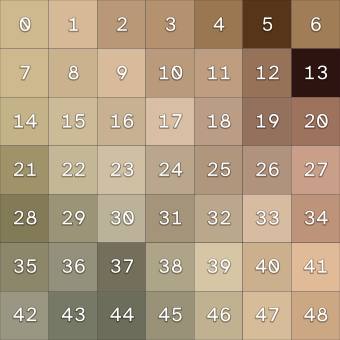
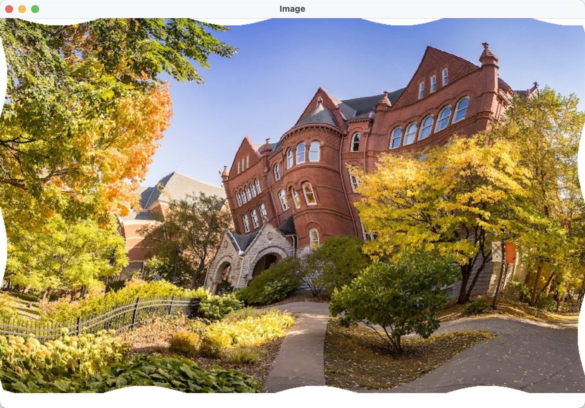

# Pixel Arrays

{:standard_toc}

## Learning goals

In this activity, you will use arrays to modify images based on the underlying pixels. After this activity, you should be able to:

- Declare and instantiate arrays in Java
- Iterate through values in an array
- Modify array values
- Check for array indices that are out of bounds

In addition practicing these array-related skills, you will practice the excellent habit of writing code in **small, testable steps**. Don’t be intimidated: today’s activity has a lot of steps, but they are baby steps!


## Arrays: a quick review

<callout>
  You’ll need to **move quickly** to finish this activity — and the end of the activity is really cool, so you _want_ to finish it! This section is review if you did the reading. Give it a quick read, keep it for reference, and get started ASAP.
</callout>

An <def>array</def> is a data type which holds elements arranged by index. In Java, unlike `Collection` subtypes (e.g. `List`, `Set`), an array can hold primitive data types without needing an object wrapper class. This makes arrays the preferred way to **store large quantities of numerical data** in Java.

<details>
  <summary>
  Huh? What does that mean?? What’s an “object wrapper class?“ (Read this after class if you want to learn more)
  </summary>

  For example, you can have an `int[]` (int array) in Java, but you _can’t_ have a `List<int>`. You can only have a `List<Integer>`.

  An `int` is **not** an object; it is a primitive value. It has not methods, and it can’t be null. An `Integer` **is** an object: it belongs to a class, it has methods, and it can be null. For complicated reasons, Java’s collection types (like `List` and `Set`) can only hold objects.

  Objects are less efficient than primitives: they take more memory, and code that creates them in large numbers tends to run more slowly. This is usually fine when we have small numbers of objects — say a few thousand — but for an image with _millions_ of pixels, it can become a problem.
</details>

Arrays show up in most programming languages, and if you continue in the Computer Science sequence, you will use them to build your own collection types in COMP 128: _Data Structures_ and see the details of their implementation in COMP 240: _Computer Systems_!

Here is a reference for the array syntax you will need:

```
// Declare an array variable
int[] things;

// Instantiate (or “allocate”) an array of size 100
new int[100]

// Declare an array variable and initialize it to a new array
int[] things = new int[100];

// Get the size of an array
things.length

// Get an array element
things[n]

// Set an array element
things[n] = ...;
```

<callout>
  Keep this syntax handy for reference during the activity.
</callout>

In this activity, you will work with array that contain pixels. A <def>pixel</def> is tiny dot (usually square-shaped) that has a single color. Computer images are made of many pixels arranged in a grid. “Pixel” is short for “**pic**ture **el**ement.”


## The plan

We are going to write code that takes an input image, reshapes and distorts it, and then displays the resulting image. How will we do the reshaping? By looping over all the pixel coordinates of the _output_ image, and asking for each one: “What _input_ image coordinates should this pixel come from?”

Here is some **pseudocode** for the approach we will use. (“Pseudo” means “false” or “fake.” This is fake code to help us think and plan.)

<callout>
  Don't implement this yet!! This is just a plan! Don't rush ahead. Remember: we are going to work in **small, testable steps**.
</callout>

```txt
load input image
get width, height from image

srcPixels ← pixels of input image  (src = “source”)
dstPixels ← new array w/same size  (dst = “destination”)

for dstX, dstY in all the destination pixel coordinates:
  srcX, srcY ← some transformation of dstX, dstY
  dstPixels at (dstX, dstY) ← srcPixels at (srcX, srcY)

create output image from dstPixels
create a CanvasWindow
add output image to canvas
```

Study that pseudocode with your partner. Talk through it together; explain it to each other. Ask questions. When you think you both understand, move on.


## Step 0: Load an image and display it

The `Image` class in Kilt Graphics has a [constructor that can load an image from a file](https://mac-comp127.github.io/kilt-graphics/edu/macalester/graphics/Image.html#%3Cinit%3E(java.lang.String)). It takes a single `String` parameter, which is the name of a file in the `res` folder of the project. You use it like this:

```
new Image("mscs-shield.png")
```

You will use this to load an image from a file and show it on the screen. Eventually you will transform this image, but for now, we are just going to make sure we can load it and display it.

Open up the `SpatialTransform` class. Add a main method. (Remember: in VS Code, you can just type `main` inside a class and then choose the autocomplete option to create the main method.)

In the main method:

- Create a new `Image` object from the file `"mscs-shield.png"`.
- Assign it to a local variable named `srcImage`.
- Create a new `CanvasWindow` with a size of 900×600.
- Add the image to the canvas.

Hints to help get you started:

- How do I create an `Image` from a file? <hidden>The instructions above give you the code.</hidden>
- How do I create a `CanvasWindow` again? <hidden>Type the syntax for instantiating a `CanvasWindow` object, and use the VS Code info window that pops up to remind you what the constructor parameters for `CanvasWindow` are.</hidden>
- How much code should this take? <hidden>About 3 lines inside the `main` method.</hidden>

**Run and test your code.** (Remember, one of today’s learning goals is taking small steps and testing every step!) You should see the MSCS shield image.


## Step 1: Convert to an array and back

To do our image transformation, we are going to put all of the pixels for our image in an **array of `int`s**. Each `int` will represent the color of one pixel. (The details of exactly _how_ an int represents a color are not today’s topic, but you can learn a bit more about color representation in digital graphics if you do the bonus part of this activity.)

Before we do any transformation, let’s just make sure we can turn our image into an array, then turn the array back into an image. Update the `main` method with the highlighted changes:

- <muted>Create a new `Image` object from the file `"mscs-shield.png"`.</muted>
- <muted>Assign it to a local variable named `srcImage`.</muted>
- <highlight>Get the pixels of `srcImage` as an array of ints using the `toIntArray()` method of `Image`.</highlight>
- <highlight>Assign that to a local variable named `srcPixels`.</highlight>
- <highlight>Create a new image from `srcPixels`.</highlight>
- <highlight>Assign that new image to a local variable named `dstImage`.</highlight>
- <muted>Create a new `CanvasWindow` with a size of 900×600.</muted>
- <muted>Add </muted><highlight>`dstImage`</highlight><muted> to the canvas.</muted>

Hints:

- How do I declare `srcPixels`? <hidden>The type of the variable is an array of ints, and the syntax for that is <hidden>`int[]`</hidden>. The declaration is thus <hidden>`int[] srcPixels`</hidden>.</hidden>

- How do I create a new image from a pixel array? <hidden>Look for a constructor in the [`Image` docs](https://mac-comp127.github.io/kilt-graphics/edu/macalester/graphics/Image.html) that takes an int array.</hidden> What _other_ parameters does it require? <hidden>`width` and `height`</hidden>. And how do you get those? <hidden>Ask `srcImage` for its size using `getImageWidth()` and `getImageHeight()`.</hidden>

  So that means the syntax for creating the new image from the pixel array is (**think for a moment** before you reveal the answer, but then don’t hesitate to reveal the answer so you can keep moving quickly):

  <hidden-block>
  ```
  new Image(srcImage.getImageWidth(), srcImage.getImageHeight(), srcPixels)
  ```
  </hidden-block>

**Run and test your code.** Taking tiny testable steps like this doesn’t help much unless we actually _test_ each step! You should still see the same picture on the screen, even though you’re now putting a _different_ image object on the canvas..


## Step 2: Copy the input image pixel by pixel

To do our transformation, we will need _two_ arrays: one for the source pixels, and one for the destination pixels. To get started, instead of trying to do any kind of transformation, we’ll loop over `srcPixels` and copy each pixel value into `dstPixels`:

- <muted>Create a new `Image` object from the file `"mscs-shield.png"`.</muted>
- <muted>Assign it to a local variable named `srcImage`.</muted>
- <muted>Get the pixels of `srcImage` as an array of ints.</muted>
- <muted>Assign that to a local variable named `srcPixels`.</muted>
- <highlight>Create a new int array named `dstPixels` with the same size as `srcPixels`.</highlight>
- <highlight>Looping `n` from 0 up to (but not including) the length of `srcPixels`:</highlight>
  - <highlight>Assign the pixel at index `n` of `srcPixels` to index `n` of `dstPixels`.</highlight>
- <muted>Create a new image from </muted><highlight>`dstPixels`</highlight><muted>.</muted>
- <muted>Assign that new image to a local variable named `dstImage`.</muted>
- <muted>Create a new `CanvasWindow` with a size of 900×600.</muted>
- <muted>Add `dstImage` to the canvas.</muted>

Hints:

- The syntax to create a new int array is <hidden>`new int[...]`, where `...` is the size of the array</hidden>.
- How do I get the size of an existing array? <hidden>Arrays have a `.length` property. (It’s not a method. Don’t use parentheses.)</hidden>
- How do I do the loop? <hidden>Remember the “do n times” pattern from [Loop Basics](/readings/loop_basics/).</hidden>
- How do I refer to element `n` of an array? <hidden>`someArray[n]`</hidden>

**Run and test your code.** You should _still_ get the same image.

Wait, the result of testing at every one of these steps _looks exactly the same_. What if we’re not really doing anything? What if we’re fooling ourselves somehow?

Let’s make a change to the output and make sure we get a different result. Instead of just copying each pixel from `srcPixels` to `dstPixels`, multiply each pixel by some number, any number. Run the code, and the colors should be all messed up. (If the image _still_ looks the same, ask an instructor / preceptor for help!)

Once you’ve done that, change it back so the image looks normal. **Test it again** that way.


## Step 3: Copy the input image, but using x/y coordinates

To do a transformation, you’ll need to understand how we put the pixels of a 2-dimensional image into a 1-dimensional array. The array will contain the first row of pixels from left to right, then the second row from left to right, then the third, and so forth. This is called <def>raster</def> order. (Images made of pixels are sometimes called **raster images**.)

For example, if we have a 7×7 pixel image, then the indices of the pixels would be:

{:scale="1"}

…so that when we put the pixels in an array, they are arranged like this:

{:scale="1"}

(Note that the plural of _index_ is _indices_.)

A tricky part of writing our transformation will be converting back and forth between (x,y) coordinates and array indices. To get started, let’s just copy the image just as before, except using (x,y) coordinates instead of array indices.

Update your main method:

- Create local variables named `width` and `height` to hold `srcImage.getImageWidth()` and `srcImage.getImageHeight()`. You’re going to refer to those a lot, so putting them in a variable will aid readability.
- Looping over every (`x`, `y`), from 0 up to but not including `width` / `height`, do the following:
  - get the pixel at those coordinates from `srcPixels`, and
  - copy the value to those coordinates in `dstPixels`.

Hints:

- How do I loop over every (`x`, `y`)? <hidden>Use nested loops.</hidden>
- Given `x` and `y`, how do I compute the array index? <hidden>How wide is each row? <hidden>width</hidden> So where, for example, does y=3 start in the array? <hidden>At index `width * 3`.</hidden> So the formula for the index of (`x`, `y`) is <hidden>`x + y * width`</hidden>.</hidden>

<details>
  <summary>
  Totally bollixed? Lost? Just looking for the answer?
</summary>

  Here is the code:

  <hidden-block>
   Wait!! Did you _really_ try to think your way through it first? Think, _then_ reveal.

   <hidden-block>
    for (int y = 0; y < height; y++) {
        for (int x = 0; x < width; x++) {
           dstPixels[x + y * width] = srcPixels[x + y * width];
        }
    }
   </hidden-block>
  </hidden-block>
</details>

**Run and test your code.** You should still get the same image — but this is the last time! Things get more exciting from here.


## Step 4: Transform the image by flipping x and y

Let’s start transforming the image! To do this, change the main method:

- Our loop variables `x` and `y` are going to refer only to the _destination_ array now, so rename them to `dstX` and `dstY`. (**Tip:** Instead of manually changing every occurrence, right-click on the variable name, then choose **Rename** from the pop-up menu. VS Code will rename all the occurrences of the variable at once!)
- Create two local variables `srcX` and `srcY` _inside_ the nested loops.
- Set `srcX = dstY` and `srcY = dstX`, so that we swap x and y between the source and destination images. <highlight>This is the heart of the transform:</highlight> the moment when source pixels and destination pixels aren’t the same anymore!
- Make the code that copies the pixel use `srcX` and `srcY` when it indexes `srcPixels`, and `dstX` and `dstY` when it indexes `dstPixels`.

**Run and test your code.** You should see the same old image, but mirrored and turned sideways!


## Step 5: Transform the _other_ image by flipping x and y {#non-square-reflection}

Change the code to load `"campus-autumn.jpeg"` instead.

Run it again. It should break: nothing shows up. Uh oh! Find the error message, and read it.

What is the error? <hidden>`ArrayIndexOutOfBoundsException`</hidden> And what does that error mean? <hidden>It means we tried to read or write past the end of an array.</hidden>

Why did it work with the other image, but not this one? This is tricky! Puzzle for a moment, then read the answer: <hidden>The first image was square — same width and height — but the second image isn’t! When we swap x and y, we end up trying to go off the bottom of the source image. That puts the array index out of bounds.</hidden>

To fix this, add a check so that we only try to copy the pixel from source to destination if `srcX` and `srcY` are within the bounds of the image.

**Run and test your code.** You should see a sideways but otherwise pleasant photo of campus in autumn.


## Step 6: Apply a wave transformation

Add the following constants to the top of the class:

```
private static final double PHASE = 1;
private static final double WAVE_SIZE = 12;
private static final double WAVE_LEN = 42;
```

Where you set `srcX` and `srcY`, replace the simple x/y swapping code with this new formula:

```
int srcX = (int) (dstX + WAVE_SIZE * Math.cos(PHASE + dstY / WAVE_LEN));
int srcY = (int) (dstY + WAVE_SIZE * Math.cos(PHASE + dstX / WAVE_LEN));
```

**Run and test your code.**

If you get an `ArrayIndexOutOfBoundsException` again, think: why might it be out of bounds now? <hidden>Did you check whether `srcX` and `srcY` are negative? That’s out of bounds too!</hidden>

When it works, you should see this:

{:scale="0.25"}

Take a moment to play with the numbers! For example, try swapping the values of `WAVE_SIZE` and `WAVE_LEN`. But don’t spend _too_ long playing with that, because here comes…


## Step 7: The awesome part

We are going to _animate_ the transform.

Make `PHASE` no longer a constant. It is going to change! (What do we need to do to make a constant no longer constant? Two things: change the declaration so <hidden>it is not `final` anymore</hidden> and rename it <hidden>to `phase`, because only constants are ALL_CAPS_LIKE_THIS</hidden>.)

Now we need to separate the things that belong inside the animation closure from the things that belong outside. The following things should only happen _once_, so make sure they all happen **outside** the closure:

- Loading the image
- Creating the two arrays
- Creating the `CanvasWindow` (We really don’t want to open 60 windows per second!)

The following things should happen over and over, so put them all **inside** a closure that you pass to `canvas.animate(...)`, including a couple of new things (highlighted):

- Loop, transform, check bounds, copy pixels
- Create `dstImage`
- <highlight>`canvas.removeAll()`</highlight> (because we don't want the canvas to have more and more and more images as we animate)
- Add `dstImage` to the canvas
- <highlight>Add 0.05 to `phase`</highlight>

**Run and test your code.** When it is working, bask in its glory.


## Step ∞: You make up more awesome parts

Play with the constants.

Play with the transformation formulae.

Add your own image files.

Have fun!


---

## Bonus Tasks: Color manipulation

If you are curious about image processing, here is a whole second set of challenges related to transforming colors.

### Bonus task 0

Read the code in `ColorTransform`. There is a command-line interface which asks a user to indicate which type of image filter they would like to apply to an image; after the user enters a value, a `CanvasWindow` will display the image resulting from applying that filter.

What parts of this code look familiar to you? What looks unfamiliar? Can you figure out the `switch()` statement? Talk it over with your partner!

Notice that the program should eventually implement three different types of image transformations: color inversion, green shifting, and lightening, each of which you will build in the next three tasks.


### Interlude: Color representation

Before we can transform an image’s colors, we have to talk a little bit about how color values are handled using pixels.

Each pixel in a raster image (that is, an image which uses a file format that encodes data using a two-dimensional pixel grid) has a color value associated with it. There are three common types of color values that are supported by the Image class: greyscale, RGB, and ARGB.

- **Grayscale** images associate each pixel with one value representing the intensity of light in that pixel: values at the low end of the scale mean less light, and are closer to black; values at the high end of the scale mean more light, and are closer to white.

- **RGB** images use three color channels for each pixel: red, green, and blue. The combination of values across these three channels creates the visible color. Much like intensity, the value in each color channel determines how much of that color is present: high values mean more red, green, or blue, and lower values mean less.

- **ARGB** (or **RGBA**) images are similar to RGB images, but they add in one additional channel: alpha, which is used to determine the pixel’s transparency. The higher the value in the alpha channel, the more opaque the pixel is.

Each of these encoding methods can be adapted to work with different value ranges. In some of the activity code in this class, we’ve seen **hex codes** (e.g. `0xFFFFFF`) for setting RGB values with the Color class. In these hex codes, each pair of letters/numbers after the `0x` represents an integer value from 0–255. These integer values encode red, green, and blue channels. It’s also common to see float values from 0.0–1.0 used for the same purpose, particularly in image filtering and transformation. We’re going to use both of these for color manipulation.

### Bonus task 1: Lighten

Lightening an image requires evenly increasing the values across all of its red, green, and blue color channels. That is, the color `0x333333` -- which looks like this on your screen:

<p style="background-color: #333333; max-width: var(--grid6);">&nbsp;</p>

...is a darker gray than the color `0x777777`, which looks like this:

<p style="background-color: #777777; max-width: var(--grid6);">&nbsp;</p>

<details>
  <summary>
  Want to play with colors and hex codes?
  </summary>
  Try [this RGB color picker](https://rgbcolorpicker.com).
</details>

We will iterate through all of the pixels in our source image and apply a lightening transformation.

Find the static helper method for lightening an image. Currently, it should throw an `UnsupportedOperationException` when called. You will need to modify this method so that it returns a new image instead.

First, let’s consider the problem of how we _get_ an array of pixels out of an `Image`. Take a look at the [`Image` class documentation](https://mac-comp127.github.io/kilt-graphics/edu/macalester/graphics/Image.html). Note that the first part of this activity used the `toIntArray` method, which returns one array element per _pixel_. There are two other methods, however, that return one array element per _color component_ of a pixel. Can you find them?

We’re going to use an array of floats for lightening these images, because float encodings of RGB values have a nice property: Kilt Graphics treats values outside of the range 0.0–1.0 as the closer endpoint (that is, a value of 2.5 is treated as 1.0), which is convenient because it means we don’t have to check the values of each new pixel value that we set.

Create a new variable, `pixels`, of type `float[]`. Assign it the array of pixels from our input parameter `srcImage`, using the RGB encoding.

Hint: <hidden>`Image` has a `toFloatArray()` helper method which takes in an `Image.PixelFormat` enumerated type. There are three PixelFormat types: `RGB`, `ARGB`, and `GRAYSCALE`.</hidden>

Hint about specifying the pixel format: <hidden>The possible values are all constant members of `Image.PixelFormat`. To learn about them, open that [`Image` class documentation](https://mac-comp127.github.io/kilt-graphics/edu/macalester/graphics/Image.html) again and then click on the `PixelFormat` type. To use one of those possible values in your code, use the syntax `Image.PixelFormat.SOMETHING`.</hidden>

Now that we have an array of floats representing our pixels, we have to iterate through it! What does the data in this array look like?

There is a line in the description of the helper method that you used to instantiate your `float[]` which reads:

> one number per color channel per pixel

How many color channels are there for RGB-encoded images? How many entries will there be in our array for each pixel?

Thankfully, we want to evenly lighten this image, so we can apply the same transformation to every array value. (This is a preview of tasks to come, hint hint!) We need to iterate through our array, apply the transformation at each step, and then use the transformed array to create (and return) a new `Image` object.

There are many ways to lighten an image. The simplest method is to multiply the value at each index by a constant that is greater than one, e.g. value becomes `value * 1.5`.

Once you’ve modified all of the values in your `float[]`, you can turn it back into an Image using one of the `Image` constructor methods:

    Image(int width, int height, float[] pixels, PixelFormat format)

To review, the steps for this task are:

1. Create a `float[]` called `pixels`, and give it the value of the RGB-encoded float array of pixels from the source image
2. Write a for loop to iterate through the full length of the array. Hint: <hidden>You need to read and _write_ each element in the array. To write an element, you need its index. That means you need a loop that gives you the index; you can’t use a for-each loop for this task.</hidden>
3. At each step in the loop, lighten the color of the value at that index.
4. Package the transformed pixel values into a new `Image`, and return it.

Don’t forget to remove the `UnsupportedOperationException` line and try out your code to confirm that it works!

### Bonus task 2: Green Shift

Great, now you should have a working sense of how to get a pixel array from an image and modify the values within it! For this task, we’re going to do the same thing, but we’re going to modify **only the green color channel**.

Locate the `greenShift()` method, which should also be empty except for an `UnsupportedOperationException`. For this task, you will need to increase the value in the green color channel by 0.25, which will shift the image colors more towards the green end of the spectrum, as compared to the original values.

The steps for this task will look very similar to those in Task 1, above. However, we _only_ want to change the value in the green channel, and leave the values for red and blue alone. Your challenge is to do this _without_ using any condition statements. That is: **no** `if`/`else`, **no** `switch`/`case`, or any other kind of conditional statements with boolean logic.

Given the encoding, three array entries are used to represent each pixel:

1. Red
2. Green
3. Blue

That is, only the second channel is of any interest to us. How can we modify our code so that we only look at this value?

Hint: <hidden>consider the way that your loop iterates over the array!</hidden>

Don’t forget to run and test your code once you’ve implemented the method!

### Bonus task 3: Invert

Now let’s invert the colors in an image! For this task, instead of using an array of floats, we are going to use an array of bytes. The Java byte type is an integer with values between 0 and 255, which conveniently matches the integer range for the RGB encoding.

The formula to invert an image color is to subtract the current value of the color channel from 255. For example the inverse of (255, 255, 255) or `0xFFFFFF` is (0, 0, 0), or `0x000000`. A less straightforward example:

> RGB: (177, 5, 68) or `0xB10544` inverted is:
>
> Red: 255 - 177 = 78
>
> Green: 255 - 5 = 250
>
> Blue: 255 - 68 = 187

    0x4EFABB

Ouch, very bright!

We can do this with subtraction. Or… we can do this with the nifty exclusive-or operator `^`. Subtracting the byte value for each channel from 255 is the same as exclusive-or’ing that value with 255 (or its hex equivalent, `0xFF`)! If you take COMP 240, you will learn exactly what this means and why it works. (Or, be impatient and [go see for yourself right now](https://en.wikipedia.org/wiki/Exclusive_or) and [use this calculator](https://xor.pw/) to experiment.)

Whether you use the `-` or the `^` operator, Java will insist that you specify that the result is supposed to be a byte and not an int. Hint: <hidden>Use a type cast to byte.</hidden> Another hint: <hidden>This is a case where VS Code’s quick fix suggestion is actually a good one!</hidden>

The steps for this task look like:

- Create a byte array for the source image.
- Iterate through each entry in the array, inverting its value.
- Construct and return a new Image based on the inverted byte array.

Don’t forget to test your code after you’ve written it!

### Other ideas

- Convert the image to grayscale
- Brighten or darken a grayscale image
- Rotate the image 90° to the left
