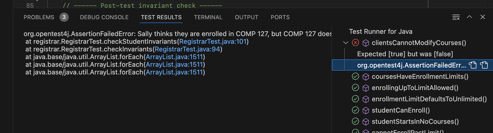

# Registrar, Part 1


{:standard_toc}


## Learning goals

- Understand how shared mutable state can create the potential for bugs
- Learn principles of defensive programming
- Practice defensive programming by using:
  - immutable collections
  - defensive copying
  - appropriate data structures
- Get more practice writing unit tests
- Learn about the `Set` data type


## Step 0: Get some context

### Study the API

In this activity, you’ll work with an object model for a hypothetical college registrar system. The system tracks which students are enrolled in which courses. **Look at the `Student` and `Course` classes**, and understand their API: What are the public methods? What do those methods do?

The registrar model has a strict API contract. Read and understand it!

<callout>
**Contract of the `Student` and `Course` API**:

* Students know their registered courses, and courses know the list of students enrolled in them: for all students and courses, `student.getCourses().contains(course)` if and only if `course.getRoster().contains(student)`.

* Courses can have a maximum enrollment limit on the number of students: for all courses, `course.getRoster().size()` ≤ `course.getEnrollmentLimit()`.

* The enrollment limit cannot change if any students are already registered for the course.
</callout>

### Study the tests

We have implemented tests that verify that the existing code satisfies this contract. **Run `RegistrarTest`.**  All the tests should pass.

Spend a little time understanding the structure of `RegistrarTest`, which exercises the API:

- Note all the specific cases it tests.
- Note the `createStudents` and `createCourses` methods at the top, which run before each individual test case (because of the `@BeforeEach` annotation).
- Note also the `checkInvariants` method at the bottom, which runs after each individual test case (because of the `@AfterEach` annotation). What is this method’s job? <hidden>It makes sure that all the invariants of the API still hold after each test case is done.</hidden>

### Study the `enrollIn` method of `Student`

This method is the API’s entry point for adding a student to a course. One uses it like this:

    someStudent.enrollIn(someClass);

How does the method ensure that the first invariant holds (the bidirectional relationship between courses and students)?

How does the method ensure that the second invariant holds (a course never goes over its enrollment limit)?

## Step 1: Identify the flaw

In the `Student` class, take a look at the `getCourses()` method. What is the **runtime type**  of the object it returns? “Runtime type?!?” Here is an explanation of what that question means:

The method declaration says it returns a `List`. That means `List` is the <def>compile-time type</def>: the method promises to return _something_ that is a `List`, and `List` is the type that Java uses to check the code at compile time (i.e. before the code runs).

However, `List` is an interface, and many different classes implement that interface. When the code actually _runs_, that code will return some specific object, and that object’s class will be some specific class that implements `List`. That specific class is the <def>runtime type</def>. What class is it? Discuss with your partner.

When you think you have the answer, check it here: <hidden>`ArrayList`</hidden>

Because of that **runtime type**, the list `getCourses()` returns is a mutable list. That means we can do this:

    // Suppose:
    // - comp127 is a Course
    // - sally is a Student
    // - comp127 has no students enrolled yet

    List<Course> sallyCourses = sally.getCourses();
    sallyCourses.add(comp127);
    System.out.println(sallyCourses);        // (1) What will this print?
    System.out.println(sally.getCourses());  // (2) How about this?

Discuss with your partner, then check your answers: Will `comp127` show up in the print statement at (1)? <hidden>**Yes**</hidden> How about the one at (2)? <hidden>**Also yes** (why?)</hidden>

This is bad news. Why? To enroll a student in a course using the API, we are _supposed_ to call the `enrollIn` method of `Student`. The `enrollIn` method carefully preserves the invariants. However, the `Student` code gives everyone a way of directly modifying the student’s list of courses, completely bypassing `enrollIn`.

After running the code above, what does this code print?

    System.out.println(comp127.getStudents());

Answer: <hidden>an empty list.</hidden>

That violates the first invariant! Sally thinks she’s enrolled in COMP 127, but she’s not on the course’s roster.

The course’s `getRoster` method has exactly the same problem. We can use it to enroll students in courses they don’t know they’re enrolled in: the common recurring nightmare come to life! We can also do this:

    comp127.setEnrollmentLimit(16);
    comp127.getRoster().add(sally);
    comp127.getRoster().add(marvin);
    comp127.getRoster().add(diego);
    //
    // ...10000 more students here...
    //
    comp127.getRoster().add(sunita);
    comp127.getRoster().add(lin);
    comp127.getRoster().add(duc);

…and now we’ve violated the invariant about enrollment limits. Argh!

The problem here is that when `getCourses` and `getRoster` return an `ArrayList`, they are **sharing the same `ArrayList` object** they use for their own _internal_ state with any _external_ code that uses the API. After this line of code:

    List<Student> whatever = sally.getCourses();

…the `whatever` variable and `sally`’s private `courses` instance variable **both point to the same object**. (This situation where two variables point to the same object is <def>aliasing</def>, which you may recall if you made it very far in the [Idea Lab](/activities/idea_lab) and [Maps](/activities/maps_intro) activities.) Returning that `ArrayList` breaks encapsulation! Any code using our API can mess with the internal state of students and courses. This opens the door to insidious bugs. It might even lead to security flaws.

<details>
<summary>
**A demo and visualization of aliasing**
</summary>
Here are two things that will help you see what is happening when one object is aliased to two variables:

First, a [great video using physical objects to show aliasing](https://youtu.be/8UI61UzjPhw?si=Cw8vq9OOJRNePJ0B). (Remember your visit to the IdeaLab?)

Second, [an interactive demo of aliasing](https://pythontutor.com/render.html#code=import%20java.util.*%3B%0A%0Apublic%20class%20AliasingDemo%20%7B%0A%20%20%20%20public%20static%20void%20main%28String%5B%5D%20args%29%20%7B%0A%20%20%20%20%20%20%20%20String%5B%5D%20firstList%20%3D%20new%20String%5B%5D%20%7B%20%22a%22,%20%22b%22,%20%22c%22%7D%3B%0A%20%20%20%20%20%20%20%20%0A%20%20%20%20%20%20%20%20String%5B%5D%20secondList%20%3D%20firstList%3B%0A%0A%20%20%20%20%20%20%20%20System.out.println%28%22firstList%20%3D%20%22%20%2B%20String.join%28%22,%20%22,%20firstList%29%29%3B%0A%20%20%20%20%20%20%20%20System.out.println%28%22secondList%20%3D%20%22%20%2B%20String.join%28%22,%20%22,%20secondList%29%29%3B%0A%20%20%20%20%20%20%20%20%0A%20%20%20%20%20%20%20%20System.out.println%28%22Setting%20index%201%20of%20secondList%20to%20'D'...%22%29%3B%0A%20%20%20%20%20%20%20%20secondList%5B1%5D%20%3D%20%22D%22%3B%0A%0A%20%20%20%20%20%20%20%20System.out.println%28%22firstList%20%3D%20%22%20%2B%20String.join%28%22,%20%22,%20firstList%29%29%3B%0A%20%20%20%20%7D%0A%7D&cumulative=false&curInstr=7&heapPrimitives=true&mode=display&origin=opt-frontend.js&py=java&rawInputLstJSON=%5B%5D&textReferences=false). Use the 'Next >' button to step through the code. Pay careful attention to:

- Line 7: Both `firstList` and `secondList` have arrows pointing to the array. This is aliasing: two variables that refer to the same object in memory.
- Line 13: watch what happens to the array. **Before running the next line**: what do you think it will do?
- Line 15: is that what you expected? It looks like we only changed `secondList`...
</details>


## Step 2: Test the flaw

We are going to fix the flaw, but **before we fix it**, let’s **write a test**  we can use to verify our fix. To be confident that our test verifies the fix, we first should verify that it _fails_ before the fix is done. Add the following code to `RegistrarTest`:

        @Test
        void clientsCannotModifyCourses() {
           List<Course> courses = sally.getCourses();
           courses.add(comp127);
        }

Run the tests. This test should fail.

Usually tests fail because of an `assertEquals()` or other test assertion. Why does _this_ test fail, even though there are no assertions in `clientsCannotModifyCourses`? (Hint: <hidden>remember `@AfterEach`</hidden>)

As of this writing, VS Code does a poor job of exposing the true error message from that test failure. You have to go digging for it:


Now we can see the true error:



Try it, and **read the full error message**. This error message is good news! The test is catching exactly the problem we wanted it to catch.

Did we need to create that local variable named `courses`? What if we do this instead?

        @Test
        void clientsCannotModifyCourses() {
           sally.getCourses().add(comp127);
        }

Does the test still fail? Why or why not? Discuss with your partner.

## Step 3: Fix the flaw

One possible approach would be to modify the `getCourses` to return a **mutable defensive copy**  of `courses` — a whole new `ArrayList`  — instead of the original object. The `Student` object’s true list of courses stays private; clients can only see a copy, and it’s fine if they modify their own copy. (Why the word “defensive?” Because the API implementation is _defending_ the API’s contract against bad behavior from API clients.)

Try doing that: make `getCourses` return a copy of the list of courses.

Hint: <hidden>`ArrayList` has a copy constructor.</hidden>

Hint: <hidden>Use the copy constructor like this: `new ArrayList<>(courses)`</hidden>

Run the tests again. Your new test (and all the old ones) should pass now!

## Step 4: Try a better fix

You’ve patched the flaw, but it’s not ideal to make defensive copies of lists all the time. Why not? Because lists take memory, and copying them takes time.

Fortunately, Java gives us an alternative: **[unmodifiable collections](https://docs.oracle.com/en/java/javase/25/docs/api/java.base/java/util/Collection.html#unmodview)**. Read the few paragraphs in the “Unmodifiable View Collections” section at that link, then try making `getCourses()` return the appropriate unmodifiable collection view.

Hint: <hidden>The one you want is `Collections.unmodifiableList()`.</hidden>

Hint: <hidden>Use it like this: `return Collections.unmodifiableList(courses);`</hidden>

When you do this, instead of copying the whole list, Java will return a tiny (and cheap) wrapper object that forwards only _read_ operations to the real course list, and refuses to forward _write_ operations. Instead of giving callers a modifiable copy, the method now gives them an unmodifiable view.

This will cause the existing test to fail again. (Why?) Modify the test so that it checks for the correct error. You can use the following code pattern in a test to say, “I expect an error to happen! The test fails if the error _doesn’t_ happen.”

    assertThrows(TypeOfExceptionYouExpect.class, () -> {
       // code that should cause the exception
    });

Run all your tests. They should all pass now.

## Step 5: Fix `getRoster` too

The `getRoster` method in `Course` has exactly the same problem. Fix it in the same way:

- Write a test that attempts to modify the list returned by `getRoster`. (It is OK to jump straight to using `assertThrows` in your test now that you know what kind of exception you expect.)
- Run the tests. Make sure the new test fails.
- Make `getRoster` return an unmodifiable view collection, just as before.
- Run the tests. Make sure they pass.

## Step 6 (if time allows): Fix a different kind of flaw

It is not essential for you to do this step if you are short on time; you’ll learn about this topic sooner or later. If you do have time, however, this is a good opportunity to learn about one of the alternatives to `List` in Java.

Here is something terrible that the current API lets us do:

    comp127.setEnrollmentLimit(16);
    for (int n = 0; n < 16; n++) {
        sally.enrollIn(comp127);
    }

Now the course is full! Sally has singlehandedly filled COMP 127 by registering herself for it multiple times. The course roster is now Sally, Sally, Sally, Sally, Sally, Sally…. Note that this does **not**  violate any of our API invariants. It sure does seem wrong, though, doesn’t it? We probably need two new invariants in our API:

> Any given student can appear in a course roster at most once.

> Any given course can only appear in a student’s collection of courses at most once.

We _could_ enforce this invariant by modifying the `enroll` method of `Course` so that it checks whether a student is already enrolled, and doesn’t re-add them. However, there’s an interesting alternative: using `Set` instead of `List`.

### A quick introduction to `Set`

In Java, `Set` is another collection type like `List`. There are two major differences between the `List` and `Set` interfaces:

- A `List` can contain duplicate elements, but every element in a `Set` is unique. If you have an empty `Set<String>` and you call `add("Hello")` a million times, the set will still only contain a single `"Hello"` and its size will be 1.
- A `List` preserves the order of elements added to it; a `Set` does not. This means that, unlike a list, you cannot get an element of a set by numeric index. You can iterate over a set with a for-each loop just like a list, but you might get the elements back in a different order than you put them in. The order in which you see the elements might even change the next time you loop over the set! (To use the terminology introduced here: when iterating over the elements of a `Set`, the order in which elements appear is not part of the contract of `Set`.)


Basic usage of `Set` closely parallels `List`:

||============================================================||

[contract]
[list] List
[set]  Set

||============================================================||

[contract] Elements ordered?
[list] Yes
[set]  No

||------------------------------------------------------------||

[contract] Elements unique?
[list] No
[set]  Yes

||------------------------------------------------------------||

[contract] Create immutable with specific elements
[list] `List.of(…)`
[set]  `Set.of(…)`

||------------------------------------------------------------||

[contract] Create empty mutable
[list] `new ArrayList<>()`
[set]  `new HashSet<>()`

||------------------------------------------------------------||

[contract] Get size
[list] `list.size()`
[set]  `set.size()`

||------------------------------------------------------------||

[contract] Check if empty
[list] `list.isEmpty()`
[set]  `set.isEmpty()`

||------------------------------------------------------------||

[contract] Loop over elements
[list] `for(SomeType elem : list)`
[set]  `for(SomeType elem : set)`

||------------------------------------------------------------||

[contract] Add `elem` to the collection
[list] `list.add(elem)`
[set]  `set.add(elem)`

||------------------------------------------------------------||

[contract] Check if `elem` in the collection
[list] `list.contains(elem)` (slow!)
[set]  `set.contains(elem)` (fast!)

||------------------------------------------------------------||

[contract] Remove `elem` from collection
[list] `list.remove(elem)` (slow!)
[set]  `set.remove(elem)` (fast!)

||------------------------------------------------------------||

[contract] Remove element at `index`
[list] `list.remove(index)`
[set]  N/A

||------------------------------------------------------------||

This should be enough information to get you through the activity. You can consult the Javadoc for [`List`](https://docs.oracle.com/en/java/javase/25/docs/api/java.base/java/util/List.html) and [`Set`](https://docs.oracle.com/en/java/javase/25/docs/api/java.base/java/util/Set.html) if you need more information.

### Using `Set` in our API

Let’s change a course’s roster and a student’s courses to both be sets instead of lists:

- Change the `roster` instance variable of `Course`:

  ```
  private Set<Student> roster = new HashSet<>();
  ```

- Change the `courses` instance variable of `Student`:

  ```
  private Set<Course> courses = new HashSet<>();
  ```

- Change the return types of the `getRoster` and `getCourses` methods to both be `Set` instead of `List`.

Note that because this is a **breaking change**, you’ll need to update code that _uses_ the API. That means lots of compile errors in the tests! Fix those compile errors, and get the tests passing again.

Add a test where you try to add a student to a course many times, and make sure that (1) they still only appear in the course’s roster once and (2) the course only appears in their enrollments once.

## Epilogue: Do unmodifiable collection views fix everything?

The answer: no!

In this activity, we fixed security flaws caused by methods **returning**  mutable collections. But what about methods **accepting**  mutable collections as parameters?

Consider the following code:

    class Professor {
       ...
       public void setAdvisees(Set<Student> advisees) {
           // establish advisor-student relationship
           for (Student student : advisees) {
               student.setAdvisor(this);
           }
           this.advisees = advisees;  // security flaw here
       }
    }

This code tries to establish an advisor-student relationship, but whoever passed in that `advisees` collection could hold on to it, and modify it after passing it to us:

        students.add(sally);
        susan.setAdvisees(students);
        students.add(marvin);

After this code runs, Susan will think Marvin is her advisee, but Marvin won’t think Susan is their advisor. (Why?)

Unfortunately, an unmodifiable view will not help us this time. Suppose we change the “security flaw here” line above to this:

        this.advisees = Collections.unmodifiableSet(advisees);

It doesn’t help. We’re saying, “we can’t modify the `advisees` list pointed to by the instance variable of `Professor`, but we don’t care if somebody _else_ changes the object we were originally passed as a parameter.” And remember, unmodifiable _view_ collections _reflect changes to the underlying collection!_ Our unmodifiable set holds on to the set we were originally passed, and reflects changes to that original set. That means the Susan / Marvin example above fails exactly as before.

The correct solution here is to make a defensive copy, as the upcoming reading assignment discusses:

        this.advisees = new HashSet<>(advisees);

…or better yet, use the handy `Set.copyOf()` method, which does not make a whole new copy if the set you give it is already immutable:

        this.advisees = Set.copyOf(advisees);

What’s the essential difference between this and the getter methods you fixed above? Why do `unmodifiableSet` / `unmodifiableList` work up above when they don’t work here? That’s a good one to ponder!

<callout>
  This activity continues as a [take-home exercise](/exercises/registrar_2).
</callout>
