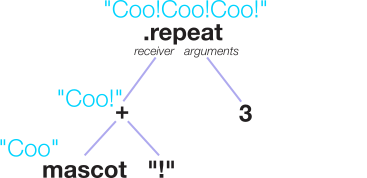
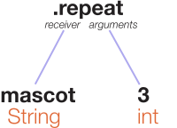
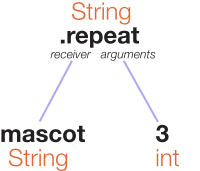
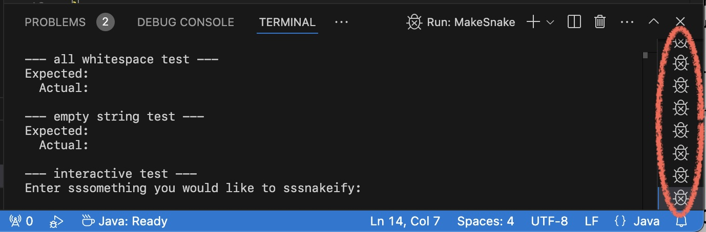
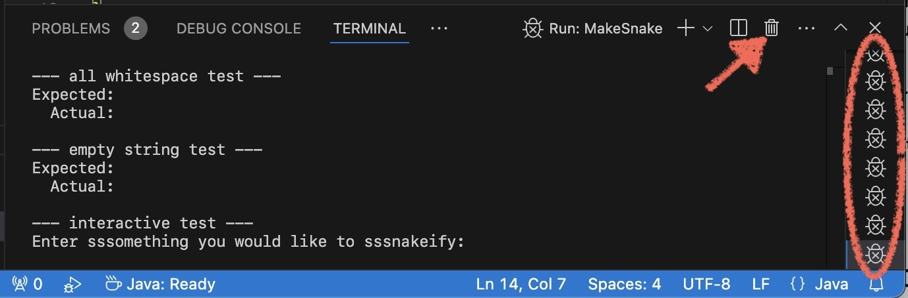
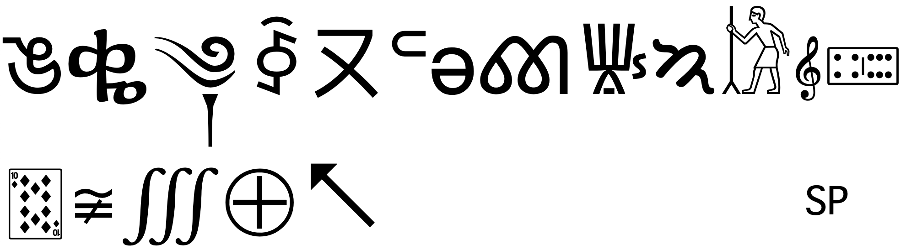

# String Methods

{:standard_toc}

## Learning goals

In this activity, you will:

- Work with String objects
- Use Java’s dot syntax to call methods of objects
- Use documentation to research what methods are available
- Practice learning to identify the receiver and arguments of a method call

Note: **we don’t necessarily expect that you will finish all of this activity during class time**. Do as much as you can during class. If you want more practice, do some more of the activity on your own time, either with your partner or solo. It is always up to you how much of each activity you complete.

## Task 0: Warm up by thinking about method call ASTs

On your latest reading assignment, the “Things to consider” section gave you some expressions and asked you to think about how you might draw ASTs for them. Here they are. **Briefly look at each of these** together with your partner(s), **and check in with each other** to make sure these diagrams make sense to both/all of you.

The first one was a simple method call:

    mascot.repeat(3)

{:.dark-mode-invert scale="1.1"}

The second was a method call where the receiver is an addition expression:

    (mascot + "!").repeat(3)

{:.dark-mode-invert scale="1.1"}

In the third example, one method call’s result becomes the receiver of _another_ method call, a code pattern we call <def>method chaining</def>:

    mascot.substring(0, 2).repeat(100)

{:.dark-mode-invert scale="1.1"}

Do these diagrams make sense? Check with a preceptor or instructor if you’re not feeling confident.

Think about that first example again:

    mascot.repeat(3)

How do we know that a `repeat` method is available? If we want to know what methods are available, where do we look? How do we find them? Let’s draw another AST, but this time, labeling the **types** instead of the **values**:

{:.dark-mode-invert scale="1.1"}

Here we have a `String` and an `int`. Which one of those two does the `repeat` method come from? Why? <hidden>It comes from the String. To determine what methods are available, we look at the type of the <strong>receiver</strong> of the method call.</hidden>

If we want to find out what methods we can call on `mascot`, we need to do two things:

1. Figure out the type of `mascot`. (We know that. It’s `String`.)
2. Find the documentation that lists all the methods available for String. A web search for “java string documentation” or “java string api” will turn it up, but for convenience, [here is a link to it](https://docs.oracle.com/en/java/javase/21/docs//api/java.base/java/lang/String.html).

Take a look at that documentation. Find the `repeat` method. If you find `repeat` in the list of methods at the top, click the method name to jump down below to get more details.

<callout id="thinking">
  VS Code will often show you this very same documentation, or at least parts of it, while you are editing code, which is handy. It will even suggest methods for you as you type! Those autocomplete suggestions can be incredibly handy…sometimes. Sometimes they will distract you. Sometimes they are wrong, and dangerously misleading. Do not develop the bad habit of just banging on the autocomplete and hoping that the correct answer eventually appears (even if that sometimes seems to work).

  Writing good code means **thinking for yourself**. It is good to know how to find and read the documentation, even when fancy tools are eager to make suggestions for us. It is good to know how to use the fancy tools — and how not to. It is _essential_ to keep your brain awake. <highlight>You can let the computer do the typing for you, but <i>never</i> let it do the thinking for you.</highlight>

  This is doubly true in the current era of AI hype. If the AI optimists are correct (the credible ones, anyway), software development will involve humans critically evaluating, shaping, and correcting the output of LLMs. If the AI skeptics are correct, then the future will bring mountains of AI slop to decode, disentangle, fix, and/or rewrite. Either way, it is _understanding_ and _critically evaluating_ code — not merely _generating_ code — that will be the truly essential ability. Always has been; will be even more so. _That_ is what you are learning here. Now, here’s a thinking exercise.
</callout>

What **type** belongs **at the root (the top) of this AST?**

{:.dark-mode-invert scale="1.1"}

To figure that out, take a look at that documentation for `repeat`. You will see a line like this:

    public String repeat(int count)

That is a <def>method signature</def>. It tells us four things:

| `public`     | Anyone code can use this method. |
| `String`     | If you call this method, it returns a `String`. |
| `repeat`     | The name of this method is “repeat.” |
| `int count`  | The method takes one argument, which must be an `int`. |
{:.compact}

So, what does belong at the top of that AST? Is is item 2 in that list, the **return type**, that answers the question: the `repeat` method will return a `String`.

{:.dark-mode-invert scale="1.1"}

In this activity, you will use this kind of thinking to make sense of Java’s documentation for `String`, and to use `String` methods.

## Task 1: Making strings EMPHATIC!!!

There is a twist to the challenges in this activity: <highlight>do not use any loops</highlight> to implement your solutions. Instead, look for methods of the String class that can help you!

Open the file `MakeEmphatic.java`. This class contains two methods: a `main` method for testing, and a method `makeEmphatic(String input)` that currently does nothing.

The syntax you see there for `makeEmphatic` will be a little overwhelming the first time you see it. It is OK not to understand all of it at once! Eventually you will understand each little detail of this syntax, but for now, you need to understand three key things:

1. This is a function. It takes one parameter, a `String` named `input`. It returns a `String`.

       String makeEmphatic(String input)

   Here is the corresponding Python syntax:

       def makeEmphatic(input):

   (Note that Python does not specify the parameter’s type or the return type, but Java specifies both.)

2. The code inside the braces (the “body” of the function), specifies what the function does when called, and what value it returns:

   <pre><muted>public static String makeEmphatic(String input)</muted><highlight>{</highlight>
      // function body goes here
   <highlight>}</highlight></pre>

   (In Python, the function body is determined by indentation. In Java, it is determined by the curly braces, but you _should_ also indent it to help human readers).

1. It is the `return` statement that specifies what value the function returns. You are going to change the code of the function so that it ends up returning the correct answer.

Your job is to fill in the body of the `makeEmphatic` method to modify an input string so that it is properly emphasized:

- Given any string, `makeEmphatic()` should return that string IN ALL CAPS and with three trailing exclamation points!!!
- Example:
  - Input: `"hello"`
  - Output: `"HELLO!!!"`

Look at the tests in the `main` method. Check: do you and your partner(s) understand them? Run the file and look at the output. Does this function do what it’s supposed to do yet? <hidden>No!</hidden>

Change the body of `makeEmphatic` so that it does the correct thing. You should **use the methods provided by the Java String class**. Remember: **no loops allowed**! Here is the documentation that has all the String methods again: [String Javadoc](https://docs.oracle.com/en/java/javase/21/docs//api/java.base/java/lang/String.html).

When you have written and tested your method, run the test cases. <highlight>The tests must _all_ pass</highlight> for your method to work properly! Take a moment to **inspect the output carefully** and make sure that each test case does exactly what it is supposed to do.

After printing out the test cases, the main method waits for more input from you. Once your code is working, **try typing some of your own strings** to test your code some more (and enjoy the fruits of your labor).

<callout>
  Hints:

  - **Run your tests early and often.** At the very least, run them after completing each task. However, it’s wise to even run them even more often! While you still have a partial solution, you can check that the tests fail in the way you expect, and thus verify that you are making progress.

  - **Don’t hesitate to ask for hints!** If you’re not sure what a particular task is asking, or aren’t sure where to start, don’t just change code willy-nilly. A professor or preceptor can help you see what you’re supposed to do. Make sure your goal is clear before you type.

  - **Did you break a method and aren’t sure how to make it work again?** No worries! Remember that you still have the original code in your Git history, so you can always copy the original code for a method and start over. Ask for help with this if you need it.
</callout>

## Task 2: Making ssstringsss sssibilant

Open the Java class `MakeSnake`. This class also contains two methods: a main method for testing and a function `makeSnake(String input)` that currently does nothing. Your job is to implement that method.

- Given any string, `makeSnake()` should return that string with three times as many ‘s’s
- Example:
  - Input: `"snake"`
  - Output: `"sssnake"`
  - Input: `"Computer Science rocks!"`
  - Output: `"Computer SSScience rocksss!"`
- Note that both uppercase and lowercase ‘s’s should be tripled, and capitalization should be preserved.

Again, please refer to the Java String class documentation linked above for help.

Remember: **do not use loops** to do this or any part of today’s activity.

<callout>
  _**“Why no loops?! Why are you doing this to us?? Why???”**_

  Today’s activity is an exercise in **working with a limited set of abstractions**. A suprisingly large portion of software development in the wild is not about asking “What is the most optimal algorithm?” or “What is the perfect programming language or framework?”, but rather “How do I build what I _need_ out of what I _have?_” Often the choice of which building blocks you can use is already determined by the environment, the team, or the constraints of the problem itself. It’s your job as a developer to create great software with what you’ve got.

  Sometimes working with a specific, limited set of abstractions can actually lead to _better_ code. This is arguably the case throughout this activity! Maybe you feel like doing it with loops would be easy, and researching the String API is tedious and slows you down. Maybe it does slow you down! You’ll find, however, that the extra time pays off: you’ll get clearer, simpler code solving these without loops. It’s a **good sign** when you put a large amount of work into writing a small amount of code.

  Sometimes it’s not the case that limited abstractions lead to better code. Sometimes it feels more like, “OK, I have a tub of yellow Lego, a squirrel, and unlimited dental floss. Can I build a blender out of this?” And sometimes, the answer is a surprising “yes!”

  Either way, figuring out how to build a thing using the building blocks you have is an _essential_ part of software development. Practice it.
</callout>

When you have written and tested your method, run the test cases. <highlight>The tests must _all_ pass</highlight> for your method to work properly!

## Interlude: A little clean-up

Look in the lower right edge of your VS Code window, where the **Terminal** tab shows the output of your code. Do you have a little line of happily marching bugs, like this?

Every one of those icons is a separate instance of your program, still running! Because these main methods all wait for input, they don’t stop each time you run the code. Each time you clicked the run button, another instance of your program started up while all the old ones kept going.

This isn’t an emergency, but eventually all those copies of your program may start using up your computer’s memory, or eating up its battery. It’s good to stop them. Click the trash can icon in the Terminal tab until all the little bug icons go away:

## Task 3: Capitalizing the first letter

Open the Java class `UppercaseFirstLetter`. As with the previous two tasks, your job is to fill in the function `uppercaseFirstLetter(String input)` that currently does nothing. You may use the provided main method for testing.

- Given any string, `uppercaseFirstLetter()` should return that string with the first letter capitalized. If the first letter is already capitalized, no change should be made.
- Example:
  - Input: `"hello"`
  - Output: `"Hello"`
- This problem will take some careful thought about strings that contain only one or zero letters! You might need a conditional statement in your method.

This one can be tricky to figure out without loops, but the solution is not complicated. Comb through the String documentation carefully.

When you have written and tested your method, run the test cases. Be sure to inspect each one carefully!

Once all the tests pass, a question: Do you know for sure that your function really works _all_ the time? Sure, the tests pass, but could there be something else you didn’t think to test?

Try adding a test for a string that has _no letters at all_. For example, `"123"` with an uppercase first letter should still be `"123"`.

What about the string `"1potato"`? What do you think `uppercaseFirstLetter` should do with that string? (This is debatable!) Try adding a test for it, too.

* * *

## Bonus challenge: A glimpse of Unicode

If you have extra time, either in class or at home, here’s something fun to explore.

To represent text, computers match each character to a number. That’s why we call it “digital” information: **everything gets turned into numbers, including text**. So…. Which number corresponds to the letter A? The digit 7? A number sign (#)? It doesn’t really matter! Each one of those symbols just needs to be assigned to _some_ number for the computer to work with it.

Alas, there are _many_ different standards for mappings between characters and numbers. (You might have heard the mysterious term “ASCII,” for example.) There are dozens of different standards out there, developed over the decades. Most of them are language-specific: there are several that were only designed for English, and several designed for Japanese, and several designed for scientific and mathematical symbols….

Having all those different standards has caused a lot of headaches over the years, so people from around the world got together in an attempt to come up with _one_ numbering system that would include characters from _all_ the world’s languages. That system is called Unicode, and most software nowadays uses it. It includes [a whole lot of writing systems](https://unicode-table.com/en/alphabets/), and the Unicode Consortium is always debating adding more!

Take a look inside `UnicodeExperiments`. This file includes a `printCodepoints` method, which takes a string and prints out each of its Unicode _codepoints_ on a separate line. **Your mission is to figure out what a “codepoint” is.** (You don’t need to understand how the implementation of `printCodepoints` works, though you’re welcome to try to figure it out.)

The main method in that class includes four test strings. The first two (`s1` and `s2`) are the phrase “Vietnamese language” in Vietnamese. Each of those strings contains 10 separate symbols, or **graphemes**. (Space counts as a grapheme too.) Try calling `printCodepoints` with `s1`. If there are 10 graphemes, how many codepoints are there in `s1`? <hidden>Also 10</hidden>.

Now try adding `printCodepoints(s2)`. Even though those two strings _look_ the same, they are not! How many codepoints are in s2? What does that tell us? <hidden>Sometimes multiple codepoints can combine into a single grapheme. These codepoints represent what are called <em>combining characters</em>.</hidden> How do these different sequences of codepoints work to create two strings whose graphemes look the same? <hidden>Sometimes there is a single codepoint for a symbol that you can <em>also</em> create out of several combining characters.</hidden> Which graphemes have multiple codepoints in `s2`?

What about emojis? Try `s3`. Are emojis graphemes? <hidden>Yes.</hidden> Are they codepoints? <hidden>This one is!</hidden>

But wait! Try `s4`. You may be surprised at the results! You may also notice that your development environment does not handle `s4` consistently: it’s possible that it will look different when printed out than it does in the code.

Lots of code out there wrongly assumes that characters, codexpoints, and graphemes are all the same thing. Code like that can break when there are combining characters in a string! (In fact, as of this writing, Slack has a bug that causes it to turn 😵‍💫into 😵💫 when typed into a message.) Such bugs are common, and can even be a source of major breakages and security flaws. When doing string processing, it is important to test one’s code on Unicode input that contains assumption-breaking text such as multi-codepoint graphemes.

String `s5` looks like it is just “MAC MAC” — the same word twice — but it isn’t! Run it through `printCodepoints` to see the trick: <hidden>symbols in different languages can look the same</hidden>. Online scammers sometimes use this fact to disguise malicious URLs, making them look like trustworthy ones. (VS Code may enclose some of those symbols in a yellow box to warn you that they are not what you probably expect.)

String `s6` is just for fun. It shows some of the amazing variety of symbols that are present in Unicode. Some of the symbols may not display correctly, depending on what fonts you have installed on your computer. In case you don’t have fonts for all those writing systems, here is what the symbols look like:

{:.dark-mode-invert scale="0.25"}

Print the codepoints of `s6`, read all the names, and marvel at the wonder of it all!

**Bonus bonus for the compulsively curious:** Search the web, learn about, and then experiment with ZERO WIDTH JOINER.

