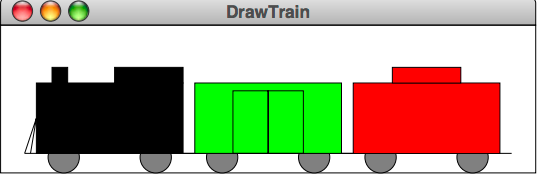
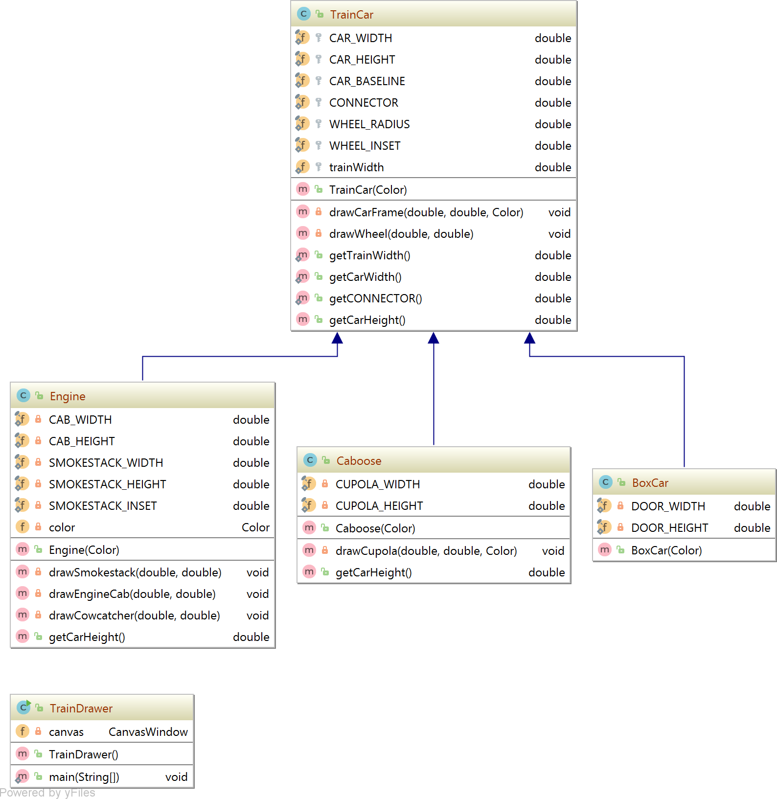
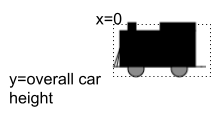

# Train Cars

{:standard_toc}


## Learning goals

- Practice creating classes that use inheritance
- Understand abstract classes
- Practice refactoring (modifying) existing code using inheritance


## Starting point

Run the `TrainDrawer` class’s main method. It will draw this train:

{:scale="1"}

Looking at the picture above, first jot down what is the same about all three train cars.  Then go look for these pieces in the code for the `TrainDrawer` class.

There is a reasonably good separation of methods in the `TrainDrawer` so the code that was used more than once, such as in the method `drawCarFrame`, lives in its own method and is called each time it is needed in the methods that create the other cars.

The real beauty of object-oriented languages, however, is that we can go one step further in taking advantage of this idea of code reuse: creating separate classes that group related methods.

In object-oriented languages like Java, we can create a class, perhaps called `TrainCar`, whose constructor contains the code that you reused to make each part of a car the same.  A class like this is called a <def>superclass</def> or a <def entry="superclass">parent class</def> for the three other child classes, `Engine`, `Boxcar`, and `Caboose`, which you will also make. Here is a detailed (perhaps too detailed!) diagram of their relationship:

{:.dark-mode-invert}

The constructor for each of the three child classes will first call the constructor for its parent, `TrainCar`. This will give you the parts of the train common to all three. Then you can add on the parts that are unique to each of the three types of train car to their respective constructors. This enables you to also add other different kinds of TrainCar classes if you want them — and greatly simplify the TrainDrawer class, which is really bigger than it should be!

Recall that a <def>constructor</def> is the setup code that runs **exactly once** when an object is **first created**. The technique we will use in this activity where one constructor calls another is called <def>constructor chaining</def>. There is setup that all `TrainCar`s share, and it lives in the `TrainCar` superclass. The subclasses call that `TrainCar` constructor first — that is the _chaining_ — and then they do their own additional setup.


## Refactoring the Existing Code

We are going to rearrange the code from the original single `TrainDrawer` class from the previous activity into several classes, according to our class diagram shown above.

The goal is:

* `TrainDrawer` should not have to concern itself with any specific train-related logic. It does one thing: it acquires an object with the graphics for a train, and draws that.

* A new `TrainCar` class will be concerned with the graphics and logic common to all train cars.

* Then we'll make subclasses of `TrainCar` that handle the graphics and logic specific to the various types of train cars: engines, boxcars, and cabooses.

### Abstract TrainCar superclass for common elements

**1**. Inside the `traincar` package, make a new abstract class called `TrainCar`, using the `abstract` keyword.

**2**. Move the two methods that are common to all cars into your new TrainCar class.  Some parts of the code show up in red text because some things are missing.  In particular, why does a call to `add()` have an error?

<callout>
⚠️ For the next several steps, you'll see lots of errors and red squiggles in Visual Studio -- that's okay! We'll be fixing those later. It's okay to have your code temporarily in an uncompileable state while we refactor the train-related logic from `TrainDrawer` to `TrainCar`.
</callout>

To handle the problem with `add()`, we’re going to do something similar to what you saw in the `Bubble` class from HW2. A `TrainCar` is really just a collection of other graphical objects (e.g. the wheel ellipses, car rectangle, etc.) grouped together. <highlight> That should remind you of another class that does that. Which one? And how do we make `TrainCar` reuse that class's grouping logic? </highlight>

**3**. Make the `TrainCar` class a `GraphicsGroup` subclass using the `extends` keyword in its class definition.

**4**. Add a constructor to `TrainCar`. For now, your constructor does not need any parameters (we will add them later). Your constructor should call the default constructor (the one without any parameters) in `GraphicsGroup` using the keyword `super()`.

**5**. Now we fix the calls to `canvas.add()` that you moved to `TrainCar`. You need to change the object to which graphical objects get added. You will no longer add them to the canvas. What object should you add them to now? What object do you have that should group together train-related graphical objects? (Hint: you can use the `this` keyword if you need a pointer to the object whose method is running.)

The additional issues still shown in red in your code are for other named constants that are still in the `TrainDrawer` class.

**6**. Move just the ones that you need, which represent the common elements to all train cars.

**7**. For the common pieces to get drawn, you can now call the function `drawCarFrame`, which calls `drawWheel`, in the constructor for `TrainCar`.

**8**. As you do this, you will notice that you need values to send in as arguments to this function. Add a parameter for color to your constructor.

The x and y values used in the starter code must also change now that `TrainCar` is a `GraphicsGroup`. You can think of a `GraphicsGroup` as a mini-canvas with its own coordinate system. In the original `TrainDrawer`, x is the start of the train and y is the height of the canvas. **Those values will now change.** In the `GraphicsGroup`’s coordinate system we want the train to start drawing at the front of the mini canvas (x = 0), and the y value will be the overall height of the train, as shown below.

{:.dark-mode-invert scale="1.5"}

**9**. To help with this, add a method called `getCarHeight()` to the `TrainCar` class. It should return the overall height of a standard train car (just the baseline and the car height).

**10**. Change the x and y values where you call `drawCarFrame` to 0 and `getCarHeight()`.

Now we have an abstract class called `TrainCar` with the common parts of any train car. The next step is to create the individual car types as subclasses of the parent `TrainCar` class.

<callout>
When you get here, please flag the teacher/preceptor to look over your work.
</callout>

### Create Engine subclass with additional features

Make a new class in your `traincar` package called `Engine` and make it extend `TrainCar` using the `extends` keyword. This makes `Engine` a subclass of `TrainCar`. Look at the original code from `TrainDrawer` and note these ideas:

- Is an `Engine` a `GraphicsGroup`? Why do we **not** have to say “`extends GraphicsGroup`” in the `Engine` class?
- The function called `drawEngine`, and in particular its contents, can now serve as the basis of the constructor for your new `Engine` class.
- The other functions called inside `drawEngine` can be used as is in your new `Engine` class. Move those functions into `Engine` first, like you did when you copied the common functions into `TrainCar`.

**11**. Make a constructor for `Engine` that also has parameters that are the same as `TrainCar`:

```
public Engine(Color color) {
   super(color);
}
```

Remember from your reading that the `super` method calls the constructor for `TrainCar`, ensuring that the common parts get drawn to the canvas.

**12**. To create the other parts of the `Engine`, add calls to the methods `drawSmokestack`, `drawEngineCab`, and `drawCowcatcher` in the constructor, after the `super()` call. Note that you’ll have to change the x and y values so that the cab, smokestack, and cowcatcher are drawn around your train car — what reference point would make sense for this? (Hint: <hidden>see step 10, where we set our reference point for the train car)</hidden>

**13**. Now you will still have a few constants left in red. Get those from the original `TrainDrawer` and add them at the top of the `Engine` class (there are five of them that are specific to the Engine).

There is one more enhancement that can be done to our engine. Notice that `Color.BLACK` is inside two of the functions. The color of this Engine really should be a private instance variable that is set inside the constructor and used by those functions.

**14**. Add the color as a private instance variable at the top of the `Engine` class:

```
private Color color;    //color of this engine
```

Then set it in the constructor using the passed in parameter and use it in the two methods that need the color. Now we can then make engines with different colors.

### Draw what we have so far

It’s time to make sure that we can at least draw an `Engine`. Then we can get back to the `Boxcar` and the `Caboose`.

**15**. Your `TrainDrawer` class should look pretty sparse by this point. Modify the constructor to instantiate an `Engine` object and add it to the canvas.

We also have some red highlighted code to consider here. You will have moved the constant class variables `CAR_WIDTH` and `CONNECTOR` into the `TrainCar` class. Since they are public, you can still access them in `TrainDrawer`, but you must put the name of the class in front of them (e.g. `TrainCar.CAR_WIDTH`).

Because the constructor for `Engine` only takes a color, you also need a way to place it on the canvas at the position you would like. We will use the fact that the `add` method in the `CanvasWindow` class is overloaded. You should use [this version](https://mac-comp127.github.io/kilt-graphics/edu/macalester/graphics/CanvasWindow.html#add(edu.macalester.graphics.GraphicsObject,double,double)), which allows you to specify where the upper left corner of the group should appear on the canvas:

<definition-callout>
```
public void add(GraphicsObject gObject,
                double x,
                double y)
```

*Adds the graphical object to the list of objects drawn on the canvas at the position x, y.*
</definition-callout>


## Create classes for the other types of train cars

**16**. Now make two more new classes in the new train package, `Boxcar` and `Caboose`, each of which extend `TrainCar`.

Have the code of the **original** `TrainDrawer` method called `drawBoxcar` be the basis of the constructor for your `Boxcar` class, and the function called `drawCaboose` be the basis of the constructor for your `Caboose` class. Remember to first create the `super()` line in each constructor, which replaces the `drawCarFrame` method call in each of the original `TrainDrawer` methods.

### Add instances of `Boxcar` and `Caboose` in the new `TrainDrawer`

When you have a good constructor for each of your new `Boxcar` and `Caboose` classes, use them in your **new version** of `TrainDrawer` in the traincar package to create instances of them.

When you have everything working, your new `TrainDrawer` code file will have one very short constructor method in it. This is something you should always be looking to accomplish: having smaller classes with specific duties. Your package now is broken out using a class hierarchy of types of trains who draw themselves, and the constructor method in a separate `TrainDrawer` class creates them.


## More ideas to try <aside>(optional)</aside>

### Add more cars!

This now gives you the ability to fairly easily add extra cars, for example multiple boxcars that have different colors in between the engine and the caboose. Try this by changing your constructor method in your newly improved `TrainDrawer` class in your traincar package.

### Make a `Train` class

If you wanted to be able to animate the train moving across the screen, you would need to move each `TrainCar` individually. You can fix that by making a new class called `Train` that is a `GraphicsGroup`. Your train class should contain `TrainCar` objects. Modify your `TrainDrawer` to create a `Train` instead of the individual cars. Your `Train` constructor should deal with creating the `Engine`, `BoxCar`, and `Caboose`.

### Animate your train

Animate your train so that it moves across the screen over time. You can do this by putting `canvas.draw()` inside a loop.

### Make `TrainDrawer` a `CanvasWindow`

You can declare a class to extend `CanvasWindow`. Try doing that with `TrainDrawer` and update its constructor. It no longer needs to make a new canvas. (Is this an improvement or not?)

### Try an animation technique: parallax scrolling

There is an interesting animation technique called parallax scrolling (see [the Wikipedia article on the topic](https://en.wikipedia.org/wiki/Parallax_scrolling) for an example animation). To do this, you can create background scenes called layers as separate `GraphicsGroup` objects. Perhaps start by adding some rectangles to represent buildings (even adding windows). To give an effect of the `Train` moving by faster in the foreground, have the scene layers move a smaller amount each time step.

Note also that you can add images to a `GraphicsGroup`. (See the class called `Image` in kilt-graphics). You will need to place your images in a folder called `res` (for resources) in the top level of your project. When you make a new image, you send it a path that includes `res`, like this example (your image file name will be different):

```
imageDie1 = new Image(1, 1, "awesome_happy_fun_image.png");
```

Thanks to Dan Kluver for suggesting this idea.

Hat tip to Bret Jackson and Libby Shoop for originally creating this activity.
