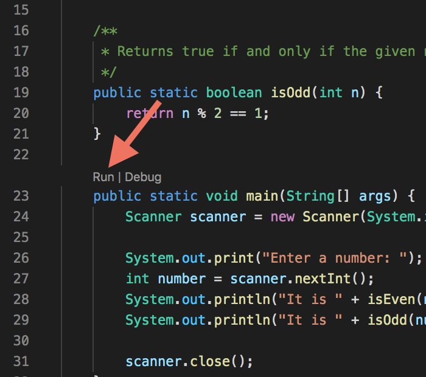
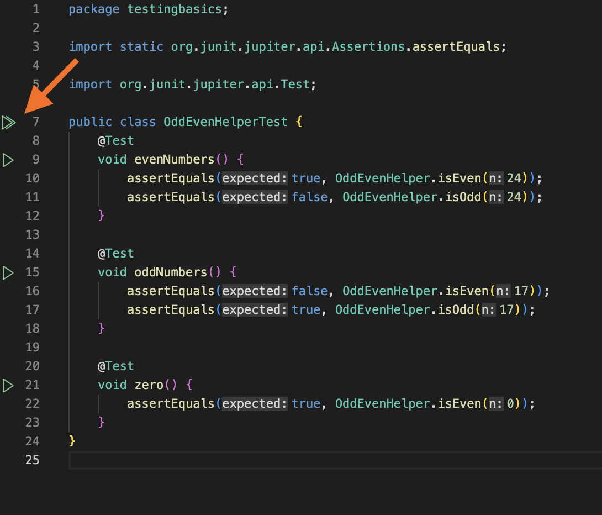
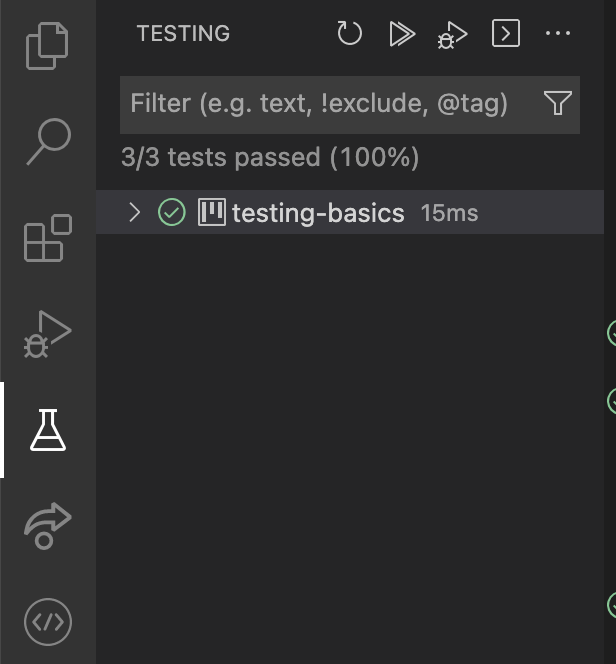

# Unit Testing


{:standard_toc}


## Learning goals

- Practice writing unit tests and working with JUnit
- Use the “test-driven development” approach
- Learn about the limitations of unit testing
- Practice working with lists


## Background for this activity

Throughout this activity you will create several separate units of code that simultaneously:

1. can be tested in isolation by **unit tests**, and
2. can be used as a building block of a large project or application.

In this _particular_ activity, the units of code you’ll be creating are **static methods**.

### Static methods

“Static method?” What exactly the “static” part means will make more sense in a few weeks. For now, just know that a <def>static method</def> in Java is a kind of function, one that you can call freely without having to provide additional context. Suppose you have this code:

    public class TextGeneration {
        public static String makeNonsenseWord(int letters) {
            ...
        }
    }

…then:

- If you are inside of `TextGeneration`, you can call the static method just like you would call a function in Python:

      makeNonsenseWord(12)

- If you are in a _different_ class somewhere else in the project, you call the static method by first specifying which class it is inside, like this:

      TextGeneration.makeNonsenseWord(12)

What’s a “class?” We’ll be learning a _lot_ more about that throughout this course. For now, just know that a class is a sort of container that holds many related pieces of code.

Have you been wondering what `public` means? Now you have the context to know: it means “can only be used inside this class.” If `makeNonsenseWord` were private instead, then that second call from another file would be illegal.

### Unit tests and JUnit

A good strategy for testing software is to test small pieces first, and make sure they work in isolation. Recall from the reading that this is <def entry="unit test">unit testing</def>. In this activity, the units of code that we are testing are static methods.

How will we test them? Think about the string activity. Remember how you had to manually inspect output in the terminal to make sure that the actual output matched the expected result? In full-scale software projects, it is common for tests to contain _thousands_ of “expected vs. actual” comparisons like this. Can you imagine manually inspecting test output on a project like that?!

Fortunately, we have tools to help us automate our testing, and check the results of our automated tests. In this class, we’ll be using a widely used tool called **JUnit**. JUnit gives us a way to write code that compares many, many, many expected results against actual values returned by our code, then get a concise report about which tests passed and which ones didn’t. That’s the big idea! We’ll learn the details by example as we go.


## Task 1: Odd / even helper

Open the file named `OddEvenHelper.java` in the `src/testingbasics` folder. Study the `isEven()` and `isOdd()` methods.

### Perform manual testing

Now study the `main()` method. What is it going to do? Just above the main method, VS Code shows “Run” and “Debug” links. Click **Run**  and try it out:



(There is a bug in the code. If you happen to find it, don’t fix it…yet!)

**Add**  code to `main()` (Don’t delete any existing code!! Add new code!) that prints “Wow, that’s odd!” if the number is odd, but does _nothing_ if it is even. Run your main method again to try your new code.

### Run the automated tests with JUnit

Open the file named `OddEvenHelperTest.java` in the `test/testingbasics` folder. Study these tests. Can you figure out the intention of this code? How is this code organized? What do you think `assertEquals` does?

Notice that VS Code shows several little green triangles throughout this file:  That is VS Code’s “Run” icon. You can choose to run just one individual test — but you want to run **all**  of them! Click the double triangle that appears to the left of the first line of the **whole class**:



When you click that icon, several things will happen: Java takes a moment to run the tests. Then, after they’ve run, the Run icons change to green checkmarks: one next to each individual test, plus one at the top of the class to show that all tests inside the class passed. **You can rerun those tests by clicking the green checkmarks.**

You’ll also notice that the panel on the left has changed. Instead of showing all the files in the project, it now shows tests:



Note “3/3 tests passed.” Which 3? You can click on that testing-basics line, expanding down a few levels to get more details:


To get back to viewing all the files in your project, click the Explorer icon in the upper left of the window:


And to see the tests again, click the Testing icon a little ways beneath it:


### Add a JUnit test

Did you notice that the unit test method `zero()` only tests `isEven()`? **Add a line to test** `isOdd()` too.

**Run the tests again**  to make sure your new test passes.

### Fix a bug using test-driven development

All the tests pass. Does that mean the software is completely correct? You don’t know! **Automated tests like these can only test what they were looking for** — and they weren’t looking in one very important place.

There is a bug in `OddEvenHelper`.

Go back to `OddEvenHelper` (not the test class) and run its main method. **Run manual tests with some negative numbers.**  See if you can find the bug, but when you do…

<callout>
**Do not fix the bug yet!**
</callout>

We are going to use a technique called <def>test-driven development</def>, or <def entry="test-driven development">TDD</def> for short. If you want to make _any_ change whatsoever in your applications functionality — adding a feature, fixing a bug, anything! — then TDD says:

1. **Run all the tests**  to make sure they pass. <highlight>**Don’t skip this step!**</highlight> Your teammates might have left the tests broken by accident. You want to catch this right away, or it will be confusing!
2. **Write a test that fails**  because you haven’t implemented your change yet.
3. **Run your new test**  to make sure it fails. <highlight>**Don’t skip this step!**</highlight> It’s easy to forget. It ensures that you’re testing what you think you’re testing.
4. Now make the **simplest change to your application code**  that makes the test pass.
5. Run **all** the tests to make sure they all pass now.
6. Go back to step 2 until you’re done with your work.
7. Clean up. <highlight>**Don’t skip this step!**</highlight> “Working” is not enough. A good programmer thinks about others: is this code readable? clear? sensible? Now that I’ve finished it, could I use clearer names for things? Did I leave any pieces dangling?

TDD developers sometimes refer to this as the “red-green-refactor” cycle: make the tests break, then make them succeed again, then clean up.

Try this technique to fix the bug you found. **Whoever is navigating, strictly hold your driver to the rules above!**  What is a test that would expose the bug? Add that test. Make sure it fails.

Then fix the bug. This might be tricky! Here are two hints:

- The solution is very, very simple. That doesn’t mean easy! Simple ≠ easy. But it is simple: once you have figured it out, you only need to change a few characters in the code. If you find yourself making the `isOdd()` method more than one line long, you are making it too complicated. Look for a simpler solution.
- To figure out how to fix it, you may find it helpful to put a print statement inside the `isOdd()` method and <hidden>see what the <code>%</code> operator does</hidden>. If you do, remember to **remove the print statement when you’re done!**

Once you think you have the bug fixed, make sure all the tests pass.

When you finish this task, **this is a good place to commit your work.**


## Optional side note: the logical framework for the scientific method and unit testing

There's a deep connection between the philosophy and limitations of unit
testing and the scientific method as we understand it today. It goes
back to Karl Popper and the idea of
[*falsification*](https://en.wikipedia.org/wiki/Falsifiability).

Popper's idea is this: if you have some scientific hypothesis, theory, or
explanation, and you perform experiments or observations of
the natural world, you *cannot* prove that hypothesis to be true. But
you can prove that it is *false*; that is, you can falsify a claim.

Why? Well, you can't check everything. There are always going to be some
observations that you can't make --- say you've measured the speed of
light many times, and always get exactly the same value. But perhaps in
the past the same observation would have given a different speed of
light! Or maybe the speed of light is different in just one town in Ohio
where you've never been! You can't measure the speed of every ray of
light in the universe since forever, so you can’t _know_ there isn't
some exception.

On the other hand, you can make an observation of the speed of light and
falsify your claim about its speed. Maybe you have claimed the speed of
light is always 299792458 meters per second --- and then you measure its
speed in water and discover that it is slower. Oh no! That one
observation (assuming it was correct) proved your theory *false*:
It is not true that "the speed of light is always 299792458 meters per
second" after all.

Popper’s insight is that in science: theories can never be proved
correct, only proved wrong. Theories can be _confirmed_ --- but all that
“confirmed” means is “we’ve tried to prove it wrong, but haven’t managed
to yet.” Science can give us confidence, but not certainty. Proof is the
stuff of mathematics.

Unit testing and what it tells you about software matches scientific
experiments and what they say about the world. Unit tests can falsify
a claim like "this function works as documented" or "this code does not
crash", but usually they can't prove that the function or code *does*
always work as intended.[^1] Units tests can give us _confidence_,
but not _certainty_.

[^1]: One difference is that with software, the "state space" is
    sometimes finite! If your function accepts one 32-bit integer as input, you
    can, in principle, check every single 2^32 = 4294967296 input value. If
    you do that, *then* you can consider to have proved that the function works
    correctly -- but only on that particular CPU, with that compiler, and so
    on...!

    (This sounds wild, but there are software projects that actually
    do this. It may sounds like 4.3 billion test cases is impossible,
    but, well, computers these days are fast, and lots of software is
    involved in actual life-or-death situations.)

Keep this in mind when writing tests. If all your tests pass, that does
*not* prove that your code is correct! But if a test fails, then you do
definitively know that either (1) your code has a bug, or (2) your test
is wrong. Or, perhaps (3) there's something wrong with Java itself, or
Visual Studio, or maybe an errant cosmic ray hit your computer's memory
and flipped a bit.[^2]

[^2]: Yes, this can happen. In one apparent incident, it affected voting
    results!

    <https://www.vice.com/en/article/space-weather-cosmic-rays-voting-aaas/>


## Task 2: Typo fixer

You often mkae typose when you type and would like to write a program
that can help fix those automatically for you. You *could* just learn
how to type more accurately and be more careful, but where's the fun in
that?

Take a look at the `TypoFixer` class, which contains a `fixTypos` method. The
`TypoFixer` class is written so that it fixes three typos -- "studnents",
"Macaleseter", and "teh" for words starting with “the”[^3].

[^3]: These are actual typos that the author of this activity makes and
    they are one of the banes of his existence.

Study how this method works. There *is* a bug lurking somewhere in that code
(spoiler!), but don't change anything yet. Just read the code. Some things to
think about:

- What are the parameters of this function: how many, and what type?
- What is the type of the return value?
- Given that the parameter is <hidden>a single `String`</hidden>, how does the
  code operate on just one word at a time? (Hint: <hidden>The key is the
  `split` method.</hidden> You can look up the documentation for that, but in
  this case the documentation is hard to make sense of. Instead, study the code
  and think about what <hidden>`split`</hidden> must do in order for the whole
  thing to work.)
- How does the method build up its return value? (Hint: <hidden>Look at the
  `output` variable and think of the reading assignment.</hidden>)
- Since <hidden>`output` is a `List`</hidden>, how does the method manage to
  return a <hidden>`String`</hidden>? (Hint: <hidden>What does the
  `String.join()` method do? The documentation for that one isn’t _quite_ as
  bad.</hidden>)

Would this code successfully correct the typos it is supposed to correct? We are
learning how to do test-driven development, so instead of running this code and
manually inspecting some output, let's interrogate the correctness of our code
with automated tests.

Go to `TypoFixerTest`. Read the tests. Do they make sense? Are they sufficient?

Run the tests. They pass (unless your VS Code Java environment is broken, which
does happen annoyingly often), so we have reason to believe that the code is
working as intended.

### Add a new word

If we can fix those three typos, let's fix more: since this is a
computer science (CS) course, you find yourself frequently typing "CS".
And let's say you would like to not need to use the shift key when
typing "CS". Since "cs" isn't otherwise an English word, you decide
you'd like your code to change "cs" into "CS".

- <highlight>**Don't modify `TypoFixer` yet!**</highlight> Instead, use the
  above specification ("cs" should get transformed into "CS") to write a new
  test. Run the test. It fails, of course. (Quick quiz: if you are very
  confident you wrote the test correctly, is it OK to skip the part where you
  run it and make sure it fails? <hidden>NO!</hidden>)
- Now let's modify `TypoFixer`. Modify the end of the `if-else` chain suitably
  to look for that typo and fix it.
- Run your test again. Does it fail? If it does, keep working until all the
  tests pass.

### Fix a bug

Copy and paste this sentence into a new text case:

```txt
There are no typos here!  Everything is correct.
```

Do no retype it! Be sure to <highlight>copy and paste that text</highlight>
so you get it exactly as it appears in these instructions, every character.

You should see an error like this:

```txt
java.lang.StringIndexOutOfBoundsException: begin 0, end 3, length 2
 at java.base/java.lang.String.checkBoundsBeginEnd(String.java:4606)
 at java.base/java.lang.String.substring(String.java:2709)
 at testingbasics.TypoFixer.fixTypos(TypoFixer.java:20)
 at testingbasics.TypoFixerTest.fixStudnets2(TypoFixerTest.java:31)
 at java.base/java.util.ArrayList.forEach(ArrayList.java:1511)
 at java.base/java.util.ArrayList.forEach(ArrayList.java:1511)
```

That’s a lot to look at, isn’t it? Don’t panic! There are two pieces of useful
information buried in all that:

- The error message on the first line is "Range [0, 3) out of bounds for
  length 2". So there's something about...a range, the numbers 0 and 3,
  and bounds. These are important clues!

- That’s _what_ the error was. The long chain of lines that start with “`at`”
  describe _where_ the error occurred. This is called a <def>stack trace</def>.

- The first stack trace line that mentions _our_ code (instead of the inner workings of Java
  itself) is this one:

  ```txt
  testingbasics.TypoFixer.fixTypos(TypoFixer.java:20)
  ```

  That tells us that the occurred on line 20 of the file `TypoFixer.java`.
  (The line number may be different for you, depending on how you modified this
  file to add the “cs” case.)

This is good! We know that some code on line 20 produced that error
message. Take a look at the code. What went wrong? [Take a look at the
relevant JavaDocs](https://docs.oracle.com/en/java/javase/21/docs/api/java.base/java/lang/String.html#substring(int,int)) for
the offending method and make sure you see why it failed.

Now, find a *different* method that will work better, not crash, but which works
for this situation.(Hint: <hidden>There is a helpful method that gives you a
very simple fix for this problem, but it may not be easy to find! Remember,
spending a lot of thoughtful time to make your code small and simple is
generally a _good_ thing.</hidden>)

Remember, the response to the question "does it work *now?*" is always:
(1) Run the tests! (2) Ask what the tests might not cover.


## Things to consider

If you would like more of a challenge, either in class or at home, here are some
interesting questions about this code and things to try.

1. Your code likely still has some bugs! Try this test case: `Studnets
   love Macaleseter!`. What should the output be? Write a test for that
   and run it. What happens? Try to fix the bug.
1. Your code now fixes a pre-determined collection of typos. Adding more
   typos to fix is rather tedious, isn't it? What if someone else
   wants to use this code, but they make different typos?

   Try changing `fixTypos` so that in addition to a string to be fixed,
   it also accepts two lists of strings: the first contains typos, and
   the second, in corresponding indices, contains the corrections. Now
   when you call `fixTypos` you specify those typos and their
   corrections. Modify your tests so that they call `fixTypos` with the
   original set of typos and keep working on your code until the tests
   pass. Now make a test for a completely new typo and make sure that
   passes too.

---

## Footnotes
