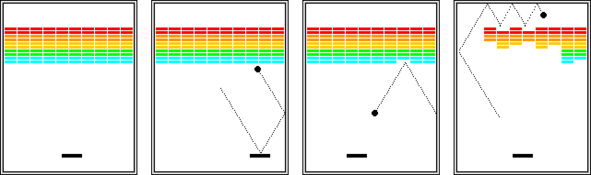
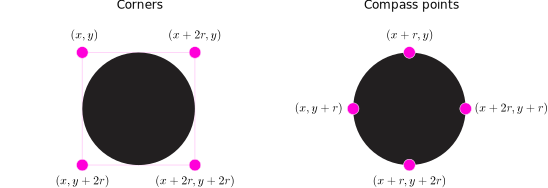

# Breakout!

<callout>
  To complete this assignment, you **must** include an Academic Integrity Acknowledgment. There are [instructions near the bottom of this document](#academic-integrity-acknowledgment).
</callout>


{:standard_toc}


In this assignment, you will put together what you have learned so far to **create an entire game from scratch**: the classic arcade game of Breakout. You will come up with your own object model and decide for yourself how to structure your code.

## Learning goals

This assignment is the first open-ended project in COMP 127. The knowledge you'll apply and the skills you'll practice here are...well, almost everything in this course.

Important items include, but aren't limited to:

- **Building software from a natural language (i.e. English) description:**
  - Reading carefully
  - Creating a feature checklist to guide your work
  - Translating words into code structures
  - Verifying the resulting software against the original text
- **Modeling and abstraction-building:**
  - Designing your own object model for an open-ended problem
  - Planning the high-level architecture of your code with a diagram
  - Choosing appropriate programming language features to implement your model
  - Inventing project-specific abstractions that will help make your code clear, correct, and manageable
  - Adjusting your plan as you work and gain better understanding of the problem
- **Making good use of resources:**
  - Pacing your work wisely over the assignment's entire multi-week timespan
  - Reading documentation to independently figure out how to use the tools you have
  - Admitting to yourself that you need help when you need help
  - Actually _asking_ for help promptly when you are stuck

This homework is less prescriptive than previous assignments; we provide you with less direction and instructions. You'll need to do more independently: coding, higher-level modeling, design, and planning. **This is in part to prepare you for the upcoming course project** which will involve even _less_ direction and instructions.


## Game description

Breakout was developed in 1976 by Steve Wozniak, shortly before he co-founded Apple Computer, Inc. He [cited the experience of building the game](https://archive.org/stream/byte-magazine-1984-12/1984_12_BYTE_09-13_Communications#page/n461/mode/2up) as part of his inspiration in creating the Apple ][, the first commercially viable home computer.

In Breakout, the player's goal is to clear a collection of bricks by hitting each of them with a bouncing ball. The easiest way to see how the game of Breakout works is to [watch a video of someone playing it](https://youtu.be/AMUv8KvVt08?si=TlB3KFeH7WsLCIbu).

Your version of Breakout will look something like the images below. The initial configuration of the Breakout game appears in the left image. The slightly larger rectangle at the bottom is the “paddle.” The paddle is in a fixed vertical position, but moves back and forth horizontally across the screen following the player's mouse until it reaches the edge of its space.

{:scale="1" .dark-mode-invert}

A complete Breakout game consists of three turns, or lives. On each turn, a ball is launched from the center of the window towards the paddle. That ball bounces off of the paddle and the side walls of the world (left, right, and top). The second image shows an example trajectory the ball might take after two bounces: one off of the paddle and one off of the right side. (_Note that the dotted line in those images only illustrate the ball's path. The dotted line won't appear on the screen in the actual game._)

In the second image, the ball is about to collide with one of the bricks on the bottom row of the brick wall. When that happens, the ball bounces just as it does on any other collision, but the brick disappears. The third image shows what the game looks like after that collision and after the player has moved the paddle to line it up with the oncoming ball.

Eventually, the ball may find a path up to the top edge of the window (fourth image). When this delightful situation occurs, the ball will often bounce back and forth several times between the top and the upper line of bricks without the user having to worry about hitting the ball with the paddle. This “breaking out” is the origin of the game's name. Note that even though breaking out is an exciting special moment for the player, there are no special rules that make it happen. It is a natural consequence of the rules of the game.

The play continues in this way until one of the following conditions occurs:

1. The ball moves off the bottom of the screen, which means that the player must have missed it with the paddle. In this case, the turn ends (the player loses a life). If the player has more lives, the ball reappears in the center and the next turn begins. If there player has no more lives, the game ends in a loss.
2. The last brick is eliminated. In this case, the game ends immediately, and the player can retire in victory.


### Specific design notes

Your version does not need to look _exactly_ like the images above. You can choose to be creative about:

- the brick colors (but the bricks must have multiple colors)
- the colors of the ball, paddle, and background
- the size of the bricks
- the number of bricks in each row
- the number of rows of bricks (but it must be ≥2)
- the placement of the brick wall
- the margin between the wall and the sides of the screen

When the game starts, the ball starts in the center of the screen. The ball waits for 3 seconds before moving, then travels diagonally downward towards one side or the other.

When a player loses a turn / life, the game exhibits a similar behavior: the ball starts in the center, waits for 3 seconds, then moves.

The player controls the paddle with the mouse. You _can_ choose to make the paddle only move if the player is _dragging_ (i.e. holding down the button while they move the mouse), but the game feels much nicer if the paddle follows the mouse's motion even when the button is not pressed. (You may also choose to use keyboard controls instead, but the game is _much_ harder that way.)


## Implementation

### Requirements

Your implementation **must** use the tools of the course, Java and Kilt Graphics. (If you want to build Breakout for some other platform, that's an excellent personal project! Bring it to the [Dev Garden](https://devgarden.macalester.edu) after you complete this assignment.)

You must use the tools of object-oriented programming we have been practicing to organize your code. We expect you to decompose your program into at least three separate classes in addition to the main `BreakoutGame` class. Excellent designs will have four or more. The goal, however, is _not_ to maximize the number of classes. The goal is to achieve a _good division of labor_. It is a bad sign if you have one giant class that does most of the work. It is a good sign if each class and each method is small, and has a clear and distinct purpose.

In your code, make good use of named constants for dimensions, distances, timings, etc. Avoid having “magic numbers” hidden deep in the code that control the gameplay.

As you develop each class, practice good method decomposition to avoid code duplication. Give each method a single clear purpose, and a name that clearly expresses that purpose. Short methods are a good sign. If a method is getting long, think about whether you can decompose it into several smaller methods.

Please pay special attention to the [Style Guide](/resources/style-guide/).

Because this program is entirely graphical, you do not _need_ to write JUnit tests; however, you _might_ find that writing some helps you develop the game logic. With or without JUnit, make sure you test thoroughly by playing the game.

### Tips

To start thinking about the design of your code, read through the game description above and pull out all of the significant **nouns** that are part of the game. This will help you spot potential classes.

Plan your work so that you can **test early** and **test often**. Do not try to build the whole game in one pass! Get a _tiny_ piece coded, run it, test it, fix it, get it working — and _then_ add another tiny piece.

Remember the refactoring skills you have learned. It is always a good strategy to get _something_ working, then refactor it and add to it. It is usually far more efficient to **take baby steps** where you can **test at every step** than to take giant steps where you go for long periods unable to tell if you're on the right track and unable to even run your code.

Your past work in this class will help you! Refer especially to your code from [Bubble Blitz](/hw/bubble_blitz), [Painter](/hw/painter), [Graphing Calculator part 2](/activities/graphing_calculator_2), and [Concurrency part 2](/activities/concurrency_2) (after we do it on
{{ format_date(data.assignments.activities.concurrency_2.in_class_date.first) }}).

### Collision detection hints

One tricky part of this assignment is checking whether the ball has collided with a brick or the paddle. Because the ball is not a single point, it is not sufficient to check the coordinates of the ball's center to detect collisions. It is not the center of the ball that collides with things; it is the edge!

The easiest way to solve this problem is to test multiple points surrounding the ball. This produces physics that are not perfectly accurate, but good enough. (In game development, most simulations don't need to be _accurate_; they need to be _convincing_.) There are at least two good ways to do this, and they come with tradeoffs:

{:scale="2" .dark-mode-invert}

- **Option 1 – Corners:** Check the four corners of the ball's bounding rectangle.

  This makes the bounce logic a bit complicated. For example, if the upper left corner of the rectangle detects a collision, did the ball hit something _above_ or something _to the left_? Hint: <hidden>Use a collision with _two_ points to determine the direction of the bounce.</hidden>

- **Option 2 – Compass points:** Check the four points at the top, bottom, left, and right of the ball.

  This has the advantage of easily distinguishing the four sides of the ball to tell which way it should bounce when it collides with something. However, this option can make collision detection a little trickier, as we will see shortly.

Remember that a Kilt Graphics `Ellipse` is defined in terms of its bounding rectangle. (You saw this in the Emoji Drawing activity.) This means that if the upper left corner of the ball's bounding rectangle is at point (_x_, _y_) and the ball has radius _r_, then the coordinates for those two options will be as follows:

{:scale="2" .dark-mode-invert}

Once you have determined the coordinates to check, how do you actually check whether there is something to collide with at those coordinates? Again you have two choices, both tricky in different ways:

- You can ask Kilt Graphics to tell you what graphics object is at a specific position by calling the `getElementAt()` method of either `CanvasWindow` or `GraphicsGroup`. If the value you get back is not `null`, then there is a graphics object there.

  It is handy to let Kilt Graphics deal with the geometry of the bricks and the paddle for you! However, this approach comes with complications. It can cause confusion with coordinate systems if you used `GraphicsGroup` to organize the UI (something which is otherwise a good idea!). If you add extra decorations to the game, it can return graphics objects that are neither a brick nor a paddle.

  Furthermore, if you use the **compass points** option, then you are testing points right on the ball's edge — and `getElementAt()` will thus always return the ball itself! How can you solve this? Hint: <hidden>Test points very slightly _outside_ the ball.</hidden> If you use the **corners** instead, you won't have this problem, but remember: that approach makes it harder to figure out which way to bounce.

- You can also do all the math to figure out for yourself whether a given point is inside a brick or a paddle. This avoids all the problems of `getElementAt()` — but doing all the math yourself means you have to do all the math yourself!

Software development is full of these sorts of <def term="tradeoff">tradeoffs</def>: no matter what you choose, you gain something and lose something. There is no single correct answer. **It's all tradeoffs.** You need to decide for yourself which approach you want to take.


## Checkpoints and due dates {#checkpoints}

This homework will have three milestones, each with its own due date:

- **Checkpoint 1**, due **{{ format_date(data.assignments.hw.breakout_checkpoint_1.due_date) }}**:

  Plan your implementation by drawing a **class diagram**. It should show classes, relationships, and perhaps even methods and instance variables, but **should not contain any actual Java code**. 

  Like the Mastermind picture, it's OK for this diagram to be a sketch. The purpose is to get you thinking.

  Please note that you **do not need to stick with this plan** when you write the code! The goal of your diagram is to _start_ thinking, not to _finish_ thinking. “Plans are useless. Planning is essential.”

  Try to give yourself a map of the whole project, but then take an _incremental_ approach to actually building it instead of trying to turn your whole diagram into code all at once!

  Upload your class diagram to Moodle.

- **Checkpoint 2**, due **{{ format_date(data.assignments.hw.breakout_checkpoint_2.due_date) }}**:

  Make the graphical elements of the game appear on the screen and make the ball animate. Your ball must bounce off of the top and sides of the screen, but does not need to collide with bricks or the paddle. If you get further than that by this date, fantastic!

- **Complete assignment**, due **{{ format_date(data.assignments.hw.breakout.due_date) }}**:

  Commit and push the completed assignment, including the Academic Integrity Acknowledgment.

## Submission requirements

To receive full credit, you must have:

- Correct execution:
  - Ball / brick collisions
  - Ball / side collisions
  - Ball / paddle collisions
  - Paddle controls
  - Logic for losing a turn / life
  - Win / lose logic for full game
  - (**Review the game description in this document** when you think you are done!)
- Good class decomposition
- Good method decomposition
- Good code style
- Academic Integrity Acknowledgment


## Academic Integrity Acknowledgment

When you have completed the assignment, create a file named `ASSIGNMENT_COMPLETE.txt` in the root directory of this project. Write the following statement in it, filling in the blanks:

```markdown
While working on this assignment:

- I did not look at anybody else's solution.
- I did not copy code from any existing implementation of Breakout.
- I did not use generative AI to write any code.

I used the following help and outside resources:

- [resource you used]
- [help you received, including from preceptors and instructors]

[your name here]
```

If the statement above is not true in your case, then explain your situation in the file.

Your homework **is not submitted** until you create, commit, and push this file.


## Attribution & history

The original idea for this assignment, most of the game description text, and all of the gameplay images come from [Eric Roberts](https://cs.stanford.edu/people/eroberts/).

This assignment has been a part of the CS curriculum at Macalester since the spring of 2008 — before Kilt Graphics existed, before COMP 127 existed, before Java had lambdas, before The Loch existed, before most of the currently CS faculty taught here, and even before many current students were born. It is a Macalester tradition.

It was Macalester CS Professor [Libby Shoop](https://www.macalester.edu/mscs/facultystaff/libbyshoop/) who brought Breakout to Macalester. She tells the story:

> I have been a regular attendee and published at ACM[^acm] SIGCSE technical symposium for my whole career at Macalester, thanks mainly to [Michael Schneider](https://www.macalester.edu/mscs/facultystaff/michaelschneider/), who urged me to attend during my first year at Mac (2001-2002). That conference has a wildly popular session that is now a permanent part of the conference called Nifty Assignments. In 2006, Eric Roberts of Stanford University presented [this assignment](https://cs.stanford.edu/people/eroberts/talks/SIGCSE-2006/NiftyAssignments-Breakout.html) there. While I did not see the talk, I later read about it. I was on the lookout for how to improve our Java course with more interesting assignments, and the next year I attended a [panel session describing the culmination of the work of the ACM Java Task Force](https://dl.acm.org/doi/10.1145/1121341.1121384). This was a time in CS education when everyone was getting on the Java bandwagon, and in fact Macalester had been leading this charge, thanks to Michael Schneider (he had already been teaching data structures with Java when I arrived in 2001, and I started teaching it also). The Java task force created libraries that made graphics approachable for students[^acm-graphics], and I was excited to try it. I switched to using Eric Roberts' textbook, [The Art and Science of Java](https://www.amazon.com/Art-Science-Java-Eric-Roberts/dp/0321486129), in our data structures course after the book came out in early 2007. I did not teach COMP 124[^124] in Fall of 2007, so I believe it was Spring of 2008 when I first used this assignment, which was described in that book (19 years this Spring!). I believe this also coincided with using a professional IDE, IntelliJ, for the course, and around that time I experimented with software versioning systems, beginning with the use of svn, then transitioning to git.
>
> This was probably the best example of something I incorporated from attending SIGCSE, and I have Mike Schneider and Eric Roberts to thank for it.

[^acm]: The [ACM](https://www.acm.org) — Association for Computing Machinery — is the flagship organization for educational, scholarly, and professional work in computer science. It is even older than this assignment, founded in 1947!

[^acm-graphics]: That ACM Graphics Library was the predecessor of Kilt-Graphics.

[^124]: COMP 124 was the predecessor of COMP 127 and 128.

---

## Extra things to try

Once you have the basic game complete, you should feel free to improve, enhance, or fiddle with your solution! Students have done some _amazing_ things with their Breakout implementations over the years — not for points, but for the glory and the sheer joy of making something awesome.

Some ideas:

- Make your graphics look better or prettier. Add color! Add borders!
- [Add some juice.](https://youtu.be/Fy0aCDmgnxg?si=h07n2WJIkxGYsY0h) ← Lots of great ideas in that video!
- Make the ball bounce off the paddle at a different angle depending on which part of the paddle it hits, like [Arkanoid](https://en.wikipedia.org/wiki/Arkanoid) ([gameplay video](https://www.youtube.com/watch?v=ckyQe_EBJG4)). (This change creates _much_ deeper gameplay!)
- Make some of the bricks give special bonuses. Maybe a special brick explodes and destroys a bunch of blocks around it? Makes the ball bigger? Turns the single ball into *multiple* balls? Summons [Donkey Kong, who starts throwing barrels at the bricks](https://youtu.be/KJkcNP4VkiM?si=Va9kMsX5oyX9HB_1)?
- Add multiple levels with different brick layouts.
- Anything else interesting or cool you like. Ask your instructor if you have any questions about your ideas.

---
