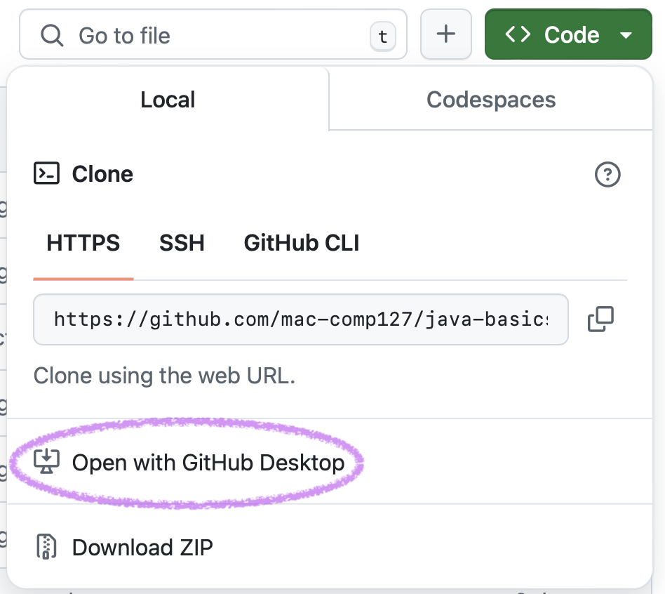
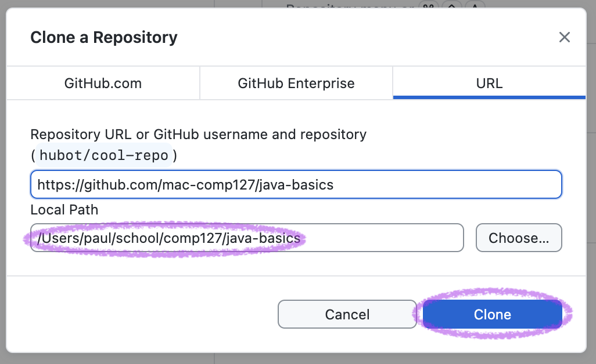
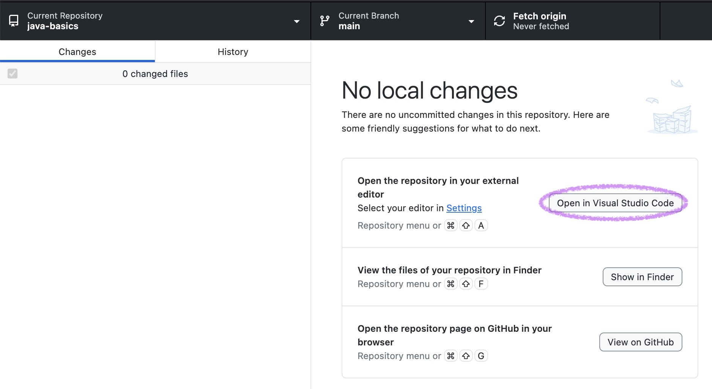
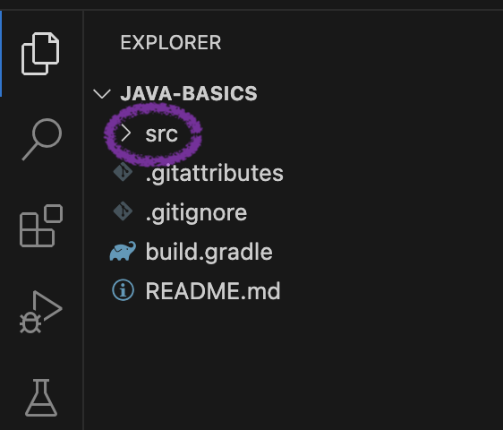
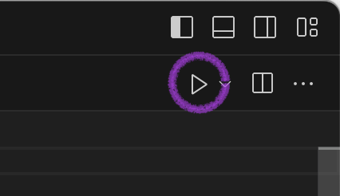

# Code-as-Reading Procedure

Some reading assignments in this class are code. You can read the code in your web browser at first, but it is a good idea to also **run the code** for yourself, see what it does, and **try experimenting with it**.

Because these readings are not something you will hand in, just your own personal experiments, the steps for getting the code on your machine are simpler than the steps for an assignment. The screenshots below are for the “Java Basics” code-as-reading assignment but they are the same for other code-as-reading assignments.

If you get stuck, ask for help. See the **COMP 127 Help** section of the sidebar to the left.

1. Open the main page for the reading’s repository. To get there, **open the reading link**, then **click the repository title** in the upper left of the web page:
   
   

1. Click the big green **Code** button:
   
   

1. Click **Open with GitHub Desktop** in the popup that appears:
   
   

1. This should open a dialog box in the GitHub Desktop app on your computer. Check the **Local Path** to make sure you like the location where it’s going to save the code on your computer — <highlight>pay attention to this location!</highlight> — then click the **Clone** button. This will create a copy of the reading’s code on your personal computer, where you can play with it.
   
   

1. You should now see a screen with the big headline “No local changes.” Underneath it, click the **Open in Visual Studio Code** button.
   
   

1. You may get a warning asking you whether you trust the authors of this code. It is OK to click the button that says **Yes, I trust the authors**. (But be careful about doing that with random code you download from the Internet! It is a valid question that VS Code is asking you here.)

1. In the upper left, VS Code’s file explorer will show the directory `src`. Click to expand it.
   
   

1. Inside it you will find one or more `.java` files. Click the one for reading to open it.

1. You should now see the code for the reading inside of VS Code. Click the **Run** button (with the icon that looks like a play button) in the upper right of the VS Code window.
   
   

1. Now, unlike the web version, you can make changes to the code and see what happens! **Experiment with the code** and **try running it with your changes** as you work through the reading.

