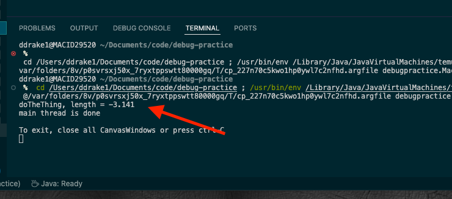
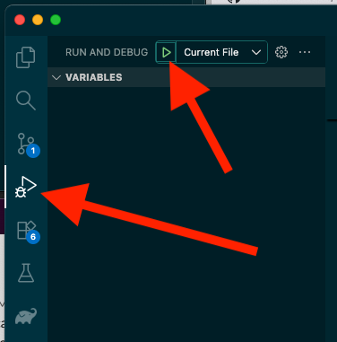
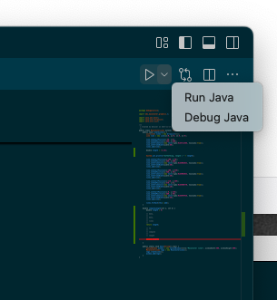
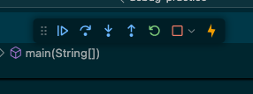
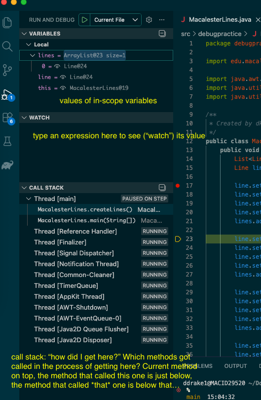

# Debugging Strategies

{:standard_toc}

## Meta-strategies for debugging

There's a [famous quote from Brian Kernighan](https://en.wikiquote.org/wiki/Brian_Kernighan), a luminary programmer, on debugging:

> Everyone knows that debugging is twice as hard as writing a program in the first place. So if you're as clever as you can be when you write it, how will you ever debug it?

Debugging can indeed be very hard. Remember that and don't get discouraged!

Regardless of which approach you're using for debugging, there's a couple things to keep in mind.

### Understand the problem

It's always a good idea to start off with clear answers to these questions. They may seem obvious, but it's surprising how tempting it is, and how often one can dive in without clear ideas and goals. These questions include:

* What is my program *doing*?
* What is happening?
* When and where is it doing the wrong thing?

You can answer the first two right away. You'll use various strategies to answer the third.

### Where is the problem?

You can't fix a bug if you don't know *which* code is flawed. So one of your first goals, before you start trying to fiddle with your code to fix it, is to find out exactly where the problem is.

You can often work iteratively: cast a wide net and narrow it down. You may start by determining that the problem lies in a particular class. Then, you use your strategies and find that the problem is somewhere in one of, say, four methods. Then work with each method in turn and try to narrow it down to a single method. Then -- keep going! -- try to narrow down *which* code in that method is doing something wrong.

Once you know where the problem is, then start carefully read the code and start working to change it.

### Detective work and likely suspects

There's a well-known joke among programmers, originally from a tweet by Filipe Fortes, that points to what's weird about debugging code that you have written:

> Debugging is like being the detective in a crime movie where you are also the murderer.

Debugging is indeed like detective work, but when it's your own code, you are *also* the murderer -- the one who committed the crime, or wrote the bad code!

As part of answering the above question, you often will have incomplete information. You may know that the problem is in, say, one of four methods. You use your debugging strategies and your reasoning skills to look at each of the four...but maybe you can't 100% rule out any of them.

This is common. And you can think like a detective: maybe you have four suspects for a crime. You can't 100% rule out any of them as innocent...but usually, one of the suspects is more likely to be the culprit (or vice versa: someone may be innocent, you're just not certain). As a detective, you'd start your investigation with the most likely suspect and not eliminate the others until you have more data.

Work with your code the same way. Take notes! You may have your four suspects; go ahead and rank them. Investigate -- debug! -- the one most likely to be guilty -- have a bug. Go back to your other suspects if the first one seems likely to be innocent.


## Strategies

Here are some popular strategies for debugging code.

### Print statements

This is perhaps the simplest possible: just insert a print statement that outputs something about the state of your program. Perhaps you suspect something is wrong in the `doTheThing` method, which has a variable `length` that doesn't seem to get set correctly. Just insert something like

```
System.out.printing("doTheThing, length is" + length);
```


When you run your program, the terminal will print that out:

{:scale="2.5" }


Now you know something about (1) the value of `length`, but also (2) its value at a particular place in the code, and (3) how many times that code got executed.


### The source debugger

The most powerful and flexible of these strategies is the source debugger. Here are a couple links on using the Visual Studio Code debugger:

* [Debugging for absolute beginners](https://github.com/MicrosoftDocs/visualstudio-docs/blob/main/docs/debugger/debugging-absolute-beginners.md)
* [Debugging for...not absolute beginners](https://github.com/MicrosoftDocs/visualstudio-docs/blob/main/docs/get-started/csharp/tutorial-debugger.md).
* [The official VS Code site's article on debugging](https://code.visualstudio.com/docs/debugtest/debugging).

To use the debugger, you need to set some breakpoints. These tell VS
Code when to stop and let you start stepping through your source code.
Click on the far left column to set a breakpoint. It'll appear as a red
dot.

Now start debugging: you can use the "triangle with a bug" pane on the left, or by selecting "Debug Java" in the upper right:


{:scale="1.1"}
{:scale="1.25" }

When the debugger hits a breakpoint, there are several things you can do. Look for the debug toolbar:

{:scale="1.5"}

The key icons are continue, step over, step into, step out, and stop. Hover over them to see the tooltips. Here's what they do:

| Action | Description |
|--------|-------------|
| Continue | Resume normal execution, keep going to next breakpoint or end of program |
| Step over | Execute the next line as a single command |
| Step into | Advance into the next method to be called as part of evaluating the current line |
| Step out | Advance to the end of the current method and stop at the first line past where it got called |
| Stop | Terminate the current program |

(If you're not used to the various "step" concepts, take a look at [the "Help Gidget" game](https://helpgidget.com/) -- it's a very simple game and may look very childish, but if you pay attention to what it does when you use the "one step" and "one line" buttons, you can see how the corresponding program behavior and state change; it works a lot like the VS Code debugger.)

**Monitoring program state:** you will of course want to know the state of your program --- values of the in-scope variables. That will be on the left side in the "Variables" box. There's also the "Watch" box and the Call Stack:

{:scale="1.1"}

### Partial execution

Sometimes you can just use the output of your program to find out about the state of your program.

In the print statement strategy above, you see that `length` is...negative! That doesn't look good. Maybe that means some line doesn't appear because of this. Where did `length` get set to a negative value?

Imagine that you get `length` from a method called `computeLength`, which is very long. Where does `length` become negative? You can *partially execute* that method by returning early and looking at the return value. The picture is something like:

```
    double computeLength(int a, int b) {
        double length = 0;

        // many,
        //
        // many,
        //
        // lines
        //
        // to
        //
        // compute
        //
        // length

        return length;

    }
```

Pick a line about halfway through the method. We'll return `length` from there and see if it's negative:

```
    double computeLength(int a, int b) {
        double length = 0;

        // many,
        //
        // many,
        //
        // lines
        //

        return length;
        // comment out everything below

        // to
        //
        // compute
        //
        // length

        return length;

    }
```

Run your program. Does the output reflect a negative value for `length`? If so, that must have happened *before* you inserted that early `return` statement: so, move the above snippet somewhere earlier in the method. Keep going until you find a small bit of code where you can find the error.

(One name for this approach is "bisecting"; abstractly, it can also be viewed as a form of *binary search* -- a core computer science algorithm you can learn about in other CS courses such as COMP 128 or COMP 221.)
