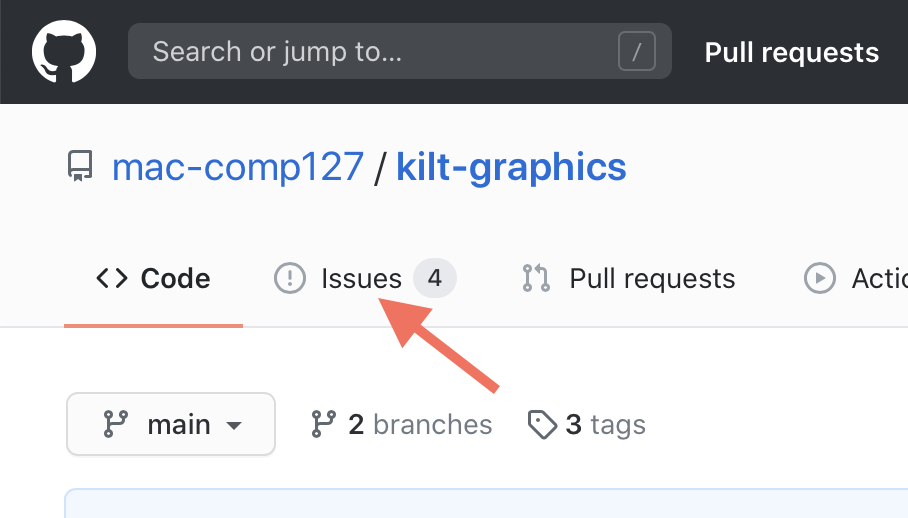
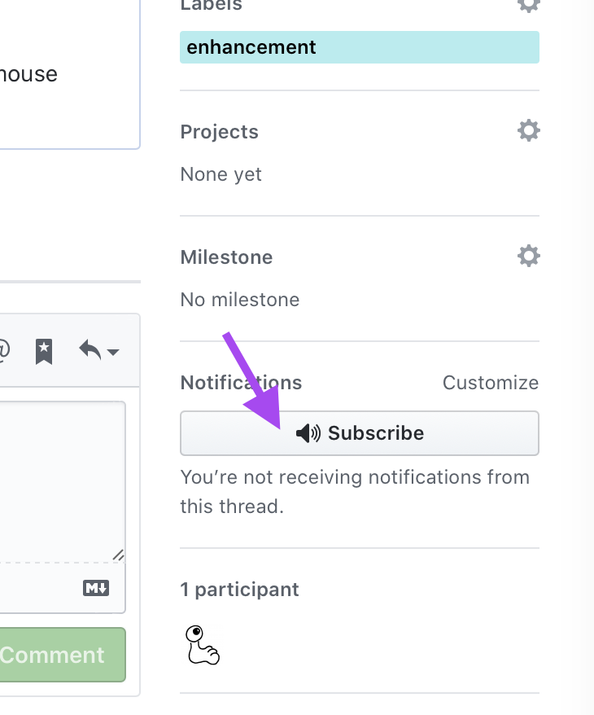
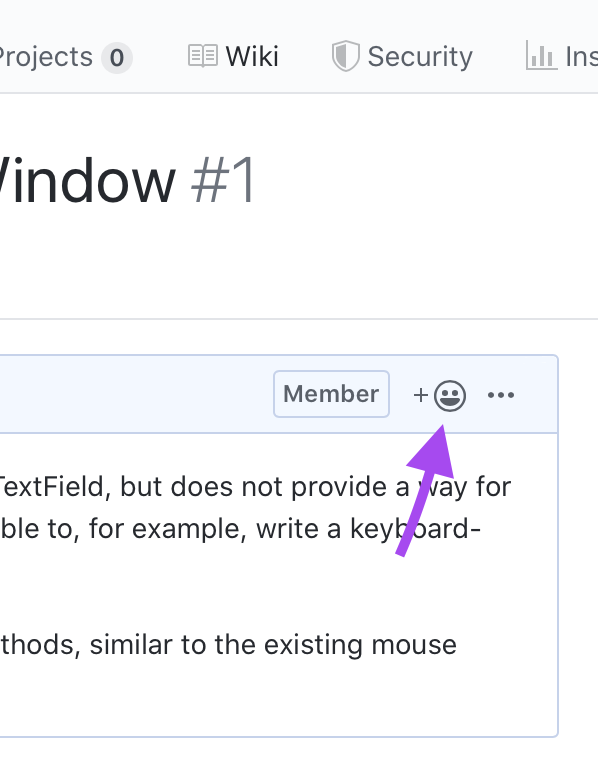

# How to File a GitHub Issue

For your class projects, you may find that you need something that Kilt Graphics does not yet provide — or you may find a bug!

If this happens, you can make a request for the professors to change Kilt Graphics to suit your needs. Many other software projects have a similar procedure.

{:standard_toc}

## What is an “issue?”

An issue is something you want to change about a piece of software. It can either be a **feature request** (also known as **enhancement request**, something new that you want to add), or a **bug report** (something already present that isn’t working the way you expect).

Here are some good examples from various projects to give you a sense of what issues look like in context. (Don’t worry if you don’t understand the technical details! Pay attention to structure, tone, and the kind of content they contain.)

- [Well-written enhancement request](https://github.com/bustoutsolutions/siesta/issues/261): clearly states both what and why
- [Clear, specific description of a bug](https://github.com/bustoutsolutions/siesta/issues/286)
- [Nice and short](https://github.com/seattlerb/minitest/issues/213), and still communicates everything it needs to
- [Bug report](https://github.com/elm/browser/issues/16) with code to reproduce + a video!
- [Great bug report with steps to reproduce](https://github.com/education/classroom/issues/1777) (But oops, it was a duplicate! Should have checked for existing issues before going to all the work to write that up)

## Filing a Kilt Graphics issue

- Visit the [GitHub page for Kilt Graphics](https://github.com/mac-comp127/kilt-graphics).

- Click the “Issues” tab near the top, just under the repository name:

    

- **Search the existing issues**, both open and closed. Has somebody else already filed the same issue?

  - **Yes, there is an existing issue!**

    - If you want to get a notification when there is more information about the issue, or when it is fixed, click the “Subscribe” button in the right column. This also effectively functions as a vote in favor of fixing the issue:

        
    
    - If you have **additional information**  about the issue that would help either the project maintainers or other users, post a comment.
    
    - However, **do not**  post a “yes please” or “+1” or “I need this too” comment! That generates an annoying email to everybody who is subscribed to the issue, and is bad form. If you can’t add useful information, don’t add a comment. Instead, if you want to express your feelings about the issue, add an emoji reaction:

        

  - **No, nobody has already reported my issue:**

    - Click the New Issue button! If you have multiple enhancement requests or bugs, **create a separate issue for each of them.**  Project maintainers use issue to keep track of what work is done, and you make their life hard if you put many requests in a single issue.
    - Give your issues **a clear, simple title**. Remember that your issue will end up in a long list of issues, so think about how your title will look in that list. Make it possible for people to recognize at a glance what your issue is about.

    - If you are making an **enhancement request**:

      - Be sure to describe both **what you need**  and **why you need it.**  (What problem are you solving?) You don’t need to describe your whole project, but give enough context that the request makes sense.
      - Be brief, clear, specific, and to the point. Code maintainers can follow up with questions if they need to.

    - If you are **reporting a bug:**

      - First, do some research. Does the bug happen every time? Can you make it happen with less code? Your goal is to make it possible for **other people to reproduce the same bug**  in the simplest way possible.
      - Describe your bug with the following checklist:

        - Describe the specific steps to make the bug happen. **Copy and paste any relevant lines of code.**
        - Describe the result you expect.
        - Describe the actual result you got. If there is an error message, then **copy the entire error message**  into your report. If it is a visual bug, post a screenshot.

## Etiquette

- **Be respectful.**  When you are filing an issue on an open source project, keep in mind that you are making a request of volunteers who owe you absolutely nothing. Even if you are filing an issue on a product for which you are a paying customer, remember that there are people reading your words who are working hard and doing their best. Come at your issue writing with an attitude of collaboration.
- **Be diligent.**  You are filing _one_ issue; the people you’re sending the issue to may have _dozens or hundreds_ to deal with. Take time on your end to provide information that is clear, correct, thorough, and as simple as you can make it.
- **Be patient.**  Your emergency isn’t necessarily their emergency. Your issue might not get fixed right away. Be prepared to wait and find workarounds.
- **Be ready to listen and help.**  The project maintainers might ask you for additional information. They might explain some context you were not aware of.
- **Don’t make it personal.**  Avoid being blameful or hurtful. Stick to the facts. Don’t make it about them. Your request might get rejected. If that happens, don’t make it about you. Keep in mind that there may be a good reason why the project works the way it does ([example](https://github.com/bustoutsolutions/siesta/issues/288)), or why your idea doesn’t fit with the larger design.

## General principles

The guide tells you specifically how to file issues for Kilt Graphics, but the advice it gives is generally useful! Doing software development in the wild, you will often need to **ask other people to change their software**  for your benefit, either because you’ve encountered a bug or because you are requesting an enhancement. This means you need to answer many questions, all of which require thought and research:

- Which software would you like to change? (This can be hard to figure out! When you are coding, do you know what features are Java and which are VS Code / IntelliJ? Which are git and which are GitHub? They are all made by different people!)
- Who maintains that software? How do they want people to make change requests? Do they have an issue tracker, a forum, a mailing list, a help system?
- What exactly do you _really_ need? Be clear about your problem.
- Have other people already encountered the same problem?

  - If so:

    - Did they find solutions already?
    - Are the software maintainers already working on a fix?
    - Have they already decided not to make the change you are requesting, and if so, why?
    - Given all that, do you have any _new_ information to provide?

  - If not:

    - How can you describe what you need clearly and concisely enough that other people can easily understand your problem? (This is difficult! It is one of the reasons I strongly recommend that everyone who will go into software work take classes that develop their writing skills.)
    - If you found a bug, did you find steps that make it happen every time? Can you describe those steps so that _other_ people can make it happen every time?

Navigating all of this well is a skill. It takes practice. If you get good at it, it will make you a better, more effective developer — and a boon to the software development community!

For further reading, here is a [good blog post on writing good bug reports](https://sifterapp.com/blog/2012/08/tips-for-effectively-reporting-bugs-and-issues/).
