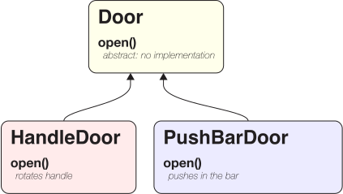
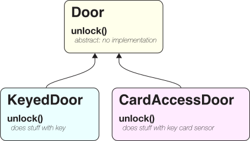
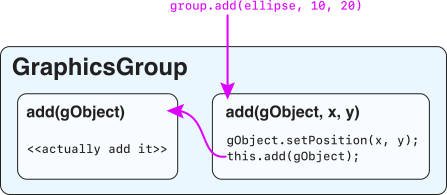

# The Problems with Inheritance

{:standard_toc}

<definition-callout>
  <def lowercase>Inheritance</def> means two things together:

  1. an _is-a relationship_ and
  2. _code reuse_.

  When class `A` extends, or inherits from, class `B`, then:

  - every `A` _is a_ `B`, and
  - `A` inherits (reuses) all the instance variables and methods of `B`, except the ones it chooses to <def>override</def>.
</definition-callout>

## Historical background

Inheritance is enticing. When programmers first learn about object-oriented programming, it is often inheritance that catches their eye. It feels a little magical (code reuse!). It scratches the deeply human itch to form taxonomies. It offers a tantalizing vision of the overwhelming mess that is code tamed by a tidy inheritance hierarchy, everything in its right place. It is a shiny object that captures our attention.

This reaction to inheritance is not unique to college students, or to beginning programmers. OOP was developed in the 1970s[^early-oop], but it was in the 80s and 90s that OOP gained mainstream traction. In those decades, developers went _wild_ for inheritance. Inheritance promised to multiply software productivity with _code reuse_: don’t write new code, just inherit and customize! Soon programmers would be 10x more productive! Soon _anyone_ would be able to write code with no training! OOP would make programming self-explanatory! (Yes, people _really did_ sometimes try to pitch all those ideas. Somebody’s always selling something.) In the 90s it was common to see a poster with a diagram of some important library’s inheritance hierarchy hanging on the wall next to a developer’s computer: a useful reference, yes, but also a statement of aesthetic values.

[^early-oop]: If you are curious to learn about the history of object-oriented programming, read about [SmallTalk](https://en.wikipedia.org/wiki/Smalltalk) and [CLU](https://en.wikipedia.org/wiki/CLU_(programming_language)).

That mania left its imprint on education. Most computer science programs still teach inheritance first, and teach interfaces as an afterthought.

Since the 90s, however, developers have backed off from inheritance. Consider three of the most significant programming languages in industry created in the past 20 years: Swift quarantines inheritance to one corner of the language, mostly for compatibility with existing libraries; Rust and Go both eliminate it entirely. All these languages — and modern programming practice in general — are shifting in the direction of things that look more like Java interfaces with powerups.[^typeclasses]

[^typeclasses]: If you want to learn more about interface-shaped abstractions in modern languages, read about [Swift protocols](https://docs.swift.org/swift-book/documentation/the-swift-programming-language/protocols), [Rust traits](https://doc.rust-lang.org/book/ch10-02-traits.html), and [Haskell typeclasses](https://learnyouahaskell.com/types-and-typeclasses#typeclasses-101).

Why? Why did inheritance, darling of programmers, fall out of favor? Why at Macalester do we choose to teach interfaces first, and inheritance as a secondary topic?

Java has inheritance, of course, as do many, many languages popular today (for example: Python, JavaScript, Ruby, C#, and C++). What did we learn from the overuse of inheritance in the 80s and 90s that can help us use it more wisely today in the languages where it exists?

Here is an overview of the problems with inheritance.

## Problem 1: Inheritance supports only a single axis of customization

Suppose we want to build an object model to represent all different kinds of doors. Doors might have some things in common, but one thing that varies a lot is the mechanism that opens them: some have a handle you turn, some have a round knob, some have a bar you push inward…. How do we handle this in our code? What if we want an `open()` method that does very different things based on the type of door?

One way to do this would be to make a `Door` class that holds all the code that all of our doors share, but leaves the `open()` method unimplemented. Then we could have different subclasses `extend Door`, one for each different way a door can open. Each one **inherits** the shared door code, but provides its own implementation of the `open()` method:

{:scale="1" .dark-mode-invert}

This is a lot like the approach we used in the [Train Car activity](/activities/train_car): a base class has the shared code, then subclasses customize it. We use inheritance as our customization mechanism for doors. And…it looks like it works!

We also want different kinds of doors to handle different kinds of locks: keys, key cards, numeric keypads, etc. No problem! We can just do the same thing…right?

{:scale="1" .dark-mode-invert}

But now we are in trouble: we want doors to have different ways of opening _and_ different ways of unlocking. We can't just freely mix and match different `open` methods with different `unlock` methods; to use inheritance, we have to specify _what is a subclass of what_. How do we work this?

Inheritance is hierarchical. If we want to use inheritance to handle different ways of opening _and_ different ways of unlocking, we have to stuff it all into one big hierarchy:

{:scale="1" .dark-mode-invert}

Now, dear reader, you might look at this picture and think, “Wow, that looks _terrible_” — and you would be correct. Is it a nightmare. Among the many problems with this approach: we are now repeating that “does stuff with key” code in both `KeyedHandleDoor` _and_ `KeyedPushBarDoor`. Wasn’t the promise of inheritance supposed to be code reuse?! We might be able to refactor that “does stuff with key” code into some shared helper method or something, but at that point, we are just trying to stop the boat from sinking by bailing buckets full of water. And we haven’t even started thinking about what will happen if we add a third kind of opening and a third kind of unlocking!

Inheritance is ill-suited for this task. The fundamental problem here is that we want to be able to customize two things — opening and unlocking — and _we want them to be independent of each other_. They are two _independent axes of customization_. Because it forces classes into a hierarchy, inheritance can only help us with a **single axis of customization**.

How _should_ we model this, then? As with most places where inheritance goes awry, the solution is to replace inheritance with <def>composition</def>: a has-a relationship between objects. The [RPG Battle exercise](/exercises/rpg_battle) you’re working on _<small>(You’ve started, right?)</small>_ is an _excellent_ example of how to handle this. In that exercise, instead of introducing inheritance to customize something, you introduce a has-a relationship. When you work on that exercise, note that you could repeat the same technique to add more axes of customization to `GameCharacter` (different defenses and different movement rules, for example), and it would work just fine.

<!-- ### A non-solution: Multiple inheritance and the Diamond Problem -->

## Problem 2: Inheritance breaks encapsulation

There’s more. Oh, poor inheritance.

Suppose we want to make a `CountingGraphicsGroup` class for Kilt Graphics that is exactly like `GraphicsGroup`, except for one thing: it counts how many times anyone called the `add(...)` method.

This seems like a perfect use for inheritance! It really does sound like our `CountingGraphicsGroup` is a `GraphicsGroup` with a small modification, right? Wouldn’t it make sense just to inherit all the code from `GraphicsGroup`, and then use method overriding to make our one little change? Let’s do that!

    public class CountingGraphicsGroup extends GraphicsGroup {
        private int counter = 0;

        public int getCounter() {
            return counter;
        }

        @Override
        public void add(GraphicsObject gObject) {
            counter++;
            super.add(gObject);
        }

        @Override
        public void add(GraphicsObject gObject, double x, double y) {
            counter++;
            super.add(gObject, x, y);
        }
    }

Note that `GraphicsGroup` has **two different `add` methods**: one that only takes a `GraphicsObject`, and another that also accepts an `x` and `y` position. We want to count when somebody calls _either one_ of the `add` methods, so we override _both_ of them in the same way: “first increment `counter`, then do the normal `GraphicsGroup` thing.” Makes sense.

Let’s test our class:

    CountingGraphicsGroup group = new CountingGraphicsGroup();
    assertEquals(0, group.getCounter());

    Ellipse ellipse = new Ellipse(10, 20, 30, 40);
    group.add(ellipse);  // First add method: no position
    assertEquals(1, group.getCounter());

We do in fact get `0`, then `1`. The test passes! Perfect!

But wait…

    CountingGraphicsGroup group = new CountingGraphicsGroup();
    assertEquals(0, group.getCounter());

    Ellipse ellipse = new Ellipse(10, 20, 30, 40);
    group.add(ellipse, 50, 60);  // Second add method: with a position
    assertEquals(1, group.getCounter());

This test fails: we get `0` from the first call to `getCounter()` as expected, but then for second call we get…`2`. Huh?!? Two???

If you open up the source code for Kilt Graphics, you will find that `GraphicsGroup` implements the version of `add` that takes both a `gObject` and an `x` and `y` like this:

    public void add(GraphicsObject gObject, double x, double y) {
        gObject.setPosition(x, y);  // Change gObject’s position
        this.add(gObject);          // Call the other add method
    }

_The one `add` method calls the other._ That is a completely reasonable thing for Kilt Graphics to do — but it messes up our subclass. Why? Here is how the `GraphicsGroup` class is _supposed_ to work when we call that add method that also sets the position:

{:scale="1.2" .dark-mode-invert}

But here is what happens when the method overrides in our `CountingGraphicsGroup` get in the way:

{:scale="1.2" .dark-mode-invert}

Follow the arrows, and see how `counter++` happens _twice_ from just _one_ call to `add(gObject, x, y)`.

Drat! It turns out we shouldn’t have overridden that second add method after all! If we only override the `add(gObject)` method, then it will work…

…for now. But remember from the first day of class: one of the primary purposes of abstraction is to [create resilience](/activities/abstraction/#generality-and-resilience). The authors of Kilt Graphics could decide in the future that they want to change how their `add` methods work so that one doesn’t call the other anymore — again, a perfectly reasonable thing to do — and then our subclass would break. Isn’t the whole point of encapsulation that `GraphicsGroup` should be able to change its implementation without changing its behavior, and existing code will continue to work?

The fundamental problem here is that **overriding methods exposes implementation details of the superclass**. We accidentally learned that one `add` method calls the other — that is an implementation detail — by overriding those methods. This is how **inheritance breaks encapsulation**.

If you are a little bit lost in all these details, for this reading it is enough for you to remember <highlight>“Oh, there’s potential danger in overriding methods from other projects!”</highlight> If you want to delve deeper, however, and learn about how to solve this problem without using inheritance and without breaking encapsulation, read [Item 18: Favor Composition Over Inheritance](https://drive.google.com/file/d/1LUzPQxSQY26HaDeBT57_eP0y0Cjh5Hyi/view?usp=share_link) from _Effective Java_ (fantastic book, highly recommended).

For now, more problems are coming right at us!

## Problem 3: Inheritance fights with LSP, and you lose

Let’s suppose we have a nice class for representing squares:

    public class Square {
        private double width;

        public double getWidth() {
            return width;
        }

        public void setWidth(double width) {
            this.width = width;
        }
    }

…and let’s suppose that we _also_ want a class for representing rectangles. The `Rectangle` class should be exactly the same as `Square` except it also has a height in addition to a width. Hey! We can harness the awesome power of inheritance to _reuse_ the width code! Check it out:

    public class Rectangle extends Square {
        private double height;

        public double getHeight() {
            return height;
        }

        public void setHeight(double height) {
            this.height = height;
        }
    }

That really does make sense, right? A `Rectangle` is just a `Square` plus a height? Wait…it sounds a little funny when we say it like that. But this code works:

    Rectangle r = new Rectangle();
    r.setWidth(10);  // We inherited this method! Yay!
    r.setHeight(3);

Yup, things are going great. Now, it just so happens that we have this handy method for computing the area of a `Square`:

    public static double computeArea(Square s) {
        return s.getWidth() * s.getWidth();
    }

But…uh oh. We can do this:

    Rectangle r = new Rectangle();
    r.setWidth(10);
    r.setHeight(3);
    computeArea(r);  // uh oh: that method is supposed to take a Square

What is the area of a rectangle width sides of 10 and 3? <hidden>30.</hidden> And what will that call to `computeArea(r)` return? Think, then check your answer: <hidden>100.</hidden> Why? <hidden>Because `computeArea` calculates width times width — which is correct for a `Square`! — and the width of that `Rectangle` is 10.</hidden>

The fundamental problem here is that our code is a lie. When we said `Rectangle extends Square`, we were saying that _every `Rectangle` is a `Square`_. That is flatly wrong — but `extends` _means_ “is a,” and that’s what we said. Even though the `computeArea` method correctly insists on being given a `Square`, Java lets us pass it a `Rectangle` because we said a `Rectangle` is a `Square`.

We just ran face first into one of the fundamental principles of object modeling, named for its inventor, Barbara Liskov[^liskov]:

[^liskov]: Inventor of the CLU language; see first footnote above!

<definition-callout>
  <def>Liskov Substitution Principle</def> (<def entry="Liskov Substitution Principle">LSP</def> for short)

  Every important property of some type should be true of all its subtypes, so that if `S` is a subtype of `T`, then it should work to substitute a value of type `S` in a context that expects a value of type `T`.

  (There are more formal ways to state LSP, but this loose description is true to the spirit.)
</definition-callout>

In our case, if `Rectangle extends Square`, then we should be able to substitute a `Rectangle` object in any code that expects a `Square`. Unfortunately, a rectangle is _not_ a square: one important property of a square is that all the sides are the same length, and that is not true of all rectangles! That’s why `computeArea` didn’t work. Our subclassing scheme here violated LSP.[^textbook]

[^textbook]: Believe it or not, one of the textbooks that we considered (and rejected) for our courses here at Macalester gave _this exact incorrect example_ with `Square` and `Rectangle` as its way of introducing inheritance.

Recall from the top of this document that “inheritance” means two things together:

  1. an _is-a relationship_ and
  2. _code resuse_.

Those two things are frequently in tension. A desire for code reuse can tempt programmers to lie about is-a relationships. We wanted to avoid writing `getWith` and `setWidth` twice, so we created a bogus is-a relationship. **Inheritance fights with LSP.** It is in fact shockingly difficult to preserve LSP when creating subclasses!

### But this specific problem is fixable, right?

Let’s stop lying about squares and rectangles! We all know that every square is a rectangle, so let’s make our code say that! Here is a nice clean `Rectangle` class that does _not_ extend `Square`:

    public class Rectangle {
        private double width, height;

        public double getWidth() {
            return width;
        }

        public void setWidth(double width) {
            this.width = width;
        }

        public double getHeight() {
            return height;
        }

        public void setHeight(double height) {
            this.height = height;
        }
    }

Now, since a square is a rectangle, obviously we want to say that `Square extends Rectangle`. But how do we make this work? If we say that, then `Square` must have a width and height, because its superclass does. And if width and height are not equal, than it’s not a square! Aha: we can just make it so that if you change one side of a square, you change _all_ the sides; if you set _either_ the width or height, then you set _both_. That way we preserve the guarantee that all sides of a square are equal:

    public class Square extends Rectangle {
        @Override
        public void setWidth(double width) {
            super.setWidth(width);
            super.setHeight(width);
        }

        @Override
        public void setHeight(double height) {
            super.setWidth(height);
            super.setHeight(height);
        }
    }

No lies detected! Now, let’s see if `computeArea` still gives the wrong answer:

    Rectangle r = new Rectangle();
    r.setWidth(10);
    r.setHeight(3);
    computeArea(r);  // ❌ Compile error

Hooray! Java now correctly tells us that `computeArea` expects a `Square`, and we can’t just give it any `Rectangle`. Success! Everything is great!

(You can feel it coming, can’t you?)

Here’s a handy method to resize a rectangle:

    public static void scale(Rectangle rect, double factor) {
        rect.setWidth(rect.getWidth() * factor);
        rect.setHeight(rect.getHeight() * factor);
    }

Suppose we do this:

    Rectangle r = new Rectangle();
    r.setWidth(7);
    r.setHeight(3);
    scale(r, 2);  // double the sides of r

What are the width and height of `r` now? <hidden>width = 14, height = 6</hidden> Great!

Now suppose we do this:

    Square s = new Square();
    s.setWidth(10);
    scale(s, 2);  // double the sides of s

What are the width and height of `s` now? <hidden>Look at the code for `Square`, take a moment to think it through, then uncover the answer: <hidden>width = 40, height = 40. Dang it. They were supposed to be 20.</hidden></hidden>

What’s going on? Uncover when you are ready for the answer:

<hidden-block>
- First the `scale` method calls `rect.getWidth()`, which returns 10.
- Then `scale` multiples that by `factor`, getting 20.
- `scale` passes 20 to `rect.setWidth()`.
- Because `rect` is a `Square`, its `setWidth()` method sets both width _and_ height to 20. Uh oh.
- Now the `scale` method calls `rect.getHeight()`, which returns 20.
- …and it multiples that by `factor` to get 40…
- …and passes that to `rect.setWidth()`…
- …and because `rect` is (still) a `Square`, its `setHeight()` method sets both width _and_ height to 40.
</hidden-block>

Incredibly, we have _still_ managed to violate LSP. An important property of a `Rectangle` is that its width and height are independent, and if you set the width then it doesn’t affect the height. Our `scale` method relies on that property — and our `Square` class breaks it. Despite the fact that a square _is_ a rectangle in geometry, it is not appropriate to say that a `Square` is a `Rectangle` in our code.

## So…I guess we should just never use inheritance, then?

You can use inheritance. Sometimes it is the best tool for the job — especially in a language like Java where it is a key piece of the language’s design vocabulary. With Kilt Graphics, for example, subclassing `GraphicsGroup` to break your user interface into subcomponents is often a nice way to organize the code.

Just be aware that inheritance has pitfalls. If you are using inheritance _a lot_, you are probably overlooking other tools you should be using instead. If you are doing something with inheritance that feels _clever_, you are almost certainly making a terrible mistake. (Beware cleverness in code!) If you are starting your object design process by trying to figure out what is a subclass of what, you are digging yourself in a hole.

Most OOP problems can be solved with simple has-a relationships. A few need interfaces. Once in a while, inheritance can help. Use it wisely.

---

## Footnotes
