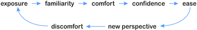

# Comp 127 Learning Goals

{:standard_toc}

## About these goals

### Kinds of Learning

This course focuses on building **three different kinds of knowledge:**

- **[Concepts](#concepts):** These are abstract ideas, _underlying patterns_ of software that do not depend on any specific programming language or development tool. They show up again and again in different contexts. You should be able to recognize, understand, and apply them even when you are not sitting at a computer. While technology changes fast, these underlying concepts evolve slowly. Their history is many decades long, and they are likely to remain relevant for a long time to come. Seeing these concepts apart from the code and tools immediately in front of you will not only help you in your work now, but will help you adapt quickly to the novel and the unfamiliar in the future.
- **[Practices](#practices):** These are _approaches, techniques, habits, and mindsets_ to use when you are working on a software project. They are not facts you can check off. They are not concepts you can master. They are _practices you build by doing them over time_. They tend to be subjective, and their meaning and relative virtue is often a matter of heated debate among developers! The only way to learn them well is with _hands-on experience._
- **[Tools](#tools):** Creating software requires many specific tools — programming language, editor, version control system, collaboration software, etc — and every one of these tools requires learning. As a developer, you will constantly encounter new tools. While some knowledge does transfer from a tool to other similar ones, the learning never ends. The tools knowledge you acquire will thus tend to be a more _ephemeral, short-term_ investment than learning about underlying concepts and practices. However, tools knowledge is the gateway to these bigger ideas. It is also frequently your first obstacle in a new context, and the most _urgent_ knowledge when you are facing a specific problem!

### The Learning Process

Learning in all these realms progresses through a long arc:

{:.dark-mode-invert scale="1.6"}

In Comp 127, you will gain _exposure_ to every item enumerated in the sections below. You will achieve _comfort_ and even _confidence_ with many of them. With others, you may not get past the point of _familiarity_. That is OK; your learning does not stop when the course ends! Even if you gain nothing more than _exposure_ to some of these items, that is just fine: important learning still occurs from exposure alone.

Your job is to find a path through all this learning that works for _you_. We teachers do our best to provide a rich environment, good challenges, good guidance, and lots of help — but ultimately, your learning path is _yours_ to find. What does that mean for you?

It means always looking for your own zone of growth: “What can I work on next? Where is the best learning for _me_, where I’m at now, as I am now?”

It means being honest with yourself about your progression through the arc of learning. Don’t get stuck at the start by getting mired in self-doubt. Don’t try to skip to the end by feigning confidence.

It means embracing struggle as a _positive_ sign. Quite often, frustration is what learning feels like! (If you are not struggling with anything, that is a bad sign. Ask: “Where can I find new challenges in this material?” There are _always_ new challenges, at any level of experience.)

It means accepting the fact that you cannot learn everything at once, so it is OK that you will _remain uncomfortable_ with some things even while you gain confidence in others.

It means understanding that there will never be a time, not ever, when you have “fully mastered programming.” That is not a thing that exists. There is not going to be some future moment when you get a gold star that says, “Now you are a _real_ developer!” Not when you receive your degree. Not when you’ve been writing code for 50 years. Not ever. (If somebody claims to hand you such a star, it’s a fake.)

Why? The full picture of learning is less an _arc_ than a _cycle_…

{:.dark-mode-invert scale="1.6"}

…so if you ever find yourself confused or uncomfortable, if you find yourself thinking “I thought I already knew programming, and I feel so lost!,” that is a good thing. It means you are still learning, still living. This may be daunting, but it is also a fact you can embrace with joy: learning never ends, and you will never run out of things to discover.

## Concepts

Your goal is to be able to do the following **in your head / on paper**, without leaning on the assistance of a development environment:

1. **Types**

    - Identify the **type of a value**
    - Understand basic differences between **integers** and **floating point numbers**
    - Understand the difference between an expression’s **static type** and its **runtime type**
    - Identify the **static and runtime type of a given expression** in a program
    - Understand the basics of **type casting** and **type promotion**

1. **Expressions**

    - Construct an expression from a **natural language description**
    - Draw the **abstract syntax tree (AST)** for a given expression, with correct operator precedence and associativity
    - **Evaluate** a given expression accurately
    - Annotate the AST for an expression with its **static types and runtime types** when evaluated for given inputs

1. **Loops and Conditionals**

    - Identify **basic looping patterns** (“for each,” “do _n_ times,” “repeat until sentinel”), and when to use them
    - **Transform** one iteration pattern to another
    - Translate decision trees expressed in natural language to and from code using **conditional constructs**: if, if/else (including chained if/else), switch/case
    - **Refactor and simplify** conditionals
    - Trace the **execution path** of conditionals in given code

1. **Objects**

    - Understand the distinction between **state and behavior**, and how object-oriented programming (OOP) represents each and groups them together
    - Understand the difference between **classes and objects**
    - Reason about how a given method will **use or change an object’s state**
    - Recognize the presence of **shared mutable state**, and be aware of its dangerous interactions with **parallelism**

1. **Object references**

    - Understand **pass-by-sharing** and **aliasing**
    - Understand what **null** is for, which types are nullable, and what kinds of operations can cause null pointer exceptions
    - In given code, trace through which object instance each variable **references** as the code runs

1. **Class structure & declarations**

    - Understand the structural building blocks of objects: **classes**, **instance variables** and **visibility modifiers**, **methods**, **constructors**, and **properties** (**getters** and **setters**).
    - Translate back and forth between **class diagrams and code**
    - Translate back and forth between **problem descriptions and object models**

1. **Scope & lifetime**

    - Identify the **scope** of **local variables**, **instance variables**, and **static variables**
    - Understand the principle of **encapsulation**
    - Understand the purpose of **access control** (private vs public vs protected) and how it relates to encapsulation
    - Understand the **lifetime of objects** and their members
    - Understand the **lifetime of variables** of different kinds

1. **Class relationships**

    - Understand the conceptual difference between **is-a** and **has-a** relationships
    - Understand both the technical meaning and modeling purposes of **subtypes and supertypes**, **interfaces**, and **inheritance**
    - Write code to **navigate an object graph** containing both types of relationships
    - Understand the **problems with inheritance**

1. **Polymorphism**

    - Reason about **message passing**, and how objects call each others’ methods
    - Given code containing interfaces and/or inheritance, and given the runtime types of values in that code, **identify which method implementation(s)** the language will use when the program runs
    - Understand when it is / isn’t possible to call a method in a **statically typed language** even if that method exists at runtime
    - Use the **Liskov Substitution Principle** to think about subtypes
    - Recognize how to use **interfaces for delegation** instead of creating subclasses, and how to **favor composition over inheritance**

1. **Closures**

    - Understand the **purpose of closures**
    - Understand the basic structure of closures, including **parameters**, **captures**, and **return values**
    - Trace **control flow** in code that uses closures; recognize and reason about **out-of-source-order execution**
    - Use function pipeline operations, e.g. **map** and **filter**, and translate back and forth between function pipelines and loops
    - Use closures for **event handling** in user interfaces

1. **APIs and Contracts**

    - Understand the idea of an **API**, and be able to perceive and reason about an API apart from its **implementation details**
    - Identify, understand, and reason about the **contracts of objects and methods**
    - Figure out how to solve a given task **using the building blocks an API provides**
    - Tell whether a given class is **mutable or immutable** given its source code and/or documentation, and identify whether given code mutates a particular object
    - Use **adversarial thinking** and search for **corner cases** that violate API contracts, and can thus cause bugs and security flaws
    - Use **defensive programming** in an API’s implementation to protect its contract

These are the most important concepts in this course, but **this is not an exhaustive list**. You will encounter many other conceptual patterns in Comp 127 that are likely to show up for you again later: input event handling, nested graphics hierarchies and local coordinate systems, parallel programming causing a race condition…. The list is longer than you can possibly know at the time. **Show up, be present, engage fully**, and you will be surprised at how many things become relevant in unexpected ways in the future!

## Practices

You will gain hands-on experience with the following software development practices. Some of them we specifically target in an activity or reading, but none of them are things you just learn once; the important thing is to continue building on them day to day, both during this course and long after it is done.

- **Collaboration and communication**
  
  <aside>Beginning programmers often dismiss the importance of these things, but they are in fact some of the most important and most difficult parts of creating software. The two hardest problems in computer science are yourself and other people! Start working on these skills and taking them seriously from the beginning.</aside>

    - Working effectively with other developers on a shared codebase
    - Using technical vocabulary to discuss ideas with other programmers
    - Listening to and reasoning about what others are thinking, both in order to write successful software and to maintain positive collegial relationships
    - Offering and accepting challenges to assumptions
    - Coding collaboratively: pair programming, code review
    - Navigating the emotional contours of sharing a codebase
    - Using individual differences as sources of _strength_ when creating software with other people

- **Coding for clarity**

    - Thinking of the human reader when writing code
    - Choosing good names
    - Tidy formatting
    - Navigating and understanding unfamiliar existing code
    - Using code structures that show your own thinking, and help others reason about what you created
    - Using comments judiciously to communicate what the code itself cannot
    - Cleaning up detritus
    - Following the coding style of the language and the team (which for our class means following the [COMP 127 Style Guide](/resources/style-guide))

- **Testing**

    - Adversarial thinking: getting from “Can I make it work?” to “Can I break it?”
    - Manual testing
    - Writing automated unit tests / regression tests
    - Test-driven development

- **Debugging**

    - Adding diagnostics to code
    - Using the source debugger to set breakpoints and step through code
    - Isolating bugs to subsections of code
    - Forming bug hypotheses using deduction, experience, and creativity
    - Experimentally verifying a bug diagnosis before attempting a fix

- **Organization and decomposition**

    - Breaking code into pieces that both work correctly and make sense
    - Identifying new abstractions wanting to emerge in code
    - Using abstractions to plan, discuss, and even debug code before writing it
    - Organizing code in small, comprehensible, testable pieces instead of giant, confusing, monolithic tangles

- **Refactoring**

    - Basic refactoring patterns: rename, extract local variable, fold or rearrange expressions, extract method, extract class, introduce new abstraction
    - Recognizing when to refactor for readability
    - Recognizing when to reflector to prepare for a change; use the practice of refactoring _first_ before altering

- **Version control**

    - Keeping regular snapshots of working code at sensible intervals
    - Using commit messages that aid communication
    - Backing up data to other computers (typically on the cloud)

## Tools

There are several specific software development tools we use throughout this class. While the specifics of these tools are not the main point of this class, learn them is necessary to do the coursework — and _learning how to learn_ new tools _is_ a primary goal of Macalester’s computer science curriculum!

Kilt Graphics is strictly a learning tool; it is training wheels, preparation for more complex graphics and user interface development. The other tools, however, are all widely used in industry.

- Java
    - Basics:
      - Java file structure & naming conventions
      - Primitive types vs object types in Java
      - Java’s basic operators and operator precedence
      - Java conditional syntax (if/else, switch/case)
      - Java loop syntax and common idioms (for-each loop, C-style for loop, while loop)
    - OOP features:
      - Java class declaration and method declaration syntax
      - Java syntax for method calls, constructor calls, and instance variable access, including the use of the special keywords `this` and `super`
      - Java’s access modifiers: public, private, protected, and package (“default”) access
    - Java closure/lambda syntax
    - Java standard library APIs
      - String
      - Basic collection types: List, Map, arrays
      - Basic stream operations: map(), filter(), collect to list, sum
      - Comparable, Comparator, and sort()
    - Many more language details too numerous to mention here
    - The relationship between all these Java language constructs and the concepts listed in the first section

- Visual Studio Code
    - Editing and transforming text
    - Running code, running tests
    - Using the debugger
    - Using refactoring tools
    - etc

- Git and GitHub
    - Cloning a project
    - Committing work as you go
    - Pushing and pulling work to/from the cloud
    - Collaborating and sharing code with other developers

- Command line basics
    - Opening a terminal
    - Using the puzzle generator utility CLI
    - Using command line arguments and option flags

- Slack
- Kilt Graphics

